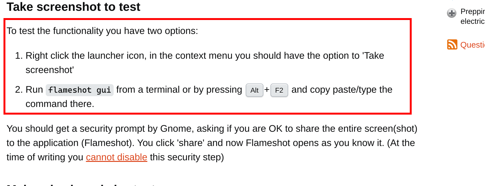

## 为什么会有这篇文章

```bash
sudo apt install flameshot
```

https://askubuntu.com/questions/1410848/ubuntu-22-04-flameshot-not-working

如果你信了这些教程的鬼话，那你就完蛋了。

不是说这些教程说错了，他们的方式的确能解决问题，但是它们并没有告诉你这么做的后果。

例如你按照教程修改了 custom.conf 文件，实际上你就使用了 Xorg 替换了 Wayland，这样你的系统就会使用 Xorg 了，降低了安全性。

我认为像这种情况一样，在帖子中不把某些命令的潜在后果说清楚，是很危险的，也是阻碍 Windows 用户迁移到 Linux 的原因之一。我们并不清楚我们复制粘贴来的某条命令，或者我们对某个文件的变更，会对系统产生什么样的影响。