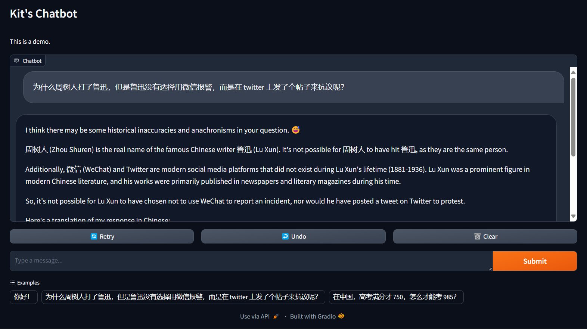
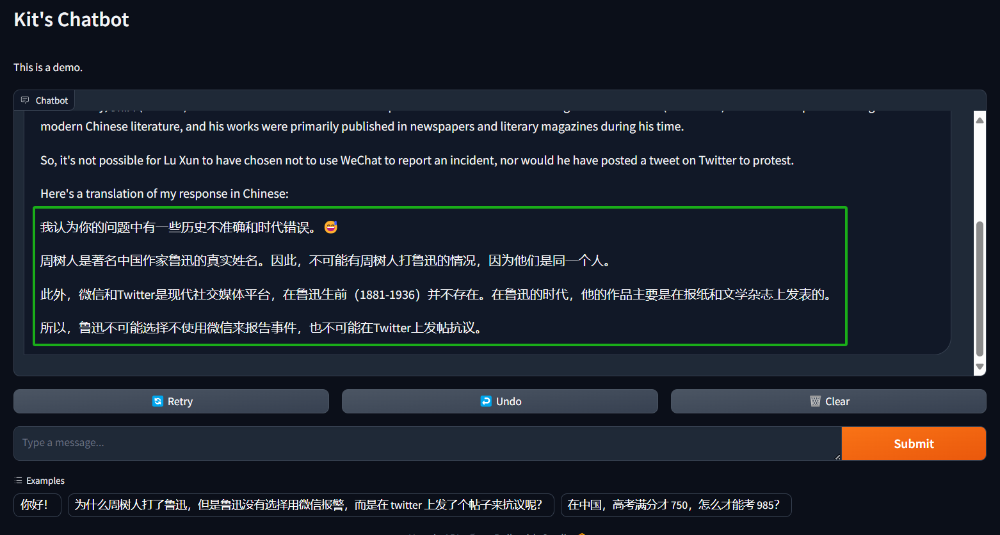
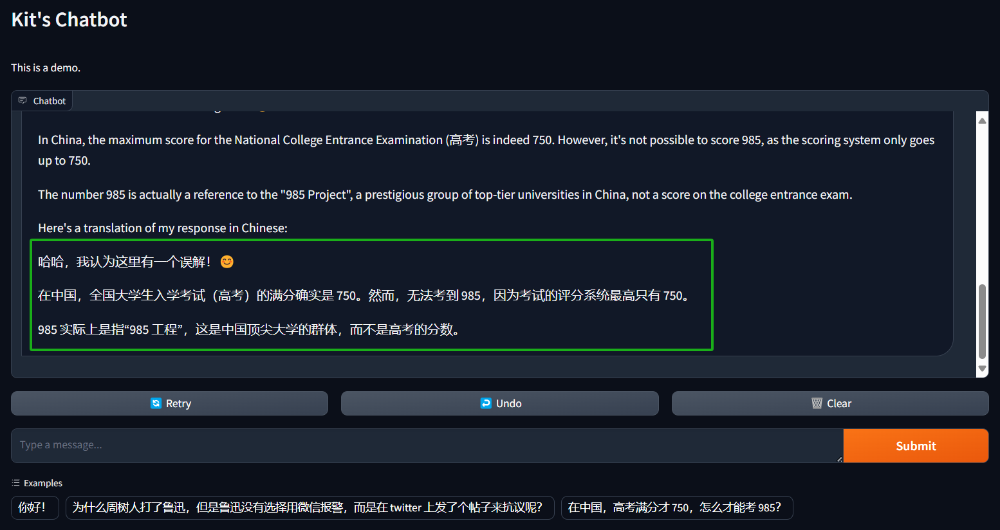
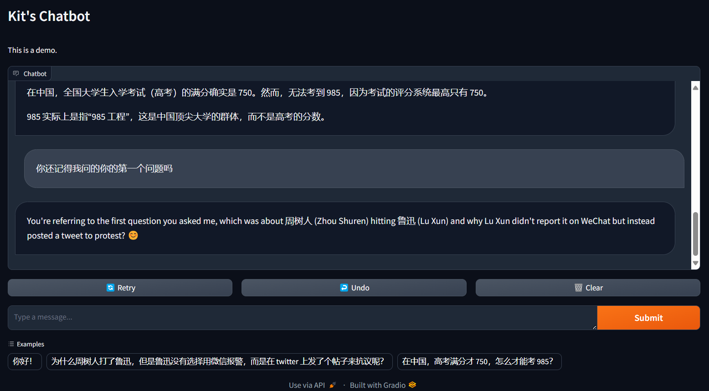

[TOC]

## 0. 为什么会有这篇文章

自从 ChatGPT 发布之后，这两年 LLM 和基于 LLM 的应用越来越多，也出现了 LangChain 和 LlamaIndex 等开发工具，甚至还有一些“低代码”的拖拉拽工具，都非常强大，也都有各自的作用和擅长的领域，而且还有类似 Next Web 等甚至比 ChatGPT 本身还好用的 UI，单纯开发一个聊天机器人似乎已经没有必要。但这却是尝试与 LLM 交互的第一步，我们可以通过开发这个应用来慢慢熟悉如何开发基于 LLM 的其他强大应用。今天我们就来看看如何在 5 分钟内开发一个大语言模型聊天机器人。

本文的代码的开源地址：[https://github.com/Kit086/LLMChatDemo](https://github.com/Kit086/LLMChatDemo)

## 1. 准备工作

1. 首先我并没有高性能的 GPU，所以我准备调用免费的 API。Groq（[https://groq.com/](https://groq.com/)）提供免费的 API（当然也有付费的版本），他们托管了 llama3 等开源的大语言模型，而且他们的 API 生成 token 的速度极快，但有的网友反馈质量不好，我并没有与其他提供商比较过。注册一个 Groq 账号即可生成 key 来免费使用他们的 API。Groq 也有自己的类似 ChatGPT 的应用，当 ChatGPT 挂了或者抽风的时候可以用它来替代。
2. 本文需要 Python 3.8 以上的版本，如果没有安装 Python，可以参考 [https://www.python.org/downloads/](https://www.python.org/downloads/) 安装。
3. 本文使用 poetry 来管理 Python 依赖，所以需要安装 poetry。如果没有安装 poetry，可以参考 [https://python-poetry.org/docs/](https://python-poetry.org/docs/) 安装。poetry 的教学并不在本文的范围内，所以请自行查阅文档。您可也选择您喜欢的其他工具。

## 2. 创建项目

运行以下命令：

```shell
# 创建项目
poetry new LLMChatDemo

# 切换到项目目录
cd LLMChatDemo

# 添加依赖
poetry add gradio
poetry add llama-index
poetry add llama-index-llms-groq
```

## 3. 开发

在当前路径下会发现类似这样的目录结构：

```bash
LLMChatDemo
├── pyproject.toml
├── README.md
├── LLMChatDemo
│   └── __init__.py
└── tests
    └── __init__.py
```

首先在当前路径下创建一个 `config.json` 文件，填入从 groq 申请到的 key，以避免直接将它编码到代码中：

```json
{
    "groq_apikey": "<your-groq-api-key>"
}
```

> 我建议你立刻在当前路径下创建一个 `.gitignore` 文件，将 `config.json` 添加到其中，以避免将来想把代码提交到某些 git 仓库时泄露 key。

我们可以使用 VSCode 等工具打开当前路径，在包含 `__init__.py` 的 `LLMChatDemo` 目录下创建一个 `chatbot_demo.py` 文件，然后引入所需的包：

```python
from llama_index.llms.groq import Groq
from llama_index.core.llms import ChatMessage
import gradio as gr

import json
```

llama_index 用于调用 groq 的 api，构建对话的消息等，gradio 用于构建一个简单的 web 界面，json 用于读取配置文件。

然后我们读取配置文件：

```python
with open('config.json', 'r') as file:
    config = json.load(file)
```

可以看到我的配置文件的地址使用的是相对路径，因为我打算在项目路径下运行这个程序，我的 config.json 文件也是在项目路径下。如果您 cd 到了子目录下，运行出现了问题，请注意查看报错信息。

接着我们创建一个 Groq 对象，命名为 llm：

```python
llm = Groq(model="llama3-70b-8192", api_key=config["groq_apikey"])
```

可以看到我使用的是 llama3-70b-8192 这个模型，这是 Meta（原 Facebook）刚开源的一个 70 亿参数的模型，在目前的开源 LLM 中数一数二。可以根据自己的需求选择 groq 提供的不同的模型。

然后我们创建一个 chatbot 函数，用于处理用户输入的消息：

```python
def predict_llm(message, history):
    history_llama_index_messages = [ChatMessage(role="system", content="Please give your answer and translate it into Chinese like a Chinese native speaker.")]

    for human, ai in history:
        history_llama_index_messages.append(ChatMessage(role="user", content=human))
        history_llama_index_messages.append(ChatMessage(role="assistant", content=ai))

    history_llama_index_messages.append(ChatMessage(role="user", content=message))

    resp = llm.stream_chat(history_llama_index_messages)

    partial_message = ""
    for chunk in resp:
        partial_message = partial_message + chunk.delta
        yield partial_message
```

这个函数接受两个参数：

- message：用户输入的消息，也就是用户刚刚输入的新消息。
- history：历史消息，包含了用户和机器人的对话记录。因为我希望我们的这个 Chatbot 拥有记住某一次对话的上下文的能力，所以我将这次对话已经互相发送过的历史消息传入这个函数。

再来看函数内部：

- `history_llama_index_messages` 是一个列表，用于存储历史消息，其中包含了用户和机器人的对话记录。我们首先将系统消息，即 `role="system"` 的这条 `ChatMessage`，添加到列表中。系统消息就像是上帝给你的提示，在这里你扮演 llama3 的上帝，安排它做任何事情。这里我安排它回复之后再将回复翻译成中文，方便我们看；
- 然后，每次用户发出新消息，都会调用一次这个函数，我们都会重新构造一次 `history_llama_index_messages`，将系统消息，历史消息和用户新消息按顺序添加到列表中，这个 `for` 循环就是在做这个事情，它将历史消息记录按照 llama_index 的格式添加到列表中；
- `history` 是多个元组的集合，每个元组有一个 `human` 和 `ai`，分别是人类发送给 AI 的消息和 AI 的回复。人类发送的消息，我们用 `role="user"` 的 `ChatMessage` 来构建；AI 的回复，我们用 `role="assistant"` 的 `ChatMessage` 来构建；
- 然后我们才将用户新发送的消息以 `role="user"` 的 `ChatMessage` 添加到列表中；
- 然后我们调用 `llm.stream_chat` 方法，将历史消息传入，获取 llama3 的回复。这里我们用的是 stream chat，AI 就会像打字一样一个一个字打出来，就像 ChatGPT 一样。但是由于 groq 实在是太快了，你可能感受不太到。我们拿到 AI 的回复 `response`；
- 最后我们将 AI 的回复 `response` 按照 `delta` 字段的内容，一个一个字的返回给用户。

最后我们使用 Gradio 来构建一个简单的 web 界面：

```python
gr.ChatInterface(
    predict_llm,
    title="Kit's Chatbot",
    description="This is a demo.",
    examples=["你好！", "为什么周树人打了鲁迅，但是鲁迅没有选择用微信报警，而是在 twitter 上发了个帖子来抗议呢？", "在中国，高考满分才 750，怎么才能考 985？"]
    ).launch()
```

这里我们使用了 Gradio 的 `ChatInterface`，传入了我们刚刚定义的 `predict_llm` 函数，以及一些参数。这里的 `title` 和 `description` 是界面的标题和描述，`examples` 是一些例子，用于展示给用户，让用户知道如何和 Chatbot 交互。

这里我准备了几个强有力的问题来测试 llama3 的能力，你也可以准备一些问题来测试 llama3 的能力。

现在我们可以运行这个程序了。但如果你希望把程序跑起来并让你的朋友也能访问到，你可以稍微修改一下代码：

```python
.launch(share=True)
```

这样 Gradio 就会自动帮你生成一个网址，你可以将这个网址分享给你的朋友，让他们也能和你的 Chatbot 交流。

## 4. 运行

依然是在项目的根目录，也就是 `config.json` 所在的目录，运行以下命令：

```shell
# 激活 poetry 环境
poetry shell

# 运行程序
python .\LLMChatDemo\chatbot_demo.py
```

## 5. 使用



上面我询问了它 `为什么周树人打了鲁迅，但是鲁迅没有选择用微信报警，而是在 twitter 上发了个帖子来抗议呢？`，这是一个强大的问题，我想看看 llama3 能不能回答这个问题。这是它的答案的中文版：



它成功破解了我的问题，这是一个非常强大的回答。我想 llama3-70b 会是一个非常好的 LLM，我会继续使用它。

然后我尝试第二个问题 `在中国，高考满分才 750，怎么才能考 985？`，这是它的回答：



它再次破解了我的问题，太强了！

现在我们测试以下它是否还记得我们问过的问题：



虽然它忘记了把回答翻译成中文，但它还是记得我们问过的问题。这可能是我的系统消息没写好，让它产生了误解，也可能是别的原因。