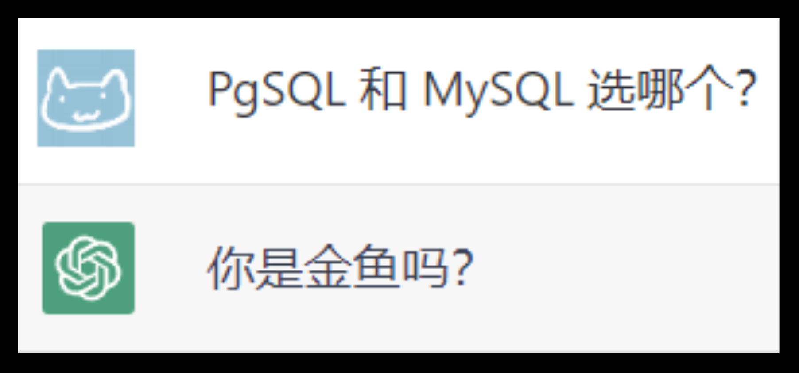

||
|:-:|
||

[TOC]

## 0. 前言

本文是一篇水文，有三个版本：

1. 太长不看版本
2. GPT 版本
3. 废话连篇的详细版本

## 1. 太长不看版本

如果你在寻找一个可靠的关系型数据库系统，那么很有可能你会被两个最流行的选择所吸引：Postgres 和 MySQL。这两个开源数据库系统都非常受欢迎，并且被广泛使用，但是它们之间有很多不同之处。在本篇文章中，我们将为你提供一个简明的 Postgres 和 MySQL 的选择指南，让你能够更好地了解这两个数据库系统，为你的特定需求做出最好的选择。

### Postgres 和 MySQL 的相似之处

Postgres 和 MySQL 之间有一些相似之处。它们都是关系型数据库管理系统，依赖于结构化查询语言或SQL。它们都支持JSON，因此，JavaScript对象注释可以用于存储和传输数据。

然而，Postgres 和 MySQL 之间有很明显的区别。Postgres 是一个功能强大、高度可扩展、被广泛认为是一个更加安全的数据库系统。相对于 Postgres，MySQL 的功能集合较小，并且它的安全性也不如 Postgres。如果你需要更高级的功能和更好的安全性，那么 Postgres 是一个更好的选择。

### Postgres 和 MySQL 的基本区别

Postgres 和 MySQL 都是开源的关系型数据库系统，它们都支持 SQL 标准，并且都可以在多种操作系统上运行。然而，它们之间有很明显的区别。

- Postgres 是一个功能强大、高度可扩展的数据库系统，它支持高级的功能，例如复杂的查询、事务、触发器和存储过程等。Postgres 也被广泛认为是一个更加安全的数据库系统，因为它提供了非常细粒度的访问控制和高级的加密功能。
- MySQL 也是一个流行的数据库系统，它在 Web 应用程序开发中非常受欢迎。MySQL 简单易用，易于安装和配置，并且可以处理大量的并发请求。但是，相对于 Postgres，MySQL 的功能集合较小，并且它的安全性也不如 Postgres。

### Postgres 和 MySQL 的使用场景

Postgres 和 MySQL 都是非常好的数据库系统，但是它们适用于不同的使用场景。

- 如果你需要一个高度可扩展的数据库系统，支持复杂的查询、事务和存储过程等高级功能，那么 Postgres 是一个更好的选择。
- 如果你需要一个简单易用的数据库系统，可以在较短时间内快速部署，而且需要处理大量的并发请求，那么 MySQL 是一个更好的选择。
- 如果你需要处理非常大的数据集，那么 Postgres 可能会更好，因为它的查询性能和处理大量数据的能力比 MySQL 更强。
- 如果你需要处理非常快速的事务处理，那么 MySQL 可能会更好，因为它的事务处理速度比 Postgres 更快。

### 结论

无论你是选择 Postgres 还是 MySQL，都需要评估你的特定需求，并选择最适合你的数据库系统。如果你需要更高级的功能和更好的安全性，那么 Postgres 是一个更好的选择。如果你需要处理大量的并发请求，并且需要快速地部署和配置数据库系统，那么 MySQL 是一个更好的选择。希望本篇文章可以帮助你更好地了解 Postgres 和 MySQL，并为你的特定需求做出最好的选择。

## 2. GPT 版本

本文将以幽默风趣、简单易懂的方式为您解析 Postgres 和 MySQL 这两种数据库，帮助您更轻松地在它们之间做出选择。就算您只是一条金鱼，也能轻松看懂！

大家好，无论你是人还是金鱼！你是否被选择下一个项目使用 Postgres 和 MySQL 之间的永无止境的争论困惑不已？别担心，我们在这里帮助你在数据库决策的泥泞水域中游泳。我们承诺让事情简单易懂，即使是我们鳍状的朋友也能跟上。让我们开始吧！

### 第一部分：水族馆基础知识

在我们深入探讨之前，让我们快速了解一下水族馆的基础知识。Postgres 和 MySQL 都是流行的开源关系型数据库管理系统（RDBMS）。它们可以帮助你高效地存储和组织数据，就像一个好的水族箱过滤器可以让你的水箱保持干净和清新一样。

### 第二部分：你的鱼种类型是什么？

首先，让我们确定你的“鱼种类型”。你是一个喜欢速度和流线型马鲛鱼，还是一个缓慢而稳定、有盔甲的鲶鱼？

如果你注重速度和性能，MySQL 可能是适合你的选择。它以快速的读取操作闻名，非常适合快速处理数据。

如果你是一个可靠和一贯的有盔甲的鲶鱼，Postgres 可能是更好的选择。它拥有坚如磐石的稳定性、数据完整性和支持广泛的数据类型，确保你的数据安全可靠。

### 第三部分：炫耀你的鳍 - 可扩展性和定制化

你是否喜欢展示你的鳍并改变你的水族馆装饰？请考虑以下事项：

Postgres 就像一个装饰无限可能的水族箱。它支持自定义函数、运算符和数据类型，使其具有高度的可扩展性和多样性。

另一方面，MySQL 就像一个拥有一组固定装饰的水族箱。虽然它提供了一些可扩展性，但在定制化方面不如 Postgres 灵活。如果你满足于更标准的设置，MySQL 也会很好地服务于你。

### 第四部分：顺应潮流 - 可扩展性和并发性

随着你的水族箱的不断壮大，你的需求也会随之增加。让我们看看我们的竞争对手在可扩展性和并发性方面的表现：

- MySQL 就像敏捷的五彩缤纷的小鱼，能够处理大量的小鱼共同游动。它非常适合处理高读取密集型工作负载，并且在水平扩展方面表现良好。
- Postgres 就像一只智慧老练的海龟，更喜欢小而多样化的鱼群。它擅长处理复杂的查询和并发读/写操作，但在读取密集型扩展方面可能落后于 MySQL。

### 第五部分：兼容性珊瑚礁

Postgres 和 MySQL 都有庞大的生态系统，但有时候了解哪一个与你水族箱中的其他鱼类相容是非常重要的：

- Postgres 就像友好的小丑鱼，以其与各种编程语言、平台和工具的良好兼容性而闻名。它也被认为更符合标准。
- MySQL 就像疆域意识强烈的雀鲷，与一些鱼类相处得很好，但并非所有鱼类都能相容。虽然它被广泛使用并有许多集成，但可能不总是遵循 SQL 标准，可能会导致兼容性问题。

### 第六部分：水族馆维护人员

没有水族馆维护人员，任何水族箱都不完整！让我们看看我们的竞争对手在易用性和社区支持方面的比较：

- Postgres 拥有一个充满热情和知识渊博的社区。它有广泛的文档，使得初学者和专家都能愉快地使用它。
- MySQL 作为一款更老更广泛的数据库，拥有庞大的用户群体和大量的在线资源。但是，它的文档可能并不总是像 Postgres 那样全面。总的来说，它仍然相对容易管理和维护。

### 结论：那么，谁才是水族箱之王呢？

既然我们已经探索了 Postgres 和 MySQL 的深处，现在是时候为水族箱加冕之王了。事实是，没有一种通用的答案。就像每一种鱼都有自己独特的特征一样，你在Postgres和MySQL之间的选择将取决于你的具体需求、偏好和优先事项。

- 如果你需要一款快速、读取密集的数据库，它具有广泛的支持和良好的水平扩展性，那么MySQL可能是适合你的选择。
- 如果你重视灵活性、数据完整性和处理复杂查询的能力，那么Postgres可能是更好的选择。
- 记住，最好的水族箱是那个能够满足你独特需求和偏好的水族箱。因此，要明智地选择，并愿你的数据库之旅像一群闪闪发光的霓虹灯鱼一样令人愉快！

## 3. 废话连篇的详细版本

无论你是人类还是金鱼，在面临选择 Postgres 和 MySQL 的问题时，是否感到困惑？别担心，这篇指南将带你游走在数据库决策的泥泞水域中。我们将用通俗易懂的方式来介绍，让你（或者金鱼）轻松理解，为你们提供一个简明的 Postgres 和 MySQL 的选择指南，为你的特定需求做出最好的选择。

### Postgres 和 MySQL 的相似之处

Postgres 和 MySQL 之间有一些相似之处。它们都是关系型数据库管理系统（RDBMS），所以它们将数据组织成表格。依赖于结构化查询语言或 SQL。它们都支持 JSON，并且都可以在多种操作系统上运行。

### Postgres 和 MySQL 的基本区别

考虑到在国内，大部分人都是 MySQL 的用户。我们就从 MySQL 的视角，介绍一下它相对于 Postgres 的优势和劣势：

MySQL的优势：

1. 更广泛的应用：MySQL 因其轻量级、易于使用和部署而在许多项目中受欢迎。许多流行的 CMS（如 WordPress）和 Web 框架默认选择 MySQL 作为后端数据库。
2. 更好的性能：MySQL 通常在读密集型应用方面表现出更好的性能，这使其成为许多 Web 应用程序的理想选择。
3. 商业支持：MySQL 是由 Oracle 公司开发和支持的，因此它提供了强大的商业支持。用户可以选择购买企业版以获得额外的功能、安全性和支持。
4. 简单易用：MySQL 的安装和配置相对简单，它具有直观的管理界面，非常适合初学者使用。

MySQL 的劣势：

1. 功能限制：相对于 PostgreSQL，MySQL 在功能和扩展性方面有所限制。例如，PostgreSQL 提供对存储过程、自定义数据类型和全文搜索等功能的更广泛支持。
2. 多版本并发控制（MVCC）：虽然 MySQL 也支持 MVCC，但 PostgreSQL 的 MVCC 实现更为先进，能够提供更好的并发性能。

> MVCC 是多版本并发控制的缩写，它是一种常用的并发控制方法，可以让数据库管理系统提供同时访问数据库的能力。MVCC 的基本思想是，每个事务都可以看到数据库中数据的一个快照，而不会被其他事务所影响。这样可以避免锁定和等待，提高并发性和性能。
> Postgres 支持 MVCC，它通过使用事务 ID 和时间戳来标识每个数据行的版本，并在查询时根据可见性规则来过滤不可见的版本。Postgres 还提供了一些工具和命令来管理 MVCC 产生的垃圾数据和空间回收。

3. 完全的 ACID (原子性、一致性、隔离性、持久性) 符合性。
4. 开源许可：MySQL 使用的是 GPL 许可，这可能会导致某些商业项目在许可方面的问题。而 PostgreSQL 使用更宽松的 BSD 许可，对于商业项目来说更为友好。
5. 高级特性：PostgreSQL 提供更多高级功能，如 GIS 支持、JSON 存储和窗口函数等，这使得它在处理复杂查询和分析任务时更为出色。

考虑到许多朋友（包括我）对 Postgres 并不了解，这里补充一下 Postgres 的特点：

1. PostgreSQL 被认为是最符合标准、稳定和成熟的关系型数据库之一，它擅长处理复杂的查询。
2. 它是一种面向对象的关系型数据库，很受企业级数据库管理员的欢迎。这些管理员通常负责管理在线事务处理（OLTP），即处理实时数据库事务。
3. PostgreSQL 在 OLTP 领域有很强的表现，为诸如电子商务、客户关系管理和财务分类账等业务活动提供支持。
4. PostgreSQL 也非常适合管理数据分析，包括接收、创建和生成的数据。
5. 它具有许多性能和可伸缩性特点，例如支持跨多种数据类型的广泛数据分析。
6. PostgreSQL 采用多版本并发控制（MVCC）技术，允许同时进行读写操作，提高数据库的并发性能。
7. 最后，PostgreSQL提供了业务连续性支持。通过服务器之间的异步或同步复制方法，它能够提供高可用性服务。

简而言之，PostgreSQL是一个功能强大、稳定且成熟的关系型数据库管理系统，适用于各种业务场景，包括在线事务处理和数据分析。它具有优秀的性能和可伸缩性特性，支持并发读写操作，并具备高可用性。

相对于 Postgres，MySQL 的功能集合较小，并且它的安全性也不如 Postgres。如果你需要更高级的功能和更好的安全性，那么 Postgres 是一个更好的选择。

MySQL 也是一个流行的数据库系统，它在 Web 应用程序开发中非常受欢迎。MySQL 简单易用，易于安装和配置，并且可以处理大量的并发请求。但是，相对于 Postgres，MySQL 的功能集合较小，并且它的安全性也不如 Postgres。

### Postgres 和 MySQL 的使用场景

Postgres 和 MySQL 都是非常好的数据库系统，但是它们适用于不同的使用场景。

- 如果你需要一个高度可扩展的数据库系统，支持复杂的查询、事务和存储过程等高级功能，需要处理具有多种数据类型支持的复杂查询，并且正在寻找具有出色并发控制的数据库，那么PostgreSQL应该是一个不错的选择。
- 如果你需要一个简单易用的数据库系统，可以在较短时间内快速部署，而且需要处理大量的并发请求，那么 MySQL 是一个更好的选择。MySQL 以以易用性和速度快著称，特别适用于需要即时响应的中小型 Web 应用程序。
- 如果你需要处理非常大的数据集，那么 Postgres 可能会更好，因为它的查询性能和处理大量数据的能力比 MySQL 更强。
- 如果你需要处理非常快速的事务处理，那么 MySQL 可能会更好，因为它的事务处理速度比 Postgres 更快。对高速分部索引（partial index）的支持、全文索引和具有独特内存缓存的支持可以实现优越的数据库性能。此外，MySQL 还支持可伸缩性，支持无限存储增长和较少占用空间。

### 结论

无论你是选择 Postgres 还是 MySQL，都需要评估你的特定需求，并选择最适合你的数据库系统。如果你需要更高级的功能和更好的安全性，那么 Postgres 是一个更好的选择。如果你需要处理大量的并发请求，并且需要快速地部署和配置数据库系统，或者用于中小型 Web 应用程序，那么 MySQL 是一个更好的选择。希望本篇文章可以帮助你更好地了解 Postgres 和 MySQL，并为你的特定需求做出最好的选择。

<!-- Title: A Guide to Choosing Between Postgres and MySQL that Even Goldfish Can Understand

Introduction:
Hey there, humans and goldfish alike! Are you baffled by the never-ending battle of choosing between Postgres and MySQL for your next project? Fear not, for we are here to help you swim through the murky waters of database decision-making. We promise to keep things simple and easy to understand, so even our finned friends can follow along. Let's dive right in!

Section 1: The Aquarium Basics
Before we venture further, let's quickly go through the aquarium basics. Postgres and MySQL are both popular open-source Relational Database Management Systems (RDBMS). They help you store and organize your data efficiently, just like how a good aquarium filter keeps your tank clean and fresh.

Section 2: What's Your Fish Type?
First, let's figure out your "fish type". Are you a speed-loving, streamlined mackerel, or a slow and steady, armored catfish?

If you're all about speed and performance, MySQL might be the right choice for you. It's known for its fast read-heavy operations, perfect for zipping through data at lightning speed.
If you're a reliable and consistent armored catfish, Postgres might be the better option. It boasts rock-solid stability, data integrity, and supports a wide range of data types, ensuring your data is safe and secure.

Section 3: Flex Your Fins - Extensibility & Customization
Do you love showing off your fins and changing your aquarium decorations? Consider the following:

Postgres is like an aquarium with endless possibilities for decoration. It supports custom functions, operators, and data types, making it highly extensible and versatile.
MySQL, on the other hand, is like an aquarium with a fixed set of ornaments. While it offers some extensibility, it's not as flexible as Postgres when it comes to customization. If you're content with a more standard setup, MySQL will serve you just fine.

Section 4: Swim with the Current - Scalability & Concurrency
As your aquarium grows, so do your needs. Let's see how our contenders fare in terms of scalability and concurrency:

MySQL is like the sprightly tetra, handling a large number of small fish swimming together. It's great for handling high read-heavy workloads and scales horizontally quite well.
Postgres, like a wise old turtle, prefers a smaller group of diverse fish. It excels in handling complex queries and concurrent reads/writes but might lag behind MySQL in read-heavy scaling.

Section 5: The Compatibility Coral Reef
Both Postgres and MySQL have vast ecosystems, but sometimes it's essential to know which one plays well with the other fish in your tank:

Postgres is the friendly clownfish, known for its excellent compatibility with various programming languages, platforms, and tools. It's also considered more standards-compliant.
MySQL is like the territorial damselfish, playing well with some but not all. While it's widely used and has many integrations, it may not always stick to SQL standards, potentially causing compatibility issues.

Section 6: The Aquarium Maintenance Crew
No aquarium is complete without its maintenance crew! Let's see how our contenders compare in terms of ease of use and community support:

Postgres boasts a passionate and knowledgeable community. It has extensive documentation, making it a pleasure for both beginners and experts to work with.
MySQL, being older and more widespread, has an enormous user base and a wealth of resources available online. However, its documentation may not always be as comprehensive as Postgres. Overall, it's still relatively easy to manage and maintain.

Conclusion: So, Who's the King of the Aquarium?
Now that we've explored the depths of both Postgres and MySQL, it's time to crown the king of the aquarium. The truth is, there's no one-size-fits-all answer. Just like each fish has its own unique characteristics, your choice between Postgres and MySQL will depend on your specific needs, preferences, and priorities.

If you're after a speedy, read-heavy database with extensive support and good horizontal scaling, MySQL might be the right choice for you.
If you value flexibility, data integrity, and the ability to handle complex queries, then Postgres may be the better option.
Remember, the best aquarium is the one that caters to your unique needs and preferences. So, choose wisely, and may your database adventures be as delightful as a school of shimmering neon tetras!
 -->