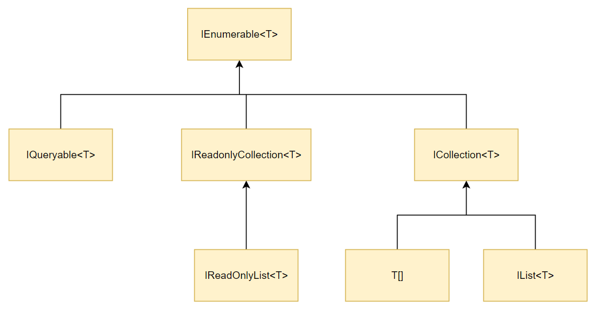

[TOC]

## 0. 为什么会有这篇博客

刚刚从上一家公司离职，但我不应该浪费每一段职业经历，现在终于有时间总结一下工作中经常遇到的典型问题，并探究一下如何解决它们。今天先探讨一下这个最普遍的问题。

在工作中，我常常看到项目代码中需要集合时，就默认全都用 `IEnumerable<T>` 或 `List<T>`。特别是开发者在使用 `IEnumerable<T>` 时，由于不清楚它的特性，使用时导致 `IEnumerable<T>` 被多次迭代，从而产生了性能问题甚至更严重的问题。

首先我们看一下 `IEnumetable<T>` 可能被多次迭代的情况：

```csharp
IEnumerable<Task> tasks = Enumerable.Range(0, 5)
    .Select(i => Task.Run(() => Console.WriteLine(i)));

await Task.WhenAll(tasks);

Console.WriteLine($"Tasks Count: {tasks.Count()}");
```

理想中，这段代码的结果应该是：

```
0
1
2
3
4
Tasks Count: 5
```

但实际结果却是：

```
0
1
2
3
4
Tasks Count: 5
4
3
2
1
0
```

0 到 4 这 5 个数字被输出了两遍。原因是 `Console.WriteLine($"Tasks Count: {tasks.Count()}");` 这行代码在 `tasks.Count()` 时又遍历了 `tasks` 一遍，可以看到有多次迭代的情况。如果 `IEnumerable<T>` 集合中元素的数量很大，会有性能问题；如果集合中有像示例代码中这种操作，甚至会导致代码行为与我们理想的行为大不相同。

我们可以把代码改写成这样子来轻易解决：`Task[] tasks = Enumerable.Range(0, 5).Select(i => Task.Run(() => Console.WriteLine(i))).ToArray();`，但更重要的是，我们需要思考何时应该使用 `IEnumerable<T>`，何时应该选择其他集合类型。

## 1. 简单比较

首先我们可以简单比较一下 `IEnumerable, IQueryable, ICollection` 等集合 interface。我先放一个继承关系图在这：

||
|:-:|
|<b>图 1 - 继承关系图</b>|

如果你只想知道 `IEnumerable, IQueryable, ICollection` 的区别的话，只看这一节就可以了。但如果你搞清楚什么时候该选什么，或者想用到 `IReadOnlyCollection<T>` 等更加特殊却好用的接口，或者想了解它们有什么独特的优势和容易产生异常和 bug 的致命缺点的话，可以往下多看几节。

### `IEnumerable<T>`

`IEnumerable<T>` 是最常用的接口。它是顶级接口，极为灵活。它可以表示任何类型的集合，包括数组、列表、集合、字典、文件、网络流等等。 **实现 `IEnumerable<T>` 的类型或接口可以用 `foreach` 遍历，如果你需要循环遍历集合中的元素并对其执行操作，那么选择 `IEnumerable<T>` 就没错了。**另外它还可以使用 `yield` 语句返回值。相信各位 C# 老法师不需要我给出示例代码了。

### `IQueryable<T>`

`IQueryable<T>` 实现了 `IEnumerable<T>`，所以它有 `IEnumerable<T>` 的全部功能。它在 `System.Linq` 命名空间中。相信使用 EF Core 等 ORM 的朋友对它不会陌生。不熟悉它的朋友就对不起了，这篇博客不是专门介绍 `IQueryable<T>` 的，你可以去官方文档查看它的详细特性。看一段示例代码，比较 `IQueryable<T>` 和 `IEnumerable<T>`：

```csharp
IQueryable<Person> persons = _dbContext.Persons.Where(......);
persons = persons.Take<Person>(3); // 当遇到 ToList() 等方法后，在数据库中执行，执行的 SQL 语句会是 `TOP(3)` 这种，只查前 3 条

IEnumerable<Person> persons = _dbContext.Persons.Where(......);
persons = persons.Take<Person>(3); // 将所有符合 Where() 条件的数据都查到内存中，再取 3 条
```

**如果你需要在数据源上执行 LINQ 操作来提高效率，那么选择 `IQueryable<T>` 就没错了。比如，当你使用 ORM 框架（比如 EF Core）时，`IQueryable<T>` 就是你的好朋友。在这种场景下处理大量数据时，使用 `IQueryable<T>` 比使用 `IEnumerable<T>` 更加高效。**

### `ICollection<T>`

最后是 `ICollection<T>`，它继承了 `IEnumerable<T>`，除了有 `IEnumerable<T>` 的特性之外，还支持添加或删除集合中的元素，使用 `Add()` 和 `Remove()` 等方法。

**如果你需要在集合对象中进行元素添加或删除操作，那么选择 `ICollection<T>` 就是你的不二之选。**

### 如何选择

现在，我们可以得出一个**初步但不完全正确**的选择指南：

1. 当需要添加和删除集合中的元素时，用 `ICollection<T>`；
2. 当需要在数据源上执行 LINQ 操作以提升效率时，选择 `IQueryable<T>`，典型场景是使用 EF Core 等 ORM 框架时；
3. 其他情况选择 `IEnumerable<T>`。

下面我们详细说明一下当函数需要返回一个集合时，应该选哪一个。

## 2. 方法返回的集合类型，如何选择？

### `IQueryable<T>` 的抽象泄露

虽然 `IQueryable` 尝试抽象化查询数据源的实现细节，但它并没有完全隐藏它们。开发人员仍然需要了解底层数据源及其处理查询的方式，这意味着抽象化并不完全 "无泄漏"。换句话说，`IQueryable` 的实现细节仍然可能 "泄漏"出来，需要开发人员直接处理。这可能会使更改底层数据源或查询实现变得更加困难，而不破坏使用 `IQueryable` 的代码。

这就带出了一个 **“抽象泄露”的概念。本来我们喜欢使用抽象，就是为了不需要了解它的实现细节，但 `IQueryable` 这个抽象却依然需要我们了解它的细节，所以说它是抽象泄露。举个例子：**

```csharp
public IEnumerable<PersonDto> GetAdults()
{
    return _dbContext.Persons
        .Where(p => p.Age >= 18)
        .Select(MapToPersonDto); // MapToPersonDto 无法被转换为 SQL 语句
}

public PersonDto MapToPersonDto(Person person)
{
    // 将 person 映射为 PersonDto
}
```

示例代码是一段使用 EF Core 对数据库进行查询的代码，`Where(p => p.Age >= 18)` 可以被翻译成 SQL 语句，而 `Select(MapToPersonDto)` 无法被翻译成 SQL 语句。

这就相当于使用 `IQueryable` 时不能无脑写 LINQ 表达式，我们必须知道 EF Core 如何实现它的 `IQueryable`。

因此，我认为，在公开的方法或接口中，应该避免使用 `IQueryable` 作为返回值类型。这是因为返回 `IQueryable` 可能会导致调用方不得不了解底层数据源和查询实现的细节，从而使得修改这些实现变得困难。返回了它，就相当于告诉我的这个函数的调用者：你可以随便使用 LINQ 表达式来操作我返回的 `IQueryable<T>`。如果调用者使用了类似 `Select(MapToPersonDto)` 这种语句，可能会出现异常。

那还该不该用 `IQueryable<T>`？当然该用，但应该在 `Repository` 内部用，不要泄露给外部。这种情况下，我们应该在内部使用 `IQueryable` 进行查询，并在公开的方法中使用 `IEnumerable` 作为返回值类型。这里我默认大家都喜欢 `Repository` 模式，不讨论是否该用这种模式。示例代码：

```csharp
public class PersonRepository
{
    public IEnumerable<Person> GetAdults()
    {
        IQueryable<Person> persons = _dbContext.Persons
            .Where(p => p.Age >= 18);

        return persons.AsEnumerable();
    }
}
```

这样我们还是以 `IEnumerable<T>` 作为了返回值类型，并没有把 `IQueryable<T>` 暴露出去。调用方也不需要知道 EF Core 对 `IQueryable` Provider 的实现细节。这就成为了一个很好的抽象，可以避免泄漏底层数据源和查询实现的细节。但在函数内部，我们还是可以使用 `IQueryable` 和它的特性。

### `IReadOnlyCollection<T>` 与 `IReadOnlyList<T>`

由前面的结论，我们发现，**返回值类型还有告诉调用方可以或不可以用返回值做什么的功能。**

我们依然以 `Repository` 层为例。我们应该通过 `Repository` 中的方法的返回值类型来告诉调用方，该方法返回的集合能否被改变。 **调用方可能希望通过改变 `Repository` 返回的集合来增删改数据源的数据，或者重新利用集合里的数据来做别的事情**，例如在 `GetAdults()` 方法返回的集合变量中添加一个自己构造的 Person 对象：

```csharp
public void Test()
{
    var elders = _personRepository.GetAdults().ToList();
    elders.Add(new Person());
    // ......
}
```

为了保证代码的可维护性，我通常不希望调用方做这种操作。如果调用方通过改变 `Repository` 中的方法的返回值而改变了数据源（使用 EF Core 等 ORM 时确实有可能），我认为会使得代码变乱，可维护性变差，后续版本迭代时会非常棘手。我也不希望调用方复用 `Repository` 中的方法的返回值集合来添加或删除集合中的元素供后续使用，这也会导致代码可读性和可维护性变差。这样很容易造出不易迭代的软件产品。我建议用户使用返回值来创建一个新的集合以实现这些操作。不必要的数据修改通常会导致一系列难以调试的问题，此时可以通过使返回集合类型不可变来避免。

因此，`ICollection<T>` 以及它的派生 `T[]`（数组）和 `List<T>`、`IList<T>` 等就不在我的选择范围内了，因为它们是可被改变的。这种情况下，我会选择 `IReadOnlyCollection<T>` 或 `IReadOnlyList<T>` 等不可变集合类型。

此外，他们的功能比 `IEnumerable<T>` 更多，`IReadOnlyCollection<T>` 直接有 `Count` 属性，可以避免文章开头说过的多次遍历问题：

```csharp
var tasks = GetTasks();

await Task.WhenAll(tasks);

Console.WriteLine($"Tasks Count: {tasks.Count}");
Console.WriteLine($"Tasks Count: {tasks.Count}");

IReadOnlyCollection<Task> GetTasks()
{
    return Enumerable.Range(0, 5)
        .Select(i => Task.Run(() => Console.WriteLine(i))).ToList();
}
```

输出结果：

```
0
1
2
3
4
Tasks Count: 5
Tasks Count: 5
```

而 `IReadOnlyList<T>` 甚至还有用索引访问元素的功能，例如 `tasks[0]`。详情可以看官方文档。

## 总结

上面说得乱七八糟，我们可以总结一下：

只考虑各种集合类型的功能，得出的初步但不完全合适的规则：

1. 当需要添加和删除集合中的元素时，用 `ICollection<T>`；
2. 当需要在数据源上执行 LINQ 操作以提升效率时，选择 `IQueryable<T>`，典型场景是使用 EF Core 等 ORM 框架时；
3. 其他情况选择 `IEnumerable<T>`。

进一步考虑可维护性等元素，得出的规则：

1. 当你的方法需要一个集合类型的输入参数时，可以选择 `IEnumerable<T>`；
2. 返回集合类型时选择 `IReadOnlyCollection<T>` 或它的子类。

促使我们不把 `IEnumerable<T>` 作为返回集合类型实际上还有一个原因。就是 `IEnumerable<T>` 有“延迟评估”的特性。如果你的公司是这样写代码：

```csharp
IEnumerable<Person> adults = GetAdults();

foreach (var person in adults) // 枚举时才会进行筛选
{
    // ...
}

public IEnumerable<Person> GetAdults()
{
    using (MyDbContext dbContext = new MyDbContext())
    {
        return dbContext.Persons
            .Where(p => p.Age >= 18)
    }
}
```

由于“延迟评估”，直到我 `foreach()` 时才会进行 `Where()` 条件的筛选，但此时， `dbContext` 已经被释放了，你就完蛋了。