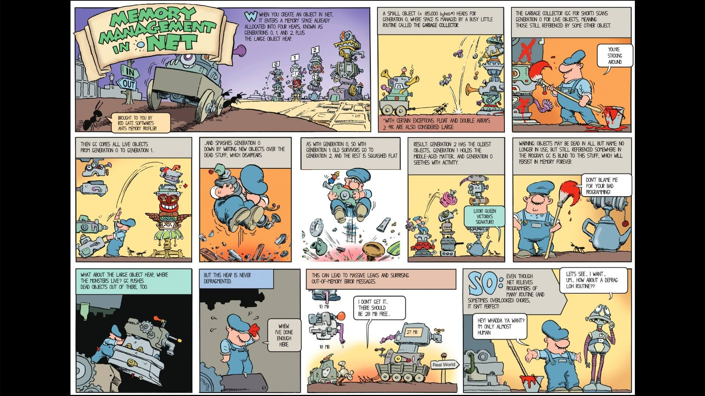

[TOC]

今天是 2023 年 1 月 21 日，农历大年三十。祝大家兔年发财，心想事成！希望自己在兔年能解决单身问题😁。

## 0. 为什么会有这篇博客

在工作中，我发现国内许多跟我水平相近的普通 dotnet 开发者对 dotnet 的一些基础知识并不了解，我们实际上只是在流水线上写代码，写增删改查，这显然对我们技术路线职业发展不利。我认为很大原因是国内的中小公司不重视技术，眼里只有业务，他们需要的实际上是能像流水线工人一样写增删改查的熟练工，而不是有创造力的开发者。

要想在这种流水线工作上找点乐子，性能优化是个不错的学习的点。dotnet 性能优化基本都要从减少 GC 压力入手。刚好我从网上看到这样一幅简单的介绍 dotnet GC 的漫画，就简单翻译一下，做一个最基础的科普。

## 1. 来源

该漫画来自 Redgate。具体地址我不知道，我是拿的网友转载的，网友没有给出地址。但应该是 .NET Framework 时代的东西了。在 dotnet 5 中，GC 新增了新的分代 POH，我也不太了解，感兴趣的朋友可以自行查阅资料。

这幅漫画是我很久之前翻译的，但被工作耽误了，一直没有发出来，今天清理磁盘的时候才发现。当时可能有一些不好的翻译和错误的理解，但是过年很忙，我懒得重新校正这些错误了。

## 2. 翻译

可以保存到本地或者放大后看。文本还是清晰的。

||
|:-:|
|<b>图 1 - 翻译</b>|

## 3. 关于 LOH（大对象堆）压缩问题的“解决方案”

有位大佬 @lorenzo_solano 给出了大对象堆压缩问题的“解决方案”，做如下设置：`GCSettings.LargeObjectHeapCompactionMode = GCLargeObjectHeapCompactionMode.CompactOnce`。

这是把 GC 的 LOH 压缩模式设置为了“压缩一次”。

你要么周期性地调用它，要么用一些启发式的方法。“解决方案”加引号是因为它只在下一个 GC 周期有效，我们回到了手动内存管理。但更糟糕的是不知道什么时候该这么做。

这个解决方案来自 @lorenzo_solano 的演讲：Benefits of Being a "Real" Polyglot Programmer（成为“真正的”多语言程序员的好处）。

## 4. 原漫画

||
|:-:|
|<b>图 2 - 原漫画</b>|
