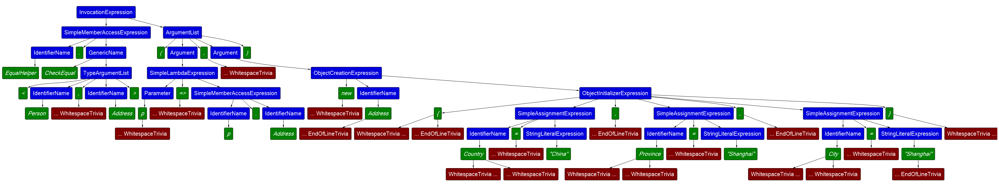

[TOC]

## 0. 简单介绍

如果您还不理解如何构建表达式树，请看一下我的这篇文章：[https://blog.kitlau.dev/posts/how-to-build-csharp-expression-trees/](https://blog.kitlau.dev/posts/how-to-build-csharp-expression-trees/)。

值对象是领域驱动设计（DDD）中的一个概念，这里不详细解释，不清楚的朋友可以去网络上了解一下。

假设我们有一个 `Person` 实体类，该类有一个 `Address` 类型的属性，属性名称也为 `Address`。`Address` 这个值对象类型有 `Country`、`Province`、`City`、`Detail` 四个属性。

假设我们要使用 EF Core 从数据库中查询 `Country == "China"` 且 `Province == "Shanghai"` 且 `City == "Shanghai"` 的数据，代码如下：

```c#
List<Person> shanghaiPersons = await dbContext.Persons
    .Where(p => p.Address.Country == "China"
                && p.Address.Province == "Shanghai"
                && p.Address.City == "Shanghai")
    .ToListAsync();
```

该值对象 `Address` 仅有 4 个属性，我们仅用 3 个属性作为查询条件，查询的代码写起来就已经很繁琐了，如果属性更多，代码将会非常繁琐。而且这样无法清晰地表现出值对象的语义。从语义上来说，值对象理应是可以直接进行相等比较，否则用值对象似乎没有很大的意义了。

我们动态构建表达式树，生成值对象进行相等比较的表达式，既简化 EF Core 中比较值对象的操作，又鲜明了语义。

## 1. 准备工作

建议直接复制或下载代码，代码地址：[https://github.com/Kit086/kit.demos/tree/main/ExpressionTrees/ComparisonValueObject](https://github.com/Kit086/kit.demos/tree/main/ExpressionTrees/ComparisonValueObject)

如果你的网络打不开代码地址，也可以跟着下面的步骤操作，但不保证所有代码都复制到了本篇博客中，那样篇幅太长，无关的东西太多。

### 创建项目并引入包

1. 创建一个控制台项目，.NET SDK 版本选择 6.0
2. 引入 Microsoft.EntityFrameworkCore.Sqlite 包，版本 6.0.7
3. 引入 Microsoft.EntityFrameworkCore.Design 包，版本 6.0.7

### 创建实体类和值对象类

1. 值对象类 Address.cs：

```c#
public class Address
{
    public Address()
    {
    }

    public Address(string country, string province, string city, string detail)
    {
        Country = country;
        Province = province;
        City = city;
        Detail = detail;
    }

    public string Country { get; set; } = null!;

    public string Province { get; set; } = null!;

    public string City { get; set; } = null!;

    public string Detail { get; set; } = null!;
}
```

2. 实体类 Person.cs 和它的 EF Core 配置类 PersonConfiguration：

```c#
public class Person
{
    public long Id { get; set; }

    public string Name { get; set; } = null!;

    public Address Address { get; set; } = null!; // 值对象

    public override string ToString()
    {
        return $"Id: {Id}, Name: {Name}, Country: {Address.Country}, Province: {Address.Province}, City: {Address.City}, Detail: {Address.Detail}";
    }
}

public class PersonConfiguration : IEntityTypeConfiguration<Person>
{
    public void Configure(EntityTypeBuilder<Person> builder)
    {
        builder.Property(x => x.Name).IsUnicode().HasMaxLength(128).IsRequired();

        builder.OwnsOne(x => x.Address, navigationBuilder =>
        {
            navigationBuilder.Property(a => a.Country).IsUnicode().HasMaxLength(128).IsRequired();
            navigationBuilder.Property(a => a.Province).IsUnicode().HasMaxLength(128).IsRequired();
            navigationBuilder.Property(a => a.City).IsUnicode().HasMaxLength(128).IsRequired();
            navigationBuilder.Property(a => a.Detail).IsUnicode().HasMaxLength(512).IsRequired();
        });
    }
}
```

该文件同时包含了它的配置类 `PersonConfiguration`，其中使用 `builder.OwnsOne` 配置了值对象 `Address`。

3. EF Core 的数据库上下文 `AppDbContext`：
   
```c#
public class AppDbContext : DbContext
{
    public DbSet<Person> Persons { get; set; } = null!;
    
    protected override void OnConfiguring(DbContextOptionsBuilder optionsBuilder)
    {
        optionsBuilder.UseSqlite("Data Source=test.db");

        optionsBuilder.LogTo(Console.WriteLine);
        
        base.OnConfiguring(optionsBuilder);
    }

    protected override void OnModelCreating(ModelBuilder modelBuilder)
    {
        modelBuilder.ApplyConfiguration(new PersonConfiguration());

        base.OnModelCreating(modelBuilder);
    }

    public async Task SeedAsync()
    {
        if (!this.Persons.Any())
        {
            this.Persons.Add(new Person
            {
                Name = "Zhang Three",
                Address = new Address(country: "China", 
                    province: "Shanghai", 
                    city: "Shanghai", 
                    detail: "Xuhui District xxx Road xxx Long 1-101")
            });
            
            this.Persons.Add(new Person
            {
                Name = "Li Four",
                Address = new Address(country: "China", 
                    province: "Shanghai", 
                    city: "Shanghai",
                    detail: "Xuhui District xxx Road xxx Long 1-102")
            });
            
            this.Persons.Add(new Person
            {
                Name = "Wang Five",
                Address = new Address(country: "China", 
                    province: "Guangdong", 
                    city: "Guangzhou",
                    detail: "Tianhe District xxx Road No. xxx 10-1-101")
            });

            await this.SaveChangesAsync();
        }
    }
}
```

这里我们配置了日志输出到控制台，而且写了一个插入种子数据的方法 `SeedAsync()`。

创建完之后，即可添加迁移，然后更新数据库。分别运行以下两条命令即可：

```bash
dotnet ef migrations add Init
dotnet ef database update
```

然后就可以看到创建好的 Sqlite 数据库文件了，看一下 Persons 表：

||
|:--:|
|<b>图 1</b>|

值对象 `Address` 并没有被单独创建一张表，因为我们没有把它作为 `DbSet` 注册到 `AppDbContext.cs` 中去，而且它也没有主键 ID。我们把它配置为了 `Person` 实体的值对象，所以它的字段默认命名方式是 `Address_Country` 这种风格。

## 2. 普通查询

使用常规的查询方式，Program.cs 的代码如下：

```c#
await using AppDbContext dbContext = new AppDbContext();
await dbContext.SeedAsync(); // 设置种子数据

List<Person> shanghaiPersons = await dbContext.Persons
    .Where(p => p.Address.Country == "China"
                && p.Address.Province == "Shanghai"
                && p.Address.City == "Shanghai")
    .ToListAsync();

foreach (Person shanghaiPerson in shanghaiPersons)
{
    Console.WriteLine(shanghaiPerson.ToString());
}
```

输出结果：

```bash
......

info: 2022/7/30 02:18:23.723 RelationalEventId.CommandExecuted[20101] (Microsoft.EntityFrameworkCore.Database.Command)
      Executed DbCommand (2ms) [Parameters=[], CommandType='Text', CommandTimeout='30']
      SELECT "p"."Id", "p"."Name", "p"."Address_City", "p"."Address_Country", "p"."Address_Detail", "p"."Address_Province"
      FROM "Persons" AS "p"
      WHERE (("p"."Address_Country" = 'China') AND ("p"."Address_Province" = 'Shanghai')) AND ("p"."Address_City" = 'Shanghai')

......

Id: 1, Name: Zhang Three, Country: China, Province: Shanghai, City: Shanghai, Detail: Xuhui District xxx Road xxx Long 1-101
Id: 2, Name: Li Four, Country: China, Province: Shanghai, City: Shanghai, Detail: Xuhui District xxx Road xxx Long 1-102

......
```

查出张三和李四的这两条数据并且打印出来了。看一下生成的 SQL 脚本，也没什么问题。

## 3. 尝试更加语义化的查询

前面已经提过，普通的方式查询，代码略显繁琐，而且不够语义化，体现不出值对象的优势。从语义上来说，值对象理应是可以直接进行相等比较。我们直接尝试让值对象进行相等比较，略微修改一下 Program.cs：

```c#
......

List<Person> shanghaiPersons = await dbContext.Persons
    .Where(p => p.Address == new Address
    {
        Country = "China",
        Province = "Shanghai",
        City = "Shanghai"
    })
    .ToListAsync();

......
```

输出结果：

```bash
......

info: 2022/7/30 02:27:58.118 RelationalEventId.CommandExecuted[20101] (Microsoft.EntityFrameworkCore.Database.Command)
      Executed DbCommand (9ms) [Parameters=[], CommandType='Text', CommandTimeout='30']
      SELECT EXISTS (
          SELECT 1
          FROM "Persons" AS "p")

......

dbug: 2022/7/30 02:27:58.139 CoreEventId.QueryCompilationStarting[10111] (Microsoft.EntityFrameworkCore.Query)
      Compiling query expression:
      'DbSet<Person>()
          .Where(p => p.Address == new Address{
              Country = "China",
              Province = "Shanghai",
              City = "Shanghai"
          }
          )'
dbug: 2022/7/30 02:27:58.152 CoreEventId.NavigationBaseIncluded[10112] (Microsoft.EntityFrameworkCore.Query)
      Including navigation: 'Person.Address'.
dbug: 2022/7/30 02:27:58.174 CoreEventId.ContextDisposed[10407] (Microsoft.EntityFrameworkCore.Infrastructure)
      'AppDbContext' disposed.
Unhandled exception. System.InvalidOperationException: No backing field could be found for property 'Address.PersonId' and the property does not have a getter.
   at Microsoft.EntityFrameworkCore.Metadata.IPropertyBase.GetMemberInfo(Boolean forMaterialization, Boolean forSet)

......
```

首先程序执行了一段 SQL 脚本，然后尝试把我们写的语义化的 Where 条件编译成 SQL 语句，然后就抛出异常了。这样行不通。

## 4. 使用动态构建表达式树的查询

我计划构建一个叫 `ValueObjectEqualHelper` 的静态类，它不仅能用于本例子，还是值对象通用的，内有 `CheckEqual<T, TProperty>` 静态方法，该方法接受两个参数，第一个参数是一个 lambda 表达式，返回要查询的实体中的值对象的属性，例如我们要查 `Person` 实体中的 `Address` 值对象属性，就传 `p => p.Address` 作为第一个参数；第二个参数是一个值对象类型的对象，作为查询的条件，在我们这个例子中就是 new 一个 Address 对象，该对象的各个属性的值都是我们的查询条件的值。

写出代码来就是这样，修改一下 Program.cs：

```c#
......

List<Person> shanghaiPersons = await dbContext.Persons
    .Where(ValueObjectEqualHelper.CheckEqual<Person, Address>(p => p.Address,
        new Address
        {
            Country = "China",
            Province = "Shanghai",
            City = "Shanghai"
        }))
    .ToListAsync();

......
```

现在我们来实现它。

新建一个类 ValueObjectEqualHelper.cs：

```c#
public static class ValueObjectEqualHelper
{
    /// <summary>
    /// 生成"检查值对象是否相等"的表达式树
    /// </summary>
    /// <param name="firstParameterPropertyAccessor">Func 委托表达式，用于取实体的值对象属性，在本例中是（p => p.Address）</param>
    /// <param name="secondParameter">用于比较的值对象参数（实际上就是 EF Core 的查询条件），在本例中是 Address 类型的值对象</param>
    /// <typeparam name="T">实体类型，本例中是 Person</typeparam>
    /// <typeparam name="TProperty">值对象类型（值对象是实体的 Property），本例中是 Address</typeparam>
    public static Expression<Func<T, bool>> CheckEqual<T, TProperty>(
        Expression<Func<T, TProperty>> firstParameterPropertyAccessor,
        TProperty? secondParameter)
        where T : class
        where TProperty : class
    {
        // 获取相等比较的第一个参数表达式
        ParameterExpression firstParameterExpr = firstParameterPropertyAccessor.Parameters.Single();

        // 将要构建的相等条件表达式
        BinaryExpression? conditionalExpr = null;

        // 遍历值对象的每一个属性，构造两个对象属性间比较的表达式
        foreach (var propertyInfo in typeof(TProperty).GetProperties())
        {
            // 将要构建的比较条件表达式
            BinaryExpression equalExpr;

            // 用于比较的值对象参数（实际上就是 EF Core 的查询条件）的值
            object? secondValue = secondParameter is not null ? propertyInfo.GetValue(secondParameter) : null;
            
            // 如果值对象（也就是查询条件）的某个属性值为 null，则跳过这个属性的比较表达式的生成
            // 否则生成的表达式就会同时要求该属性的值必须为 null
            // 翻译成的 SQL 就会多一个查询条件
            // 例如我们要查中国上海的人，查询条件的值对象会是：
            // new Address {Country = "China", Province = "Shanghai", City = "Shanghai"}
            // 没有为 Address 的 Detail 属性赋值，它的值就会默认为 null
            // 翻译成的 SQL 就会多一个查询条件：
            // AND ("p"."Address_Detail" IS NULL)
            // 会导致查询到的数据不是我们想要的全部数据
            if (secondValue is null)
            {
                continue;
            }

            // 左表达式子树是 firstParameter 的属性
            var leftExpr = Expression.PropertyOrField(firstParameterPropertyAccessor.Body, propertyInfo.Name);

            // 右表达式子树是 secondParameter 的属性
            Expression rightExpr = Expression.Convert(Expression.Constant(secondValue), propertyInfo.PropertyType);

            // 判断属性的类型是否是原始类型，如果是 int 等原始类型，则直接调用 Equal 方法构建 Binary 表达式即可
            if (propertyInfo.PropertyType.IsPrimitive)
            {
                equalExpr = Expression.Equal(leftExpr, rightExpr);
            }
            // 如果属性类型不是原始类型，而是 string 等，则需要调用相等运算符重载方法 op_Equality
            // 所以需要使用 MakeBinary 来手动构建 Binary 表达式
            else
            {
                equalExpr = Expression.MakeBinary(ExpressionType.Equal, leftExpr, rightExpr, false,
                    propertyInfo.PropertyType.GetMethod("op_Equality"));
            }

            // 遍历的第一个属性
            if (conditionalExpr is null)
            {
                conditionalExpr = equalExpr;
            }
            // 后续的属性
            else
            {
                // 多个连续的相等比较是由多个 AndAlso 操作组成的二叉树
                // 所以第一个属性确定了比较的 conditionalExpr 表达式
                // 后续属性都 AndAlso 即可
                conditionalExpr = Expression.AndAlso(conditionalExpr, equalExpr);
            }
        }

        // 如果比较的值对象的类没有任何属性
        if (conditionalExpr is null)
        {
            throw new Exception("cannot compare two ValueObject that have no properties.");
        }

        return Expression.Lambda<Func<T, bool>>(conditionalExpr, firstParameterExpr);
    }
}
```

每行代码的思路都在注释里了，手机看会很累，建议用电脑看。

确定 Program.cs 中的代码已经更新为使用 `ValueObjectEqualHelper.CheckEqual` 方法后。运行一下：

```bash
......

info: 2022/7/30 02:49:56.545 RelationalEventId.CommandExecuted[20101] (Microsoft.EntityFrameworkCore.Database.Command)
      Executed DbCommand (3ms) [Parameters=[], CommandType='Text', CommandTimeout='30']
      SELECT "p"."Id", "p"."Name", "p"."Address_City", "p"."Address_Country", "p"."Address_Detail", "p"."Address_Province"
      FROM "Persons" AS "p"
      WHERE (("p"."Address_Country" = 'China') AND ("p"."Address_Province" = 'Shanghai')) AND ("p"."Address_City" = 'Shanghai')

......

Id: 1, Name: Zhang Three, Country: China, Province: Shanghai, City: Shanghai, Detail: Xuhui District xxx Road xxx Long 1-101
Id: 2, Name: Li Four, Country: China, Province: Shanghai, City: Shanghai, Detail: Xuhui District xxx Road xxx Long 1-102

......
```

生成的 SQL 脚本和打印出的结果都没有问题。

在本例子中，动态生成的表达式是这样的：

```c#
p => (((p.Address.Country == Convert("China", String)) AndAlso (p.Address.Province == Convert("Shanghai", String))) AndAlso (p.Address.City == Convert("Shanghai", String)))
```

表达式树如图 2，建议用电脑看：

||
|:--:|
|<b>图 2</b>|

完美。

## 总结

没什么好总结的，建议先看一下我前几篇与表达式树有关的博客，特别是这篇如何构建表达式树：[https://blog.kitlau.dev/posts/how-to-build-csharp-expression-trees/](https://blog.kitlau.dev/posts/how-to-build-csharp-expression-trees/)。