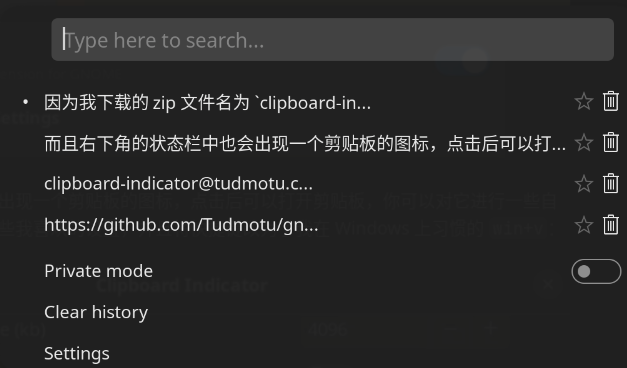
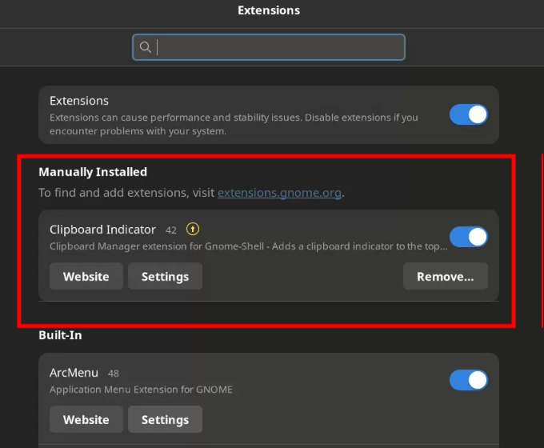
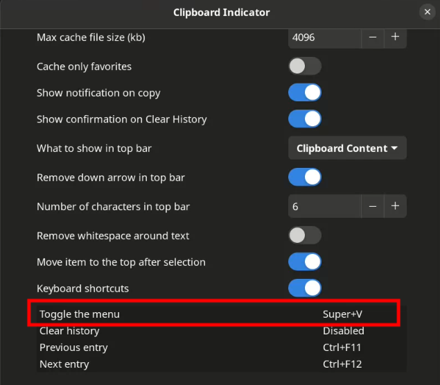

[TOC]

## 0. 为什么会有这篇文章

过去，我是一个死忠 Windows 用户，几乎不看其他系统一眼。但正如我在上一篇文章提到的，我现在开始使用 AnduinOS。对于一个只知道 Windows 的迂腐老开发来说，切换到这个“新大陆”并不是件轻松的事，尤其是当你发现，一些你曾经认为理所当然的工具突然就消失了。

例如，Windows 11 自带的剪贴板工具 —— 快捷键是 `win+v` ——在我的编码世界里是救命稻草。复制粘贴的灵魂伙伴，能帮我在不同窗口之间快速搬运多条文本。这个工具的操作方式和功能是这样的：

原本我们使用 `ctrl+c` 和 `ctrl+v` 来复制粘贴时，我们复制一条，粘贴一条。而如果我想从一个窗口中复制几条文本，然后在另一个窗口中的各个位置分别粘贴这几条文本，就做不到。如果遇到这种情况，我们只能不断切屏或者切换窗口。而 `win+v` 唤出的剪贴板工具可以在剪贴板中保存多个我通过 `ctrl+c` 复制的内容，我每复制一次，它就在剪贴板中新增一条。当我准备粘贴时，我可以通过 `win+v` 快捷键来打开剪贴板，分别将我之前复制的几条内容在我想要的地方粘贴。

但到了 AnduinOS，你可能就要怀疑人生了。找不到类似的功能，也有可能是我蠢到有这个功能却没找到。所以，我不得不自己动手，当然不是自己开发，没那个能力知道吧，是指我自己动手 Google，找到了一个能代替它的工具：clipboard-indicator。这是它的 github 地址：[https://github.com/Tudmotu/gnome-shell-extension-clipboard-indicator](https://github.com/Tudmotu/gnome-shell-extension-clipboard-indicator)。

这玩意儿是 GNOME 的扩展，而 AnduinOS 恰好使用了 GNOME，所以应该可以搭配使用。于是，我决定记录下整个安装和配置过程，毕竟在 GNOME 世界，我也只是个“新手小白”，我甚至不知道什么是 GNOME extensions，得摸索一下。

这个扩展的全名为 `clipboard-indicator@tudmotu.com`。这是它的样子：



## 1. 确认应该安装的版本

第一步当然是搞清楚你用的是什么版本的 GNOME shell。直接在终端里运行：

```bash
gnome-shell --version
```

它会吐出像这样一串字符：

```bash
GNOME Shell 42.9
```

现在我知道了，我用的 GNOME Shell 版本是 42.9。

接下来就要去 clipboard-indicator 的 GitHub 页面确认一下，看看哪个版本的扩展适合我的系统。这是我刚刚从它的 README 文件中复制出来的，目前（2024-10-01）的支持情况：

- GNOME 46 and above:
    - Use latest version
- GNOME 45:
    - v57
- GNOME 42-44
    - v47
- GNOME 40-41
    - v39
- GNOME <40
    - v37

结果很显然，我需要 v47 版本。

## 2. 下载

接下来，到 GNOME extensions 网站下载扩展：[https://extensions.gnome.org/extension/779/clipboard-indicator/](https://extensions.gnome.org/extension/779/clipboard-indicator/)。

在页面上的 Download 位置，你会看到要选择两个版本号：Shell 版本和扩展版本。在我的环境下的选择方式，你的可能会不同：

- Shell version？选 42；
- Extension version？没错，v47。

然后，就等着下载完成。我把它保存到 `~/Downloads` 目录下。

## 3. 安装与启用

下载完成后，安装的过程几乎无脑，只需要解压到 `/usr/share/gnome-shell/extensions/clipboard-indicator@tudmotu.com` 文件夹下。命令行操作很简单：

```bash
sudo unzip ~/Downloads/clipboard-indicatortudmotu.com.v47.shell-extension.zip -d ./clipboard-indicator@tudmotu.com 
```

因为我下载的 zip 文件名为 `clipboard-indicatortudmotu.com.v47.shell-extension.zip`。别忘了把文件名替换为你自己下载的版本名。

接着启用这个插件：

```bash
gnome-extensions enable clipboard-indicator@tudmotu.com
```

大功告成！现在，你可以在 AnduinOS 的扩展管理器里看到这个插件，它已经开始为你服务了：



而且右下角的状态栏中也会出现一个剪贴板的图标，点击后可以打开剪贴板，你可以对它进行一些自定义的设置。这里我做了一些我喜欢的设置，并且将快捷键改为了我在 Windows 上习惯的 `win+v`：



然后你就可以体验类似 Windows 上的剪贴板的功能了，在写代码的时候来回复制的时候会特别有用。

## 4. 使用

现在，我们终于有了一个 Windows 风格的剪贴板助手。你可以像以前一样，连续多次使用 `ctrl+c` 复制多条文本，然后通过 `win+v` 快捷键打开剪贴板，选择你要粘贴的内容，并用 `ctrl+v` 粘贴到你想要的地方。如果你复制的来源和粘贴的目的地在终端中，别忘了使用 `ctrl+shift+c` 和 `ctrl+shift+v` 快捷键，为终端中的 `ctrl+c` 和 `ctrl+v` 快捷键另有他用，否则你会陷入不必要的终端混乱中。

## 5. 总结

总而言之，这个剪贴板扩展完美解决了我在 AnduinOS 上的“生产力焦虑”。也许它不会像某些高端科技工具一样引发一场技术革命，但在我的编码生活中，它就是我掌控效率的武器。
