> 本篇博客技术相关内容翻译自 **pragimtech** 的：[How do sql indexes work](https://www.pragimtech.com/blog/sql-optimization/how-do-sql-indexes-work/)，并结合视频添加了一些原文中缺失的内容。本文中大部分图片与代码出自该文章。
> 
> 翻译水平有限，见谅。

[TOC]

## 0. 环境及软件
SQL Server

SQL Server Management Studio

## 1. 聚集索引的结构
考虑一下下面这张 Employees 表：

| 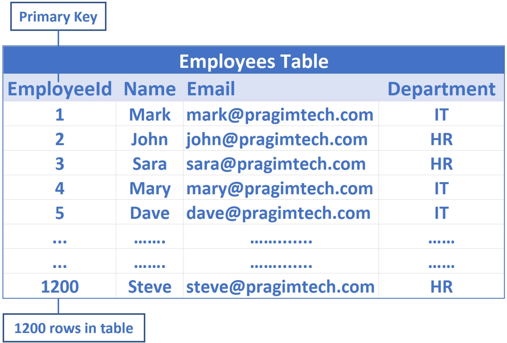 |
|:--:|
| <b>图 1 - Employees 表</b> |

`EmployeeId` 是主键，所以默认会为该列创建聚集索引（clusterd index）。这意味着 employee 数据按 `EmployeeId` 列排序，并物理存储在一系列数据页中，这些数据页位于类似树的结构中，如下所示：

| 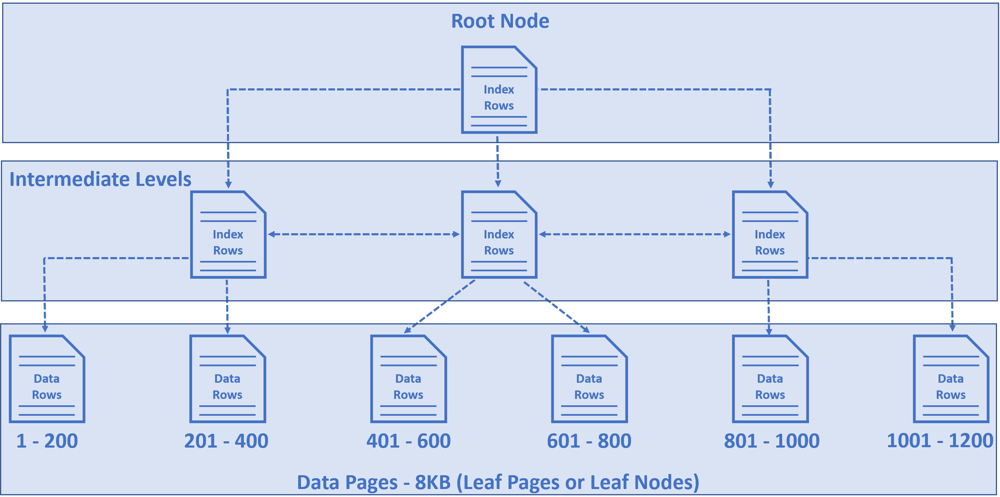 |
|:--:|
| <b>图 2 - 聚集索引的结构</b> |

- 树底部的节点们被称为数据页（data pages）或叶子节点（leaf nodes），它们包含实际的数据行（data rows），在例子中是 employee 行。
- 这些 employee 行按 `EmployeeId` 列排序，因为 `EmployeeId` 是主键，默认情况下会在该列上创建一个聚集索引。
- 在我们的例子中，假设在 Employees 表中有 1200 行，并假设每个数据页中有 200 行。
- 因此，在第一个数据页中，我们有 1 到 200 行，在第二个数据也是 201 到 400 行，在第三个是 401 到 600 行，以此类推，如上图所示。
- 位于树顶部的节点称为根节点（root node）。
- 根节点和叶节点之间的节点称为中间层（intermediate levels）。
- 根节点和中间节点包含索引行（index rows）。
- 每个索引行包含一个键（在本例中为 `EmployeeId`，从下文看，应该是一个 `EmployeeId` 的范围，例如 1-400）和一个指向 b- 树中的中间层的页或底层的叶节点中的数据行的指针。也就是每个索引行都是一个键值对。
- 因此，这个类似树的结构有一系列指针，帮助查询引擎快速找到数据。

## 2. SQL Server 是如何通过 ID 查到数据行的？
举个例子，比如说我们想查 `EmployeeId = 1120` 的数据行：

| 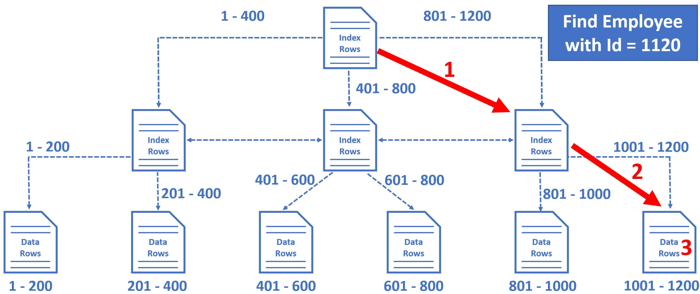 |
|:--:|
| <b>图 3 - SQL Server 通过 ID 查数据行的过程</b> |

1. 数据库引擎从根节点开始，并选择右边的索引节点，因为数据库引擎知道这个节点包含从 801 到 1200 的 `EmployeeId`（注意，中间层存的键依旧是 `EmployeeId` 的一个范围，值是指向叶节点的数据行的指针）。
2. 从这里（这个中间层的索引节点）开始，它再次选择最右边的叶节点，因为这个叶节点中存在 1001 到 1200 之间的员工数据行（注意，叶节点存储的就是数据行了，也就是图 1 那种数据行）。
3. 叶子节点中的数据行按 `EmployeeId` 排序，因此数据库引擎很容易找到 `EmployeeId = 1120` 的员工行。

注意，只需 3 步操作，SQL Server 就能找到我们要找的数据。它利用了表上的聚集索引。

让我们看看实际情况。

## 3. 使用脚本创建 Employees 表
> 注意，下面这段循环插入一百万条数据的脚本我执行了 56 分钟才完成，建议你可以改成 10 万条或者 1 万条。

```SQL
Create Table Employees
(
	Id int primary key identity,
	[Name] nvarchar(50),
	Email nvarchar(50),
	Department nvarchar(50)
)
Go

SET NOCOUNT ON
Declare @counter int = 1

While(@counter <= 1000000)
Begin
	Declare @Name nvarchar(50) = 'ABC ' + RTRIM(@counter)
	Declare @Email nvarchar(50) = 'abc' + RTRIM(@counter) + '@pragimtech.com'
	Declare @Dept nvarchar(10) = 'Dept ' + RTRIM(@counter)

	Insert into Employees values (@Name, @Email, @Dept)

	Set @counter = @counter +1

	If(@Counter%100000 = 0)
		Print RTRIM(@Counter) + ' rows inserted'
End
```

## 4. 聚集索引查找（Seek）
| 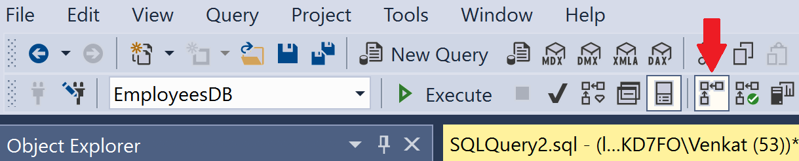 |
|:--:|
| <b>图 4 - Include Actual Execution Plan 图标</b>

在 SQL Server Management Studio 中单击"Include Actual Execution Plan(包含实际执行计划)"图标，然后执行以下查询：

```SQL
Select * from Employees where Id = 932000
```

实际的执行计划如下：

| 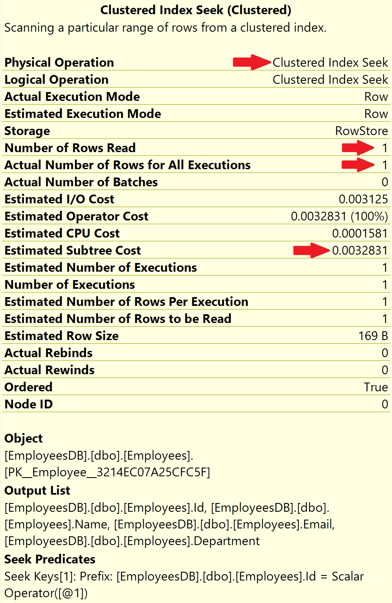 |
|:--:|
| <b>图 5 - 聚集索引查找（Seek）执行计划</b> |

注意，留意一下上图红色箭头指向的行。

该操作是 Clustered Index **Seek**（聚集索引**查找**），这意味着数据库引擎正在使用 `EmployeeId` 列上的聚集索引来查找 `EmployeeId = 932000` 的 Employee 数据行。

- 读取的行数 = 1
- 所有执行的实际行数 = 1

读取的行数，是 SQL Server 生成查询结果必须读取的行数。

在我们的示例中，`EmployeeId` 是唯一的，因此我们期望查到 1 行，它就是所有执行的实际行数。

在索引的帮助下，SQL server 能够直接读取我们想要的 1 个特定的 Employee 数据行。因此，读取的行数和所有执行的实际行数都是 1。

所以关键是，如果有数千条甚至数百万条记录，只要有索引可以帮助查询找到数据，SQL server 就可以轻松快速地找到我们要找的数据。

## 5. 聚集索引扫描（Scan）
上面介绍了聚集索引查找（Seek），这里介绍聚集索引扫描（Scan）。一听就知道扫描的速度多数情况下要比查找的速度慢，除非你要查的就是扫描的第一条或前几条。

在本例中，`EmployeeId` 列上有一个聚集索引，因此当我们根据 `EmployeeId` 进行搜索时，SQL Server 可以轻松快速地找到我们要查找的数据。如果我们通过 Employees 表的 `Name` 列进行搜索呢？目前在 `Name` 列上没有索引，所以 Sql Server 没有简单的方法来找到我们正在寻找的数据。SQL Server 必须读取表中的每一条记录，性能非常低。

打开"Include Actual Execution Plan(包含实际执行计划)"，然后执行以下查询：

```SQL
Select * from Employees Where Name = 'ABC 932000'
```

实际的执行计划如下:

| 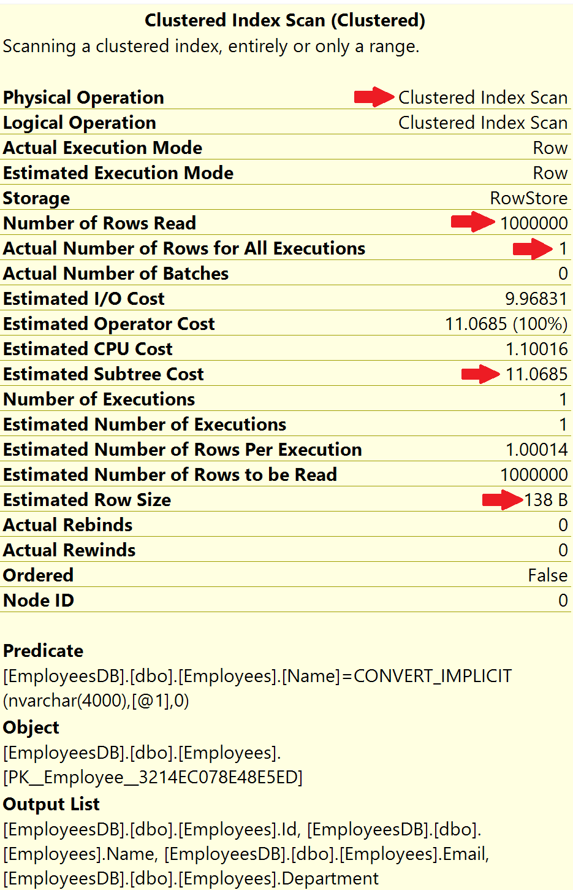 |
|:--:|
| <b>图 6 - 聚集索引扫描（Scan）执行计划</b> |

注意，该操作是聚集索引扫描（Scan）。由于没有合适的索引，数据库引擎别无选择，只能读取表中的每条记录，也就是扫描整张表。这就是为什么 Number of rows read（读取的行数）是 1 百万的原因，这个值就是表中的所有行数。

读取的行数 = 1000000
所有执行的实际行数 = 1

我们期望在结果中有多少行？只有一行，因为只有一个员工的 `Name = 'ABC 932000'`。并且因为没有索引来帮助这个查询，为了产生这 1 行作为结果，SQL Server 必须从表中读取所有这 100 万行。**这被称为索引扫描（Scan），通常，索引扫描性能不好。**

SSMS 执行计划里甚至告诉了我们优化方式：

| 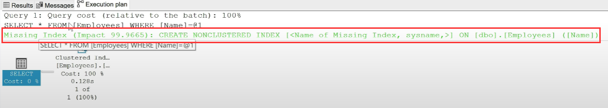 |
|:--:|
| <b>图 7 - SSMS 执行计划告诉我们的优化方式</b> |

这条语句可以让我们在 `Name` 列创建非聚集索引。

## 6. SQL Server 中的非聚集索引
这是在 `Name` 列上创建非聚集索引需要执行的 SQL 语句：

```SQL
CREATE NONCLUSTERED INDEX IX_Employees_Name
ON [dbo].[Employees] ([Name])
```

| 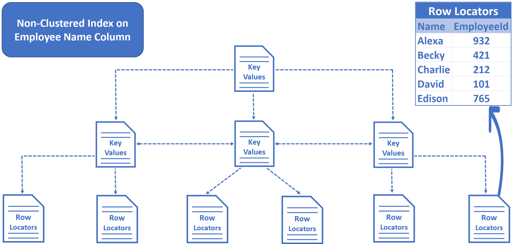 |
|:--:|
| <b>图 8 - 非聚集索引的结构</b> |

- 在非聚集索引中，没有表数据。只有键值（key values）和行定位器（row locators）。
- 我们在 `Name` 列上创建了一个非聚集索引，因此键（在本例中是 `Name`）按字母顺序排序并存储。
- 树底部的行定位器包含该行的 `Name` 和聚集键（cluster key）。在我们的示例中，`EmployeeId` 是聚集键。

再次打开“包含实际执行计划”执行以下查询：

```SQL
Select * from Employees Where Name = 'ABC 932000'
```

以下是执行计划：

| 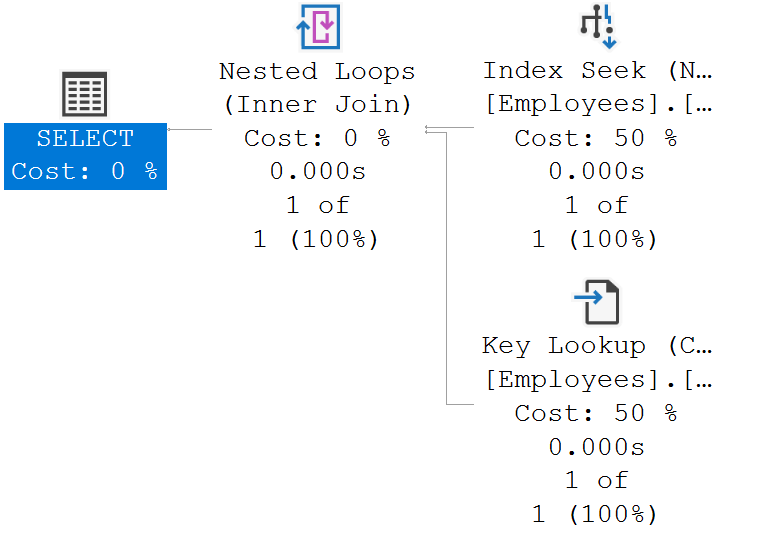 |
|:--:|
| <b>图 9 - 非聚集索引执行计划</b> |

应当从右到左，从上到下阅读 SQL Server 执行计划。等后面我们再阅读执行计划。

## 7. 非聚集和聚集索引的作用
当我们执行这个查询时：`Select * from Employees where Name='David'`

| 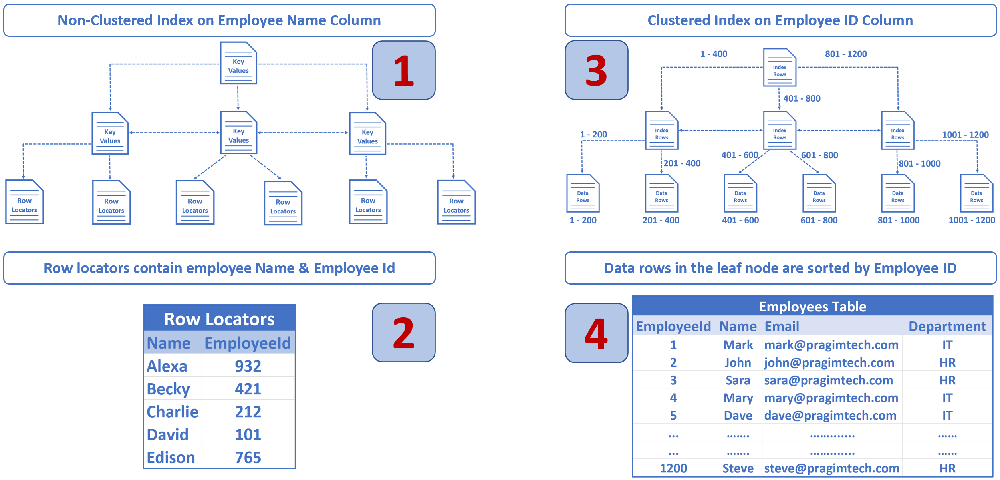 |
|:--:|
| <b>图 10 - 该查询的执行过程</b> |

- SQL Server 使用 `Name` 列上的非聚集索引在 index 中快速查找此员工条目。
- 在非聚集索引 Emplyee `Name` 中，我们在 Row Locator 中查到聚集键（在本例中是 `EmployeeId`）。
- 数据库引擎知道 `EmployeeId` 上有一个聚集索引，所以使用这个聚集索引配合我们刚从非聚集索引中查到的 `EmployeeId` 来查找相应的 employee 记录。

相当于非聚集索引的作用就是查到目标数据条目的聚集索引（本例中为 `EmployeeId`），然后再通过聚集索引查到目标数据。

注意在 `Name` 列上有和没有非聚集索引的 Estimated Subtree Cost（估计子树的成本）：

| 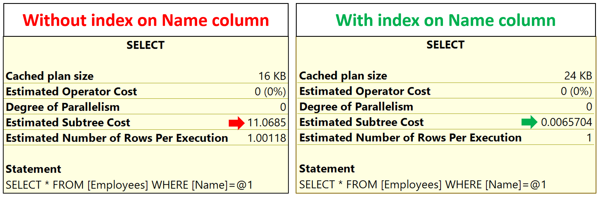 |
|:--:|
| <b>图 11 - Estimated Subtree Cost 对比</b> |

## 8. 补充：根据 `Name` 非聚集索引查询时的执行计划详解
这一段在原文中没有，是我的补充。

执行计划前面放过了，见图 9。

先看最右上的 Index Seek：

| 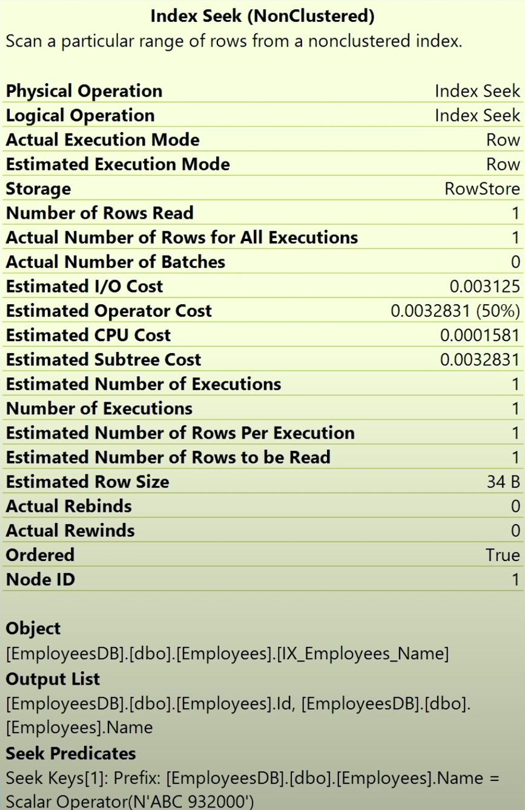 |
|:--:|
| <b>图 12 - 非聚集索引：索引查找（Index Seek）</b> |

这是通过非聚集索引查找到我们要查的 `Name`，在本例中只有 1 条数据的 `Name` 符合要求，但是在其他例子中可能会存在多个 `Name` 都符合要求。最终查到的是图 12 下方的 `Output List`，也就是 Row Locators 里的内容，也就是 `Name` 和 `EmployeeId` 的对应关系。实际上就是根据 `Name` 查询索引/聚集键（`EmployeeId`) 的过程。可能查出一个包含 `Name` 和 `EmployeeId` 的结果集来。在本例中，该结果集只有 1 条数据。

再看右下的 Key Lookup：

| 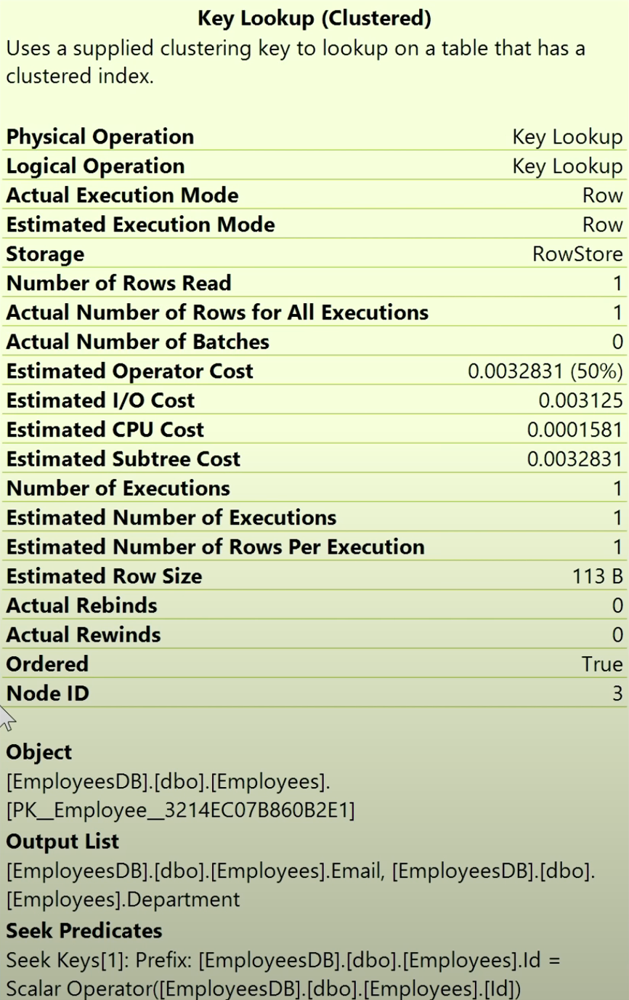 |
|:--:|
| <b>图 13 - 聚集索引：Key 查找（Key Lookup）</b> |

这里是用上面非聚集索引查出的结果集中的聚集键（`EmployeeId`) 来查 Employee 数据，看图 13 下面的 `Output List` 就知道了，这次查询出了上一个结果集的 `Email` 和 `Department` 字段。


再看左边的 Nested Loops（嵌套循环）：

| 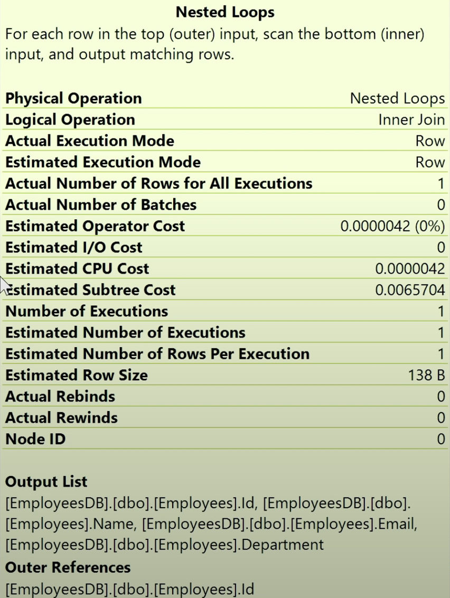 |
|:--:|
| <b>图 14 - 嵌套循环（Nested Loops）</b> |

看图 14 的第二行 `Logical Operation`，值是 `Inner Join`。再结合图最下方的 `Output List` 和 `Outer Reference` 可以判断是根据 `EmployeeId` 将前面的两个结果集 Inner Join 起来了，组成了最终的结果集。

<!-- 非聚集索引：

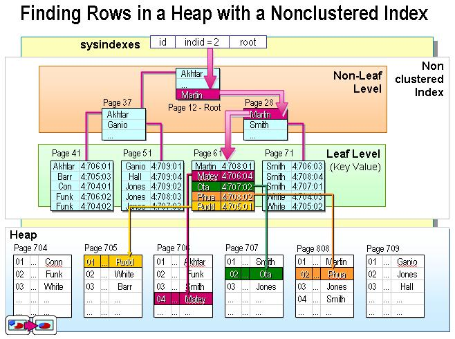

介绍非聚集索引时，原文只说了叶子节点，也就是 Row Locator 的存储结构和内容，并没有说根节点和中间节点的键值对存的是什么内容，我从网上找到了这张图。

看起来跟聚集索引一样，root 节点存了一个简单的索引表，按字母排序。键是（被排序后的）有非聚集索引列的值，值是子节点的位置。

我粗略地画了这么一个图：

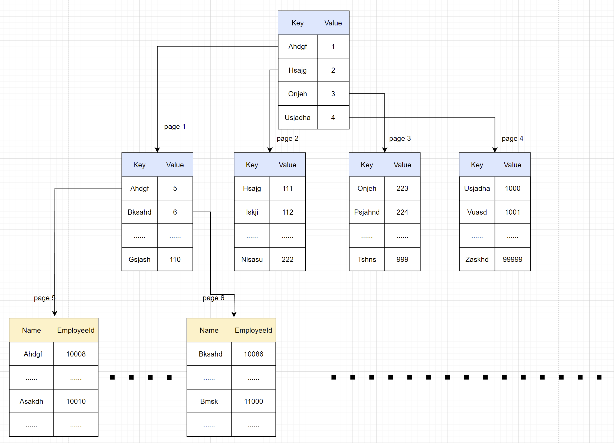

假设 Name 这列有从 A 到 Z 所有字母开头的字符串，那么非聚集索引的 root 节点可能只有 A，H，O，U 四个字母开头的字符串，共 4 条数据，而且每条都是这个字母开头的所有字符串中排序最靠前的一条，例如 A 开头的可能就是 "AAAA"，因为这样即使在全都是 A 开头的字符串的集合中排名也是靠前的。

那么上图里 root 节点中的 "Ahdgf" 实际上就代表了从 A-G 开头的所有的数据，它是个键值对，键为 "Ahdgf"，值为 1，指向第 1 页。"Hsajg" 实际上就代表了从 H-N 开头的所有数据，指向第 2 页，以此类推。相当于 root 节点有几条数据，就有几个中间节点。

然后再看第 1 页，它也无法装下从 A-G 开头的所有数据，所以它可能各存一条，例如 A 开头的它还是只存了 "Ahdgf"，但是它指向第 5 页，第 5 页就是**叶子节点，它的值就不是索引中的 Page 号了，而是 Name 为 "Ahdgf" 的这条数据的主键 Id**。
假设这里每个字母开头的字符串刚好能均匀放到每个叶子节点中，就会有 26 个叶子节点。相当于中间节点有几条数据，就会有几个叶子节点。

其中的关系靠文字不太方便描述，能看图理解就行。 -->


## 我的总结
以前不太了解数据库索引的原理，只知道索引的一些表现，例如：加了索引的列查起来就快，主键默认有索引，加了索引多占一些存储空间，插入更新数据可能变慢，但是一直不了解其中原理，以及不了解什么是聚集索引，什么是非聚集索引。

之前百度过几次中文内容的答案，但大部分朋友的博客里写得都像是上中学时背的书一样，看完了又似乎什么都没看，什么都记不住。今天看到这篇文章，感觉讲解得非常简单，且图文并茂，十分易懂，所以把部分内容翻译过来，供自己和其他跟我有相同疑惑的开发者浏览。

相信了解了聚集索引和非聚集索引的原理后，你之前了解的索引的功能和优缺点就都能解释得通了。