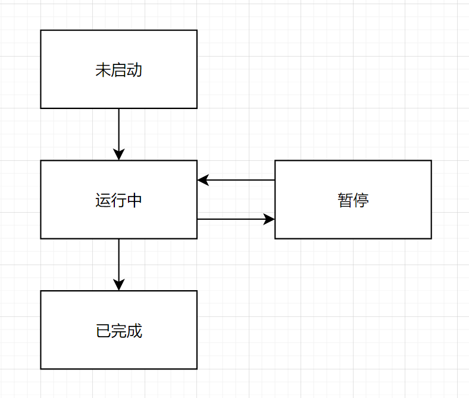
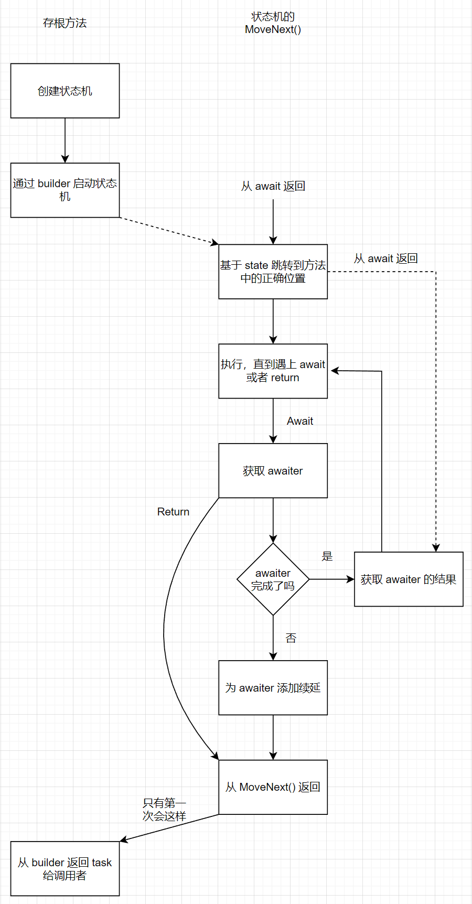

> 参考资料：*C# in Depth, Fourth Edition* - Jon Skeet

[TOC]

## 1. 通过续延简单理解异步的原理

上篇文章提到了“续延（continuation）”这个概念，通过解释它，简单解释一下异步的原理。提前说一下，原理不等于实现，实际上 C# 实现异步的方式是基于状态机的，稍微有点复杂。

```c#
public static async Task Main()
{
    var sw = Stopwatch.StartNew();
    
    Console.WriteLine("1.Main: " + Thread.CurrentThread.ManagedThreadId);

    await Task.Delay(100);

    Console.WriteLine("2.Main: " + Thread.CurrentThread.ManagedThreadId);
    
    Console.WriteLine(sw.ElapsedMilliseconds);
}
```

输出结果：

```bash
1.Main: 1
2.Main: 5
115
```

- 在执行到 `await Task.Delay(100);` 前，以同步方式执行
- 当执行到 `await Task.Delay(100);` 时，会检查是否已经得到 `Task.Delay(100);` 的执行结果，如果没有得到结果，就会创建一个**续延**，然后等待，等得到结果后，就执行该续延
- 在该例中，等待 100ms 后执行续延。续延会执行方法的剩余内容，即从 `Console.WriteLine("2.Main: " + Thread.CurrentThread.ManagedThreadId);` 继续执行

## 2. 续延（continuation）“本质上”是什么？“实际上”是什么？Task 扮演了什么角色？

**注意，这里说的是“本质上”，不是“实际上”。** 实际上 C# 实现异步的方式是用了 try-catch 和 switch-case 等。

- 续延“本质上”是个回调函数（Action 委托），异步操作执行完成后会调用这个回调函数
- 在异步方法中，续延负责维护方法的状态。就像闭包能捕获（维护）变量上下文一样，续延可以记录方法执行的位置，方便以后恢复方法的执行

续延“本质上”就是可以保存程序执行状态的回调，负责接收异步操作的结果。顺带一提，`Task.ContinueWith()` 是用来附加续延的方法。

让编译器为我们创建续延，是 `await` 关键字的作用之一。

前面说了一堆“本质上”，是为了方便理解，但可能弄巧成拙把诸位绕晕了。现在说一下“实际上”。

- **续延并没有像回调函数一样传递给异步方法**，所以并不是异步方法执行完成后调用续延，而是**异步操作发起并且返回了一个“令牌”**，这个“令牌”可被续延使用
- “令牌”通常就是 `Task` 或 `Task<T>` 类型的对象，即异步方法返回的对象。但并不强制必须是它们，异步方法也可以返回其它类型或 void
- “令牌”代表正在执行的操作，它可能在返回给调用方之前就执行完了，也可能还在执行，也可能被取消了。它的状态（Status）是 `Task.Status` 属性
- “令牌”用于通知调用方在该操作完成之前不能进行后续的处理操作

## 3. 异步的流程

扯到这里，就可以简单说一下异步的流程了：

1. 执行某个方法，例如 `Main()`
2. 一直执行到一个异步方法，启动这个异步方法，异步方法会立刻返回一个令牌，拿到这个令牌
3. 执行一些其它的同步或异步的操作，也可以什么都不做
4. 通过“令牌”等待异步操作完成（await）
5. 执行其它操作，包括异步操作的后续操作，即续延中的操作

在（1. 通过续延简单理解异步的原理）开头那段示例代码中，实际上就是在第 4 步卡 100ms，await 语句通过 `Task.Delay(100)` 这个异步方法返回的“令牌” Task 来等待异步操作完成。

示例代码可能不太明显，像下面这样写就很明显了，这里的 `Task t` 就是异步操作返回的“令牌”：

```c#
public static async Task Main()
{
    Console.WriteLine("1.Main: " + Thread.CurrentThread.ManagedThreadId);
    
    Task t = Task.Delay(100);
    
    await t;
    
    Console.WriteLine("2.Main: " + Thread.CurrentThread.ManagedThreadId);
}
```

你完全可以在 `Task t = Task.Delay(100);`语句和 `await t;` 语句之间插入一些其它的代码，相当于你点外卖，叫了一份黄焖鸡米饭，然后去做别的事了，等其它事情做完，而且饭送到之后（假设骑手可以等你做完其它事再开门取餐），再回来处理黄焖鸡米饭送到之后的续延，比如坐到桌前吃饭。

如果直接 `await Task.Delay(100);` 或者 `Task.Delay(100).Wait();`，就会一直等待 Delay 100ms 之后才继续往下执行。就相当于你叫了份黄焖鸡米饭，然后你坐等骑手来送餐，期间什么都不做。

## 4. 等待异步方法（await）为什么能够不阻塞线程？

**因为正在被调用的异步方法遇到 await 后立刻返回了（令牌）。** 对调用方来说相当于调用异步方法的这行代码立刻执行完了。

异步方法**立即返回**一个令牌，之后异步方法继续执行着，调用方拿着异步操作返回的“令牌”，就能知道异步操作何时能完成，然后做出自己接下来要执行操作还是要等待等选择。

## 5. 异步实际上的原理

从逻辑上理解很简单，但实际上编译器做了很多很难理解的事。我在以前就尝试过反编译异步代码来看看它到底整了啥活，但是只看到一堆 switch-case 和 goto。

比如看这段代码：

```c#
static async Task PrintAndWait(TimeSpan delay)
{
    Console.WriteLine("Before first delay");
    await Task.Delay(delay);
    Console.WriteLine("Between delays");
    await Task.Delay(delay);
    Console.WriteLine("After second delay");
}

static void Main()
{
    PrintAndWait(TimeSpan.FromSeconds(1)).Wait();
}
```

这段代码来自 *C# in Depth, Fourth Edition*，书的作者大慈大悲地把编译器生成的代码翻译成了人话，让我们能看懂，至少能看懂变量名和方法名。下面我们来看编译器生成的代码，一些给我们理解代码造成障碍的 Attribute 我已经删掉了。

## 6. 状态机

异步实现的原理基于状态机。

### 状态机的状态

状态当然是状态机最重要的部分，毕竟它就叫“状态”机。

||
|:--:|
|<b>图 1 - 状态机的状态</b>|

可以分为这 4 种状态。但异步方法中每个 await 表达式是单独的暂停状态，即可能有多个暂停状态，每次 await 表达式返回后都会触发后续代码的执行。每次状态机需要暂停的时候就记录下状态，为了将来能从当前执行位置恢复执行。现在听起来很抽象，后面我们一起看看代码就知道了。

state 是 int 类型，它有以下几种可能：
- -1：尚未启动/正在执行
- -2：执行完成/执行出错
- 其他值：正在某个 await 表达式处暂停

为什么“尚未启动”和“正在执行”状态用同一个值表示？后面讲完状态机我再解释。

为什么“执行完成”和“执行出错”状态用同一个值表示？因为对与状态机来说，这两种情况都属于执行完了，再没它什么事了。

### 状态机结构体

编译器会生成一个 private 的结构体 `PrintAndWaitStateMachine` 代表异步方法：

```c#
private struct PrintAndWaitStateMachine : IAsyncStateMachine
{
    public int state; // 状态机的状态（需要恢复的位置）
    public AsyncTaskMethodBuilder builder; // 通用异步基础架构类型关联的 builder
    private TaskAwaiter awaiter; // 当恢复执行时用于获取结果的 awaiter
    public TimeSpan delay; // 原始方法参数

    // 状态机主要的工作代码
    void IAsyncStateMachine.MoveNext()
    {
        // 暂时省略......
    }
    
    void IAsyncStateMachine.SetStateMachine(IAsyncStateMachine stateMachine)
    {
        this.builder.SetStateMachine(stateMachine); // 连接 builder 和装箱后的状态机
    }
}
```

**由于我们是基于发布的构建，所以编译器生成的是结构体。如果我们基于调试构建，编译器会生成一个 class。两者主要是性能上的区别。**

在分析状态机结构体之前，我们先看一下负责创建状态机对象的存根方法。

### 存根方法（stub method）

```c#
private static unsafe Task PrintAndWait(TimeSpan delay)
{
    // 初始化状态机
    var machine = new PrintAndWaitStateMachine
    {
        delay = delay,
        builder = AsyncTaskMethodBuilder.Create(),
        state = -1
    };

    // 运行状态机，直到它需要等待时
    machine.builder.Start(ref machine);

    // 返回代表异步操作的 Task
    return machine.builder.Task;            
}
```

- `delay` 本是 `PrintAndWait(TimeSpan delay)` 方法的形参，被编译成状态机结构体的一个字段
- `builder` 取决于 async 方法返回类型。可以使用 builder 来生成成功信息或失败信息，处理 await 等，它可理解为 helper
- `state` 初始状态为 -1

异步实现的原理基于状态机。编译器会生成一个 private 的嵌套结构体 `PrintAndWaitStateMachine` 代表异步方法，也就需要一个存根方法 `PrintAndWait()` 来构建结构体对象。该存根方法与原方法同名，它是一切的开始。

通过观察存根方法的代码，分析一下它做的事：

1. 初始化状态机，得到一个状态机对象
2. 调用状态机的 builder 的 `Start()` 方法来启动状态机，同时把状态机对象本身作为参数传给它（引用传递，为了保证 state 等字段一致）
3. 返回 builder 的 Task，这就是我们前面说过的“异步方法立即返回”的那一刻。

这样在运行 `Start()` 方法的过程中，状态机 machine 的 state 的变化就会直接反映在 machine 这个对象上，我们不需要让 Start 返回什么值，我们只需要取 machine 的值就知道 Start 执行到什么情况了。

前面我们状态机结构体代码中有一个最重要的 `MoveNext()` 方法。状态机 start 之后不会创建新线程，只是执行 `MoveNext()` 方法，执行到状态机 await 另一个异步方法或者状态机停止为止。不管是哪种，`MoveNext()` 都会返回，存根方法中调用的 `Start()` 也会返回。这样就可以把 Task 作为整个异步方法的结果返回给调用方。

### 状态机的结构

这里我重新贴一下状态机的代码：

```c#
private struct PrintAndWaitStateMachine : IAsyncStateMachine
{
    public int state; // 状态机的状态（需要恢复的位置）
    public AsyncTaskMethodBuilder builder; // 通用异步基础架构类型关联的 builder
    private TaskAwaiter awaiter; // 当恢复执行时用于获取结果的 awaiter
    public TimeSpan delay; // 原始方法参数

    // 状态机主要的工作代码
    void IAsyncStateMachine.MoveNext()
    {
        // 暂时省略......
    }
    
    void IAsyncStateMachine.SetStateMachine(IAsyncStateMachine stateMachine)
    {
        this.builder.SetStateMachine(stateMachine); // 连接 builder 和装箱后的状态机
    }
}
```

- 实现了 `IAsyncStateMachine` 接口，该接口有 `MoveNext()` 和 `SetStateMachine(IAsyncStateMachine stateMachine)` 方法
- 各字段保存了状态机步进时需要的信息
- 状态机启动时以及从“暂停状态”恢复到“运行状态”后会调用 `MoveNext()`

在完成一些内部事务之后，`Start()` 方法会调用 `MoveNext()` 方法来迈出异步方法的第一步。

结构体中还有几个字段，如前面讲过的 `state` 等。状态机从某个暂停状态恢复时可能会取这些字段的值。

简单说一下 `awaiter` 这个字段。任何特定的状态机一次只能 await 一个值，所以每个泛型 Task 一次只能有一个与这个泛型相关的 awaiter。例如我们有一个 async 方法，里面一共有 6 个 await 语句，其中有两个是 await `Task<int>` 类型的返回，一个 `await Task<string>`，三个 `await Task`，那么就会编译成 3 个 awaiter 字段，他们的类型分别是：`TaskAwaiter<int>`，`TaskAwaiter<string>`，`TaskAwaiter`。在这 6 次 await 时会复用这三个字段。

### `MoveNext()`

现在来看一下最重要的 `MoveNext()` 方法。

为了防止忘记，先放一下原方法的代码：

```c#
static async Task PrintAndWait(TimeSpan delay)
{
    Console.WriteLine("Before first delay");
    await Task.Delay(delay);
    Console.WriteLine("Between delays");
    await Task.Delay(delay);
    Console.WriteLine("After second delay");
}
```

然后看一下 `MoveNext()` 的代码：

```c#
void IAsyncStateMachine.MoveNext()
{
    int num = this.state;
    try
    {
        TaskAwaiter awaiter1;
        switch (num)
        {
            default:
                goto MethodStart;
            // case 的数量与 await 表达式的数量相等
            case 0:
                goto FirstAwaitContinuation;
            case 1:
                goto SecondAwaitContinuation;
        }
    MethodStart:
        Console.WriteLine("Before first delay"); // 第一个 await 表达式之前的代码
        awaiter1 = Task.Delay(this.delay).GetAwaiter();
        if (awaiter1.IsCompleted)
        {
            goto GetFirstAwaitResult;
        }
        this.state = num = 0; // 设置状态机状态
        this.awaiter = awaiter1; // 设置第一个 awaiter
        this.builder.AwaitUnsafeOnCompleted(ref awaiter1, ref this);
        return;
    FirstAwaitContinuation: // 从续延中恢复执行的代码
        awaiter1 = this.awaiter;
        this.awaiter = default(TaskAwaiter);
        this.state = num = -1;
    GetFirstAwaitResult: // 快速路径和慢速路径汇合处
        awaiter1.GetResult();
    // 👇 剩余代码，包括更多的标签以及 awaiter 等
        Console.WriteLine("Between delays");
        TaskAwaiter awaiter2 = Task.Delay(this.delay).GetAwaiter();
        if (awaiter2.IsCompleted)
        {
            goto GetSecondAwaitResult;
        }
        this.state = num = 1;
        this.awaiter = awaiter2;
        this.builder.AwaitUnsafeOnCompleted(ref awaiter2, ref this);
        return;
    SecondAwaitContinuation:
        awaiter2 = this.awaiter;
        this.awaiter = default(TaskAwaiter);
        this.state = num = -1;
    GetSecondAwaitResult:
        awaiter2.GetResult();
        Console.WriteLine("After second delay");
    }
    catch (Exception exception)
    {
        // 执行出错
        this.state = -2;
        this.builder.SetException(exception); // 通过 builder 填充异常信息
        return;
    }
    // 正常执行完成
    this.state = -2;
    this.builder.SetResult(); // 通过 builder 填充方法完成的信息
}
```

过一遍代码，估计有的朋友就看懂了这异步是怎么实现的了。

1. **`MoveNext()` 方法会在 async 方法第一次调用时被调用，然后每次恢复执行时都被调用一次。**
2. 在 await 表达式时，有两种可能，await 的异步操作尚未完成，或者已经完成。例如上面代码中：
```c#
MethodStart:
    Console.WriteLine("Before first delay");
    awaiter1 = Task.Delay(this.delay).GetAwaiter();
    // 两种可能
    if (awaiter1.IsCompleted)
    {
        goto GetFirstAwaitResult;
    }
    this.state = num = 0;
    this.awaiter = awaiter1;
    this.builder.AwaitUnsafeOnCompleted(ref awaiter1, ref this);
    return;
FirstAwaitContinuation:
    // ......
GetFirstAwaitResult:
    awaiter1.GetResult();
    Console.WriteLine("Between delays");
    // ......
```
如果 `awaiter1` 等待的异步操作已经完成，即 `awaiter1.IsCompleted == true`，就会直接运行 `goto GetFirstAwaitResult;`，也就是直接运行下面的 `GetFirstAwaitResult:` 代码块。这被称为**快速路径（fast path）**。

如果并未完成，即 `awaiter1.IsCompleted == false`，就会继续往下走，状态机进入暂停状态，状态机的 state 字段被置为 0，awaiter 字段被置为还在等的 awaiter1，最后 return。一直等到状态机恢复执行时，`MoveNext()` 方法再次被调用，进入 switch-case 语句：
```c#
switch (num)
{
    default:
        goto MethodStart;
    case 0:
        goto FirstAwaitContinuation;
    case 1:
        goto SecondAwaitContinuation;
}
```

因为 num 取的 state 的值，也就是 0，所以直接 `goto FirstAwaitContinuation;`，代码走进了 FirstAwait 的**续延（最开始提到的续延概念）**，也就是代码走进了 `FirstAwaitContinuation:` 代码块：
```c#
FirstAwaitContinuation:
    awaiter1 = this.awaiter;
    this.awaiter = default(TaskAwaiter);
    this.state = num = -1;
GetFirstAwaitResult:
    awaiter1.GetResult();
    Console.WriteLine("Between delays");
    // ......
```
`FirstAwaitContinuation:` 代码块就赋值一下变量，调整一下状态到 -1（尚未启动/正在执行），就是做了一些状态机恢复运行后的准备操作，然后就又走进了 `GetFirstAwaitResult:` 代码块。跟**快速路径**交汇。这叫做**慢速路径（slow path）**。

如果我们 Delay 的一直是 0ms，或者 await 的一直都是已经完成的异步操作，就会一直走快速路径，`MoveNext()` 方法从头到尾就只会被调用一次。

看到这里，相信大家都可以读懂上面代码的执行过程了，也就看懂了状态机，也就知道了 C# 异步的实现。

总结一下最重要的 `MoveNext()` 方法，该方法的工作：
1. 从正确的位置开始执行（起始位置或中间位置，均能正确执行）
2. 即将暂停时保存状态（为状态机结构体对象的 state，awaiter 以及其它变量赋值）
3. 需要暂停时安排一个续延（为 state 赋值即安排续延，因为 `MoveNext()` 被重新调用后会根据 state 的值选择接下来要运行的代码块，也就是续延）
4. 从 awaiter 获得返回值（上例中没有 await 语句返回值，只有苍白的 `awaiter2.GetResult();` 这种语句，没明确体现出来，不过不影响我们理解异步的实现）
5. 通过 builder 生成异常。catch 住异常后执行了这些代码：
   ```c#
   this.state = -2;
   this.builder.SetException(exception); // 通过 builder 填充异常信息
   return; // 直接 return，并没有 throw
   ```
   只是通过 builder 来 Set 了异常，然后就 return 了，并没有重新 throw 出异常（只有 StackOverflowException 或 ThreadAbortException 等特殊异常才会直接被抛出去）
6. 通过 builder 生成返回值或完成方法

到现在，C# 异步的实现部分已经基本扯完了。看到这里前面留下的问题：为什么“尚未启动”和“正在执行”状态用同一个值表示？也已经有答案了。因为正常情况下 `MoveNext()` 只会在状态机刚启动或者恢复执行的时候被调用，所以“尚未启动”和“正在执行”可以用同一个状态码表示。

### 异步方法的流程图

最后我把 *C# in Depth, Fourth Edition* 里的异步方法的流程图搞过来了：

||
|:--:|
|<b>图 2 - MoveNext 方法流程图</b>|

调用 `SetStateMachine()` 方法以及 try-catch 没有放到流程图中，但不影响理解。

## 总结

知道了 C# 如何实现异步之后，我们就能彻底整明白 `await` 这种看起来很简单实际上很复杂的表达式到底做了什么了。后面有时间的话我再写一下。
