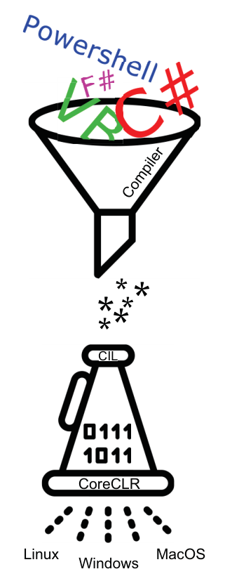

[TOC]

## 0. 为什么会有这篇博客

在编写代码或读其他开发者的代码时，如果不知道这段代码做了什么，我会感觉心里有点没底。同样，在编写基于 dotnet 的代码时，如果不知道它是如何编译的，也会感觉写起来不够放心。所以今天搜集资料学习了一下它的编译过程，特别是 code like a pro in c# 这本书中简单清晰地描述了这个过程，有条件的建议直接看一下这本书。我个人觉得它名过其实，但确实能学到一些成为 pro 所必须的东西。dotnet 平台的语言很多，本篇以 C# 举例。

## 1. C# 的编译过程概览

||
|:--:|
|<b>图 1 - C# 编译过程</b>|

dotnet 采用了**静态编译和即时编译（Just-in-time compile，简称JIT）编译结合**的方式将 C# 代码编译为机器码：
1. 开发者编写代码后编译代码，编译的结果是存储在可执行文件（32 位是 PE，64 位是 PE+）中的公共中间语言（Common Intermadiate Language，简称 CIL），如 Windows 的 .exe 和 .dll 文件，这些文件被分发给用户或部署到服务器上。
2. 当运行 dotnet 程序时，操作系统调用公共语言运行时（Common Language Runtime，简称 CLR）。CLR 将 CIL 进行 JIT 编译，编译为运行该代码的平台的机器码（Native code）。这使得能够静态编译为 CLI 的语言可以在很多平台和编译器类型上运行。但是使用虚拟机和 JIT 编译器来运行代码会导致性能不够好。

其他的采用纯**静态编译**的语言编写的程序在执行时有性能优势，因为不需要等待运行时（runtime）来编译代码。

静态编译和 JIT 编译是两种常用的代码编译方式。C# 结合使用了静态编译和 JIT 编译。静态编译会提前编译所有的源代码，代码在最后时刻被编译成字节码。

## 2. 本文提到的 dotnet 各部分的简称

|简称|全称|描述|
|--|--|--|
|CLR|Common Language Runtime，公共语言运行时|dotnet 虚拟机运行时。CLR 管理一些关键的事情，如代码执行、垃圾收集、线程和内存分配|
|CLI|Common Language Infrastructure，通用语言基础架构|描述 dotnet 生态系统中可执行代码是什么样子，以及应该如何执行的规范|
|CIL|Common Intermediate Language，公共中间语言|一种可以通过 CLR JIT 编译来执行的兼容 CLI 的语言，它是 C# 在第一个编译阶段的结果|
|IL|Intermediate Language，中间语言|CIL的另一个术语|
|MSIL|Microsoft Intermediate Language，微软中间语言|CIL的另一个术语|

为了方便，后文中将使用简称。

CLI 描述了 dotnet 的基础架构，dotnet core 3.1，dotnet 6，Mono 等都是 CLI 的实现，它为语言提供了形成它们的类型系统（type system）等的规范。

这里的 CLI 不是命令行接口（command-line interface）。

## 3. 第一步：C# code

现在我们解释的是图 1 的这一部分：

||
|:--:|
|<b>图 2 - C# code，静态编译阶段</b>|

以勾股定理举例，我们小学的时候通常用勾股定理求直角三角形斜边的长度，它等于直角三角形邻接两条边长度的平方根。公式：a^2 + b^2 = c^2。

```c#
public static double GouGu(double length1, double length2)
{
    double squareLength3 = length1 * length1 + length2 * length2;
    return squareLength3;
}
```

该方法返回直角三角形斜边的平方的值。

可以使用 `dotnet build` 命令编译这个程序。运行这行命令之后，编译器就开始运行：

1. 编译器通过 NuGet 包管理器 restore 所有该项目依赖的包。
2. 命令行工具编译这个 project，将编译的结果保存在一个叫 bin 的文件夹中。
3. bin 中可能有两个文件夹：debug 和 release。编译结果存储在哪个文件夹中取决于我们设置的编译模式。默认是 debug 模式。

debug 模式包含所有存储在 .pdb 文件中的调试信息。debug 和 release 模式编译后的代码主要区别在于性能和安全。

debug 模式编译的输出代码中包含对 .pdb 文件的引用，相当于运行时必须走更多的代码来执行相同的逻辑，而没有这些引用的 release 模式则不需要这么做。因此与 release 相比，debug 模式编译的中间语言更大，需要更长时间。

如果你发布了用 debug 模式编译的代码，黑客就可以轻易利用这些信息来了解你的代码库。当然 release 模式编译的代码也没那么安全，反编译中间语言非常简单。如果你想保护你的源代码，可以看看混淆器。

进行完第一步，我们的 C# 高级代码已经编译成了可执行文件中的中间语言代码了。

## 4. 第二步：Common Intermediate Language（CIL，程序集层/汇编层）

这一层英文叫 Assembly level，Assembly 可以翻译为程序集或汇编，而且它们似乎跟这一层都有点关系，我也不知道该怎么翻译。

CIL 也常被称为中间语言 IL。IL 也不能直接被操作系统运行。所以我们接下来要解释的是这部分：

||
|:--:|
|<b>图 3 - IL，JIT 编译阶段</b>|

**CLR 可以将 IL 编译为 Native code。CLR 就是我们常说的 dotnet 的运行时（runtime），相当于 Java 的 JVM（Java Virtual Machine）。** dotnet core 出现后，CoreCLR 在取代旧的 CLR，我们这里为了方便，都叫 CLR。

任何使用 CLI 的实现（例如 dotnet 6）编写的代码都可以编译为 CIL，也就是说 F#，C#，VB，PowerShell 等语言编写的程序都可以编译为 IL。CLR 只看 IL，只要给它的是 IL 就行，dotnet 编译器又可以将任何兼容 CLI 的语言编译为 IL，这也就允许了 C# 代码调用 F# 类库这种操作。

我们看一下刚才写的勾股定理方法的 IL：

```c#
.method public hidebysig static float64
  GouGu(
    float64 length1,
    float64 length2
  ) cil managed
{
  .maxstack 3
  .locals init (
    [0] float64 squareLength3,
    [1] float64 V_1
  )
  // [6 5 - 6 6]
  IL_0000: nop
  // [7 9 - 7 70]
  IL_0001: ldarg.0      // length1
  IL_0002: ldarg.0      // length1
  IL_0003: mul
  IL_0004: ldarg.1      // length2
  IL_0005: ldarg.1      // length2
  IL_0006: mul
  IL_0007: add
  IL_0008: stloc.0      // squareLength3
  // [9 9 - 9 30]
  IL_0009: ldloc.0      // squareLength3
  IL_000a: stloc.1      // V_1
  IL_000b: br.s         IL_000d
  // [10 5 - 10 6]
  IL_000d: ldloc.1      // V_1
  IL_000e: ret
} // end of method GouGuTheorem::GouGu
```

如果你学过汇编语言，可能会觉得这个东西看起来很亲切。在你的电脑上编译出的 IL 可能跟我的不一样，特别是 ldarg 操作码，但这无关紧要。

### IL 的方法声明

我们现在学习一下如何阅读 IL，首先看方法声明的部分：

```c#
.method public hidebysig static float64
  GouGu(
    float64 length1,
    float64 length2
  ) cil managed
```

可以读出：这是一个 method，它的访问限制等级是 public，它是 static 方法，返回值类型是 float64（即 double），方法名是 GouGu，它有两 float64 类型的参数 length1 和 length2。

hidebysig 即 hide by signature 告诉我们这个方法隐藏了有相同方法签名的其他方法。如果没有这个关键字，这个方法会隐藏有相同方法名的其他方法，而不是相同方法签名的其他方法。

cil managed 表示这代码是 CIL，而且我们运行在 managed 模式。另一种模式是 unmanaged 模式，这涉及到 CLR 是否可以执行该方法，是否可能有手动内存处理，以及是否有 CLR 需要的所有元数据。默认情况下，所有代码都在 managed 模式下运行，除非用 unsafe 关键字标志来显式地告诉 CLR。

### IL 的方法内容

可以把方法分为两部分：设置部分和执行部分。先看一下设置部分：

```c#
.maxstack 3
.locals init (
  [0] float64 squareLength3,
  [1] float64 V_1
)
```

`.maxstack 3` 告诉我们，在执行期间，允许在内存栈上的最大元素数量是 3。静态编译自动生成这个数字，告诉 CLR JIT 编译器有多少元素需要去保存。如果不这样做，CLR 根本不知道应该预留多少内存。

`.locals init (…)`

声明变量时，编译器会在编译时为变量赋值一个作用域，并将变量的值初始化为默认值。`locals` 关键字告诉我们，在此代码块中声明的变量的作用域是局部作用域，即作用于方法，而不是类。`init` 表示将声明的变量初始化为默认值。编译器根据变量是引用类型还是值类型，将其赋值为 null 或对应的零值。

IL 声明了两个局部变量 `squaredLength3` 和 `V_1`，并将它们初始化为零值。问题是我们这个函数中只有一个局部作用域变量 `squaredLength3`，那 `V_1` 是干啥的？

回头看一下 `GouGu()` 的 C# 代码，我们 return 了 `squaredLength3`，是 return 的值，而不是引用，这意味着在底层有一个新的变量被声明、初始化并赋值为 squaredLength3。它就是 V_1。

再看一下方法的执行部分，也就是逻辑部分：

```c#
// [6 5 - 6 6]
IL_0000: nop
// [7 9 - 7 70]
IL_0001: ldarg.0      // length1
IL_0002: ldarg.0      // length1
IL_0003: mul
IL_0004: ldarg.1      // length2
IL_0005: ldarg.1      // length2
IL_0006: mul
IL_0007: add
IL_0008: stloc.0      // squareLength3
```

第一个操作码（英文是 opcodes）是 `nop`，学过汇编语言的朋友应该认识，它就是什么都不干的意思。nop 在 IL 和汇编代码中用得很多，用来支持断点调试。与 debug 模式编译生成的 .pdb 文件一起，CLR可以在 nop 操作时注入指令来停止程序的执行。这允许我们在调试的时候单步执行代码。

紧跟着的是连续两个 `ldarg.0`（load argument），表示加载两个 `length1` 到栈上。因为我们在 C# 中的代码是 `length1 * length1`，所以要加载两次。

然后是 `IL_0003: mul`，mul 是 multiply 的简写。我们把第一个数学求值的两个参数加载到栈上之后，就调用了乘操作。结果是 IL_0001 和 IL_0002 加载的两个参数被乘了，然后存储到堆栈上的一个新元素中。垃圾收集器现在从栈中清除以前的元素，当然，是现在不再使用的元素。

`IL_0004`，`IL_0005`，`IL_0006` 是 `length2 * length2` 的过程。不再细说。

此时，我们的栈上有两个元素，它们的值是 length1^2 和 length2^2，接下来我们需要将这个两个值加起来，并赋值给 squareLength3：

```c#
IL_0007: add
IL_0008: stloc.0      // squareLength3
```

这两个操作码完成了这步操作。`add` 跟 `mul` 相似，将两个值加起来，结果存储到栈上。IL 获取该元素并通过 `stloc.0`（store location 还是 store local，我也不清楚）操作码将其存储到我们在设置时初始化的 squaredLength3 变量中。`stloc.0` 操作从栈中取出一个值，并将其存储在索引 0 上的变量中。为了防止你忘了，前面我们初始化的代码是这样的：`[0] float64 squareLength3`。

接下来我们还需要 return 返回值：

```c#
// [9 9 - 9 30]
IL_0009: ldloc.0      // squareLength3
IL_000a: stloc.1      // V_1
IL_000b: br.s         IL_000d
// [10 5 - 10 6]
IL_000d: ldloc.1      // V_1
IL_000e: ret
```

`ldloc.0` 将内存中存储在 0 位置的值加载，也就是 squareLength3 的值。因为我们用值传递而不是引用传递，所以我们创建了一个 squareLength3 的拷贝来 return 到函数外。最开始初始化的 `V_1`：`[1] float64 V_1` 就派上用场了。我们将取到的值通过 `stloc.1` 来存到索引位置 1 上，也就是 `V_1`。

接下来的操作码是 `br.s         IL_000d`，这是一个分支操作符，表示计算并存储返回值以供返回。IL 使用分支操作符进行调试，它就跟 `nop` 差不多，当调用 return 语句时，代码的所有不同分支（带有其他返回值的条件）都跳转到 `br.s` 操作符。

一个操作码通常占用一个字节，`br.s` 操作码占用两个字节，因此有两个 IL 位置：`IL_000b` 和 `IL_000c`。因为它占用两个字节，所以 `IL_000c`（IL 中没有直接给出）被包含在 `br.s` 的两个 IL 位置之间（注意它的两个 IL 位置是以 b 和 d 结尾，c 当然在 b 和 d 中间），这允许调试器如果必要的话，可以在加载存储的返回值时停止执行，并对其进行操作。

最后我们通过 `ldloc.1` 加载存储在 1 位置的 `V_1`，然后通过 `ret` 返回。

## 5. 第三步：Native code（机器码，处理器层）

||
|:--:|
|<b>图 4 - Native code，JIT 阶段</b>|

编译过程的最后一步是从 CIL 到 Native code 的转换。在这之前，代码都是静态编译的，但是这里发生了变化。当 dotnet 6 执行一个应用程序，CLR 启动并扫描可执行文件中的 IL 代码。然后 CLR 在运行时调用 JIT 编译器将 IL 转换为 Native code。

Native code 是人类可读的最低级别代码。处理器可以直接执行这些代码。

JIT 编译看起来有额外的性能开销，但也意味着我们可以在 CLR 和编译器支持的任何平台上执行基于 dotnet 的代码。

也因为有 JIT 的存在，直接查看 Native code 非常困难，我们就不看了，也看不懂。如果你有兴趣，可以用一个叫 ngen 的命令行工具。

## 总结

到这里，C# 编译过程就讲完了，这里放一个 code like a pro in c# 中的图来形象的描述这个过程：

||
|:--:|
|<b>图 5 - C# 代码编译过程</b>|

我们同时学会了基本的 IL 怎么读。这似乎没什么用，但有时候想对比两个能达成相同结果的操作的性能和开销时，可能需要读一下它们的 IL 来判断。