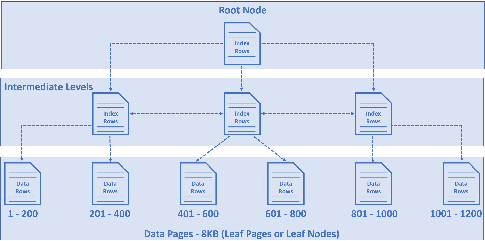

> 本篇博客技术相关内容翻译自 **pragimtech** 的：[How is data stored in sql database](https://www.pragimtech.com/blog/sql-optimization/how-is-data-stored-in-sql-database/)，本文中大部分图片与代码出自该文章。
> 
> 翻译水平有限，见谅。

[TOC]

## 0. 前言
作为开发者，数据库相关的知识十分重要，特别是当你想要排除故障并修复性能不好的 SQL 查询时。理解以下这些术语是非常重要的，特别是当你正在进行 Sql Server 性能调优相关的操作时。

1. Data pages（数据页）
2. Root node（根节点）
3. Leaf nodes（叶节点）
4. B-tree（B 树）
5. Clustered index structure（聚集索引结构）

## 1. 数据是在物理上是如何存储在 SQL Server 中的？
表中的数据在**逻辑上**以行和列的格式存储，但在**物理上**，它以 Data pages（数据页）的形式存储。

数据页是 SQL Server 中数据存储的基本单位，每个数据页的大小为 8KB。当我们将任何数据插入到 SQL Server 数据库表中时，它将该数据保存到一系列 8KB 的数据页中。

|  |
|:--:|
| <b>图 1 - 一系列 8KB 的数据页</b> |

## 2. SQL Server 中的数据存储在一个树状结构中
SQL Server 中的表数据实际上存储在一个类似树的结构中。让我们通过一个简单的例子来理解这一点。考虑下面的 Employees 表：

|  |
|:--:|
| <b>图 2 - Employees 表</b> |

- `EmployeeId` 是主键列；
- 因此，默认情况下，将在 `EmployeeId` 列上创建一个聚集索引；
- 这意味着**物理**存储在数据库中的数据按 `EmployeeId` 列排序。

看过我翻译的上一篇文章 [【译】SQL 索引是如何工作的](https://blog.kitlau.dev/posts/how-do-sql-indexes-work/) 的朋友应该已经猜的八九不离十了。

## 3. 数据实际存储在哪里
它存储在一系列数据页中，这些数据页的树形结构如下所示。

这种树状结构称为：
- B-Tree（B 树）；
- index B-Tree（索引 B 树）；
- Clustered index structure（聚集索引结构）。

这 3 个名字的意思是一样的。

|  |
|:--:|
| <b>图 3 - 聚集索引结构</b> |

这实际就是我翻译的上一篇文章的聚集索引结构。

- 在树底部的节点称为数据页或树的叶节点，正是这些叶节点包含我们的表数据。（我们的表数据物理上就是存储在这些叶节点内）
- 每个数据页的大小为 8KB。这意味着每个数据页中存储的行数实际上取决于每行的大小。本例假设一行只有 40B，一个数据页就可以存储 200 行数据。
- 在我们的例子中，假设在这个 Employees 表中有 1200 行，我们假设每个数据页中有 200 行，但实际上，根据实际的行大小，我们可能会有更多的行或更少的行，但在这个例子中，我们假设每个数据页有 200 行。
- 记住，重要的一点是：这些数据页中的行是按 `EmployeeId` 列排序的，因为 `EmployeeId` 是我们表的主键，因此是聚集键。
- 因此，在第一个数据页中，我们有 1 到 200 行，在第二个是 201 到 400 行，在第三个是 401 到 600 行，以此类推。
- 位于树顶部的节点称为根节点。
- 根节点和叶节点之间的节点称为 intermediate levels（中间层）。
- 可以有很多个中间层。在我们的示例中，我们只有 1200 行，为了使示例简单，我只有 1 个中间层，但实际上，中间层的数量取决于底层数据库表中的行数。
- 根节点和中间层节点包含 index rows（索引行），而叶节点（即树底部的节点）包含实际的数据行。
- 每个索引行包含一个键（在本例中为 `EmployeeId`）和一个指向 B 树中的中间层节点或叶节点中的数据行的指针。
- 所以重点是：这个树状结构有一系列的指针，可以帮助数据库引擎快速找到数据。

## 4. SQL Server 如何通过 ID 找到一个数据行
这部分在我翻译的上一篇文章中已经包含了（[【译】SQL 索引是如何工作的 - SQL Server 是如何通过 ID 查到数据行的？](https://blog.kitlau.dev/posts/how-do-sql-indexes-work/#sql-server-id)），这里不再翻译。