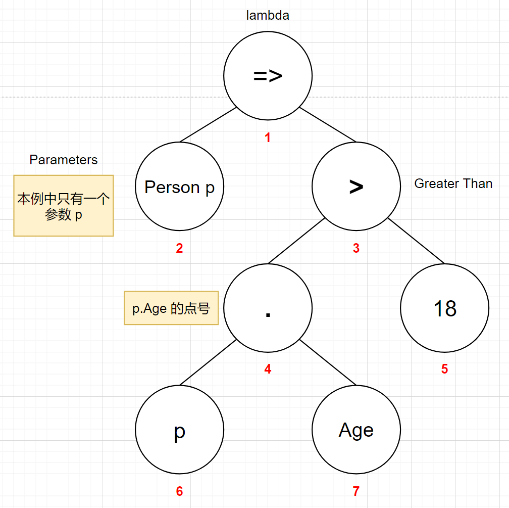
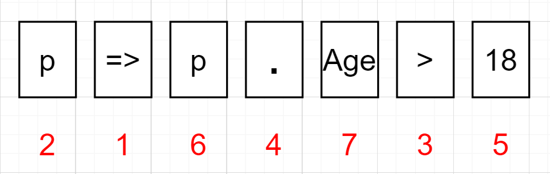
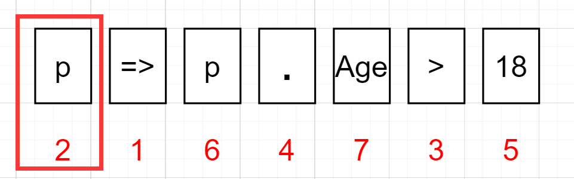
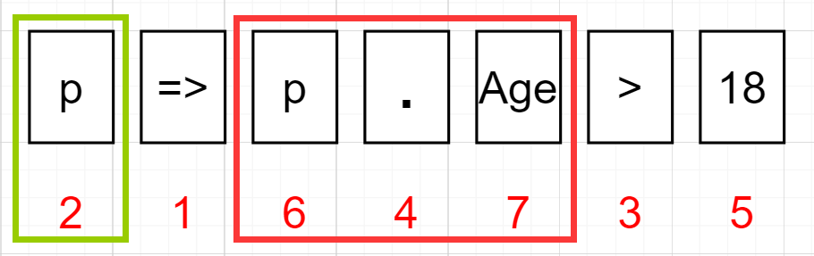
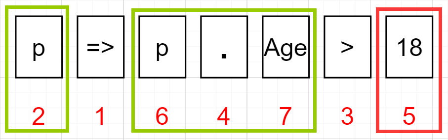
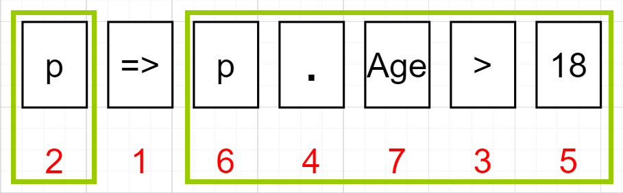

[TOC]

## 0. 为什么会有这篇博客？

上一篇博客简单介绍了什么是表达式树，如何使用表达式树：[https://blog.kitlau.dev/posts/how-to-use-csharp-expression-trees/](https://blog.kitlau.dev/posts/how-to-use-csharp-expression-trees/)，该文中也演示构建了一个简单的表达式树 `Expression<Func<Person, object>> exp = p => p.Name;`，实际就是通过使用 Expression 构建了 `p => p.Name` 这样一个 lambda 表达式，但是构建过程的说明略显复杂，估计很多朋友看了会被我绕进去，不容易理解。

这次举一个更完整更常用的例子，尝试构建 `p => p.Age > 18` 这样一个 lambda 表达式。

## 1. 准备工作

创建 Person 类 Person.cs：

```c#
public class Person
{
    public string Name { get; set; } = null!;

	public int Age { get; set; }
}
```

拿到表达式 `p => p.Age > 18`，我们用上一篇文章的思路，把它画成一个简单的表达式树：

||
|:--:|
|<b>图 1</b>|

表达式各元素与表达式树各节点的对应关系如下图：

||
|:--:|
|<b>图 2</b>|

## 2. 构建表达式树

1. 首先构建 2 号节点，这个节点是个参数表达式（ParameterExpression）：

```c#
ParameterExpression parameterExpr = Expression.Parameter(typeof(Person), "p");
```

现在我们构建完成了这部分：

||
|:--:|
|<b>图 3</b>|

2. 构建 4、6、7 号节点的表达式，因为这三个节点的目的是取出参数 p 的 Age 成员属性，所以三个节点可以构建成一个成员表达式（MemberExpression），可以使用上面构建好的 2 号 p 参数节点。：

```c#
MemberExpression memberExpr = Expression.PropertyOrField(parameterExpr, "Age");
```

<!-- `Expression.PropertyOrField()` 方法的第二个参数 `"Age"` 也可以是 `"age"`，因为这个方法顾名思义，就是可以取属性（Property）或字段（Field）。Person 类的 `public int Age { get; set; }` 属性会由编译器生成名为 `age` 的私有字段。 -->

现在我们构建完成了这部分，绿色框表示前面已经构建完成的部分：

||
|:--:|
|<b>图 4</b>|

3. 构建 5 号节点的表达式。该节点是一个常量表达式（ConstantExpression）：

```c#
ConstantExpression constantExpr = Expression.Constant(18, typeof(int));
```

`Expression.Constant()` 是构建常量表达式的方法。

现在构建完了这部分：

||
|:--:|
|<b>图 5</b>|

4. 通过前面构建的 4、6、7 号成员表达式和 5 号常量表达式，构建 3 号节点的大于号的二元运算符表达式（BinaryExpression），因为 `>` 是二元运算：

```c#
BinaryExpression greaterThanExpr = Expression.MakeBinary(ExpressionType.GreaterThan, memberExpr, constantExpr);
```

`Expression.MakeBinary()` 是构建二元运算符表达式的方法，第一个参数是二元运算符表达式的类型，这里我们是 `>`，所以参数就是 `ExpressionType.GreaterThan`，第 2、3 个参数是 `>` 左右两侧的参数，所以顺序不能反了，如果反了，表达式就会变成 `18 > p.Age`。

现在构建完了这部分：

||
|:--:|
|<b>图 6</b>|

5. 最后将第 1 步构建的 p 的参数表达式和第 4 步构建的 `p.Age > 18` 的二元运算表达式中间连接上 `=>` 符号，组成一个 lambda 表达式即可：
   
```c#
Expression<Func<Person, bool>> finalExpr = Expression.Lambda<Func<Person, bool>>(greaterThanExpr, parameterExpr);
```

`Expression.Lambda()` 的第一个参数是方法体，也就是 `p.Age > 18` 的 `greaterThanExpr` 表达式，第二个参数是方法参数 `p`，也就是第 1 步构建的 `parameterExpr`。

因为我们要构建的表达式 `p => p.Age > 18` 是一个接受 Person 类型参数，返回 bool 类型值的函数，也就是 `Func<Person, bool>` 委托，所以 `Expression.Lambda()` 方法的泛型参数以及最终返回的 Expression 的泛型类型都是 `Func<Person, bool>`。

现在构建完成了，最终得到了 `finalExpr`。

## 3. 使用表达式树

我们编写一些代码来测试使用这个表达式树：

```c#
var personsList = new List<Person>()
{
    new Person
    {
	    Name = "Zhang Three",
	    Age = 8
    },
    new Person
    {
	    Name = "Li Four",
	    Age = 19
    },
    new Person
    {
	    Name = "Wang Wu",
	    Age = 10086
    }
};

var result = personsList.Where(finalExpr.Compile()).ToList();

foreach (var person in result)
{
    Console.WriteLine(person);
}
```

运行结果：

```bash
Name: Li Four, Age: 19
Name: Wang Wu, Age: 10086
```

## 4. 是多此一举吗？

在这里我们手动调用了 `Compile()` 方法将表达式编译了，似乎是多此一举，不如直接在 `Where()` 方法中写 lambda 表达式，就像这样：`var result = personsList.Where(p => p.Age > 18).ToList();`。

我们这里调用的是 `IEnumerable` 的 `Where()` 方法。其实 `IQueryable` 的 `Where()` 等方法支持直接使用表达式，不需要手动调用 `Compile()` 方法编译，也就是说可以配合 EF Core 使用我们自己构建的表达式，而且会发挥奇效。

我接下来会写两篇把表达式树应用在 EF Core 的示例的文章，并配有代码：

1. 展示如何动态构建表达式树来简化和语义化值对象（DDD 中的概念）的比较
2. 如何为每一个实体类的属性（例如软删除的属性）设置过滤器，而不是手动在每一个实体类的 `IEntityTypeConfiguration` 类中一个一个设置