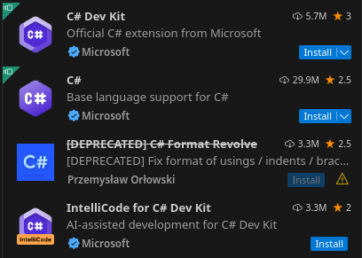

[TOC]

## 0. 为什么会有这篇博客

最近，我开始探索 [AnduinOS: https://www.anduinos.com/](https://www.anduinos.com/)。

作为一名 .NET 开发者，配置一个舒适的开发环境是我上手后必须面对的挑战。由于 AnduinOS 是一个 Linux 发行版，我们不得不告别 Visual Studio。尽管 Jetbrains Rider 是一个出色的选择，但没有免费的社区版，这对我这样的贫穷开发者来说，显得有些奢侈。

当然，如果你实在无法割舍 Visual Studio，你甚至可以走邪路，例如装一个 Windows 虚拟机。但那又失去了 AnduinOS 的初衷。别担心，VSCode 仍然在我们手边。

虽然市场上还有 NeoVim、Sublime Text 等其他编辑器，但我对此不太熟悉，因此今天我将把注意力集中在 VSCode 上。我计划通过一些插件，让 VSCode 的 C# 开发体验更接近 Visual Studio 的标准。

也就是说，这篇文章不止适用于 AnduinOS，而且适用于所有可以使用 VSCode 的操作系统。

**我并不常使用 VSCode 开发 .NET，以下内容纯属我在短暂使用后的“经验之谈”。如果你有更好的建议，欢迎在评论区留言；若觉得不合适，也可以当我在随意发言。**

AnduinOS 的文档中已经详细介绍了如何在 AnduinOS 上安装 .NET SDK、VSCode 等操作，还有很多能让你的生活变得更好的设置，甚至还教了你如何安装微信，详情请查阅文档。这篇文章不再介绍安装 SDK 和 VSCode 的步骤。

首先请看以下截图中的第 1、2 和 4 插件：



## 1. C# 插件

上图中的第二个插件 C# 是必装的插件之一，它提供 C# 的基本语言支持。

安装完成后，不妨逛逛这个插件的 settings，看看有没有那些默认关闭却值得开启的选项，简直像是开启了隐藏关卡。

<!-- 关于：Roslyn 编译器特性 / Roslynator / 自动使用（也许还有命名空间自动完成 / C# XML 文档注释）

简而言之 - 将以下内容放入你的 settings.json 文件中：

  "omnisharp.enableEditorConfigSupport": true,
  "omnisharp.enableImportCompletion": true,
  "omnisharp.enableRoslynAnalyzers": true


我将讨论两件事：1）C# 扩展（OmniSharp）设置，这些设置将 VS Code 的 C# 编辑体验从“还不错”提升到 8.5，10 分是 Visual Studio；2）启用这些设置可能使 Roslynator 等变得多余。

1）OmniSharp 设置

Visual Studio 的 C# 编辑体验大部分是通过 C# 的 Roslyn 编译器提供的。分析器、代码修复、重构、应用“代码风格”（格式、命名、大小写等）。所有这些都可以通过 "omnisharp.enableRoslynAnalyzers": true 在 VS Code 中实现。灯泡图标现在会显示与 Visual Studio 相同的信息和修复建议，以及首字符的三点建议/修复等。

至于“代码风格”和错误/严重性级别，"omnisharp.enableEditorConfigSupport": true 可以进一步提升体验。Visual Studio 的所有代码风格和严重性级别实际上是底层的 editorconfig，并可以导出为 editorconfig 文件。通过启用 OmniSharp 的 editorconfig 支持，OmniSharp 将查找 editorconfig 文件并将编译器指向它，提供与 Visual Studio 相同的体验。如果我没记错，仅启用此设置而不提供 editorconfig 文件的体验也比禁用更好。

最后，我知道的设置是 "omnisharp.enableImportCompletion": true。

2）可能多余的扩展

* "omnisharp.enableImportCompletion": 我确信自动使用和导入完成的行为是不同的，但需要说明的是：OmniSharp 有一个选择加入的版本。

* "omnisharp.enableEditorConfigSupport": 在这里并不是“多余”，更准确地说是“正交”：此设置适用于否则会被忽略的 dotnet 特定的 editorconfig 值。可以搜索 “visual studio editorconfig” 或 “dotnet editorconfig”。所有内容都可以 1:1 地从 Visual Studio 转移过来。一些有趣的功能在这里，比如自动排序/分组 using。

* "omnisharp.enableRoslynAnalyzers": 启用此设置将激活随着每个 .NET 发布而增加的大量分析器和修复。Visual Studio 提供的所有功能，除了需要复杂用户输入的重构（比如参数重新排序）。Roslynator 提供了更多（分析器/修复/重构）——当我一起使用它们时，发现了很多重复的分析器和修复。这里还发生了其他一些魔法，可能会使其他扩展部分或完全多余。

呼，想起那些尝试过 VS Code 的 C# 并根据默认设置做出判断的怀疑者，我真的感到痛心。随着 OmniSharp 即将被淘汰，我想知道新的 VS Code + Roslyn 体验会是怎样的？  -->

此外，我习惯在 settings.json 文件中添加以下几项，以便让 VSCode 更加给力：

```json
"dotnet.server.useOmnisharp": true,
"omnisharp.enableDecompilationSupport": true,
"omnisharp.enableEditorConfigSupport": true,
"omnisharp.enableImportCompletion": true,
"omnisharp.enableRoslynAnalyzers": true
```

有时我听到开发者抱怨 VSCode 在 .NET 开发上功能不够强大。如果你也有类似的疑虑，不妨试试我的设置，或许能为你的开发体验带来一些意想不到的提升。

## 2. 强大的 C# Dev Kit

1. 上图第 1 个插件：C# Dev Kit，为 VSCode 提供了类似 Visual Studio 的功能，例如创建 solution、创建 project、build、run、代码补全、debugging、testing 等。可以说，这个插件非常全面，几乎把所有你需要的功能都打包了。
2. 第四个插件 IntelliCode for C# Dev Kit 则是那种一听名字就知道的智能代码提示工具，是 C# Dev Kit 的绝佳搭档。

最近两年 Microsoft 开发了这个插件，可以给 VSCode 的用户爽用，但是代价呢？

它们的许可证政策与 Visual Studio 相似，个人、学术和开源项目可以免费使用，而对于最多 5 人的团队，商业目的下也能免费使用。至于 6 人以上的团队，恭喜你们，需要 Visual Studio Professional（或更高版本）的订阅。

在使用该插件时，还需要登录微软账号来授权，所以如你所见，我根本没有安装它们，免得不小心踩了许可证的红线。

## 3. Roslynator

这个插件与 C# Dev Kit 是互斥的，你需要把 C# Dev Kit 设置为 Disable 才可以使用它。

它是基于 Roslyn 的代码分析器和代码修复器，提供了 500+ 个分析器，以此来提供例如代码格式化、代码优化、代码重构等功能。

而 Jetbrains Rider 提供了 2500+ 个分析器，所以你可以把它当作 Rider 的代码优化和重构功能的一个免费简化版。

如果你在前面的设置中开启了 `"omnisharp.enableRoslynAnalyzers": true`，你可能会发现 Roslynator 的功能有些重复。但是我在使用时的确有一种似曾相识的感觉。如果你曾经被 Rider 教过如何写代码，那你一定懂我说的那种“惊喜”，而 Roslynator 也可能会带给你类似的启发。

## 4. C# XML Documentation Comments

这个插件可以帮助你快速生成 XML 文档注释，仿佛在 Rider 中的体验，只需要输入 `///`，就可以生成一个 XML 文档注释了，例如：

```xml
/// <summary>
///
/// </summary>
/// <param name="id"></param>
/// <returns></returns>
```

## 5. C# Namespace Autocompletion

在 VSCode 中，每次新建一个空的 C# 文件时，需要手动添加命名空间，这个插件可以给你完成命名空间的补全功能。

## 6. Github Copilot

Github Copilot 是一个每月 10 美元，包年 100 美元的强大的代码提示工具，它可以帮助你快速编写代码，但是它的订阅价格可能会让你不禁咽口水。

即使你没用过这个工具，想必也听说过它的名声。当年它被发布，一时风头无两，几乎让程序员们感受到被 AI 取代的恐惧。后来与 ChatGPT 联手，再次掀起波澜，但如今似乎被新兴的 Cursor 抢了风头。对于我这个懒人来说，Cursor 只用过一次，一直没有深入学习它，不便评论。所以我只能说 Copilot 是一个很好的产品，但如果你希望把它跟 Cursor 做比较，考虑订阅哪个更划算的话，建议你去咨询经常使用两者的工程师。

## 总结

以上列举了我在使用 VSCode 开发 .NET 时使用的一些插件，有一些常用的但与 .NET 没有关系的其它插件我并没有列举，例如 `Markdown All in One` 等。

我希望这篇文章能够让你在使用 AnduinOS 开发 .NET 时更加愉快，如果你有更好的建议，欢迎在评论区留言。
