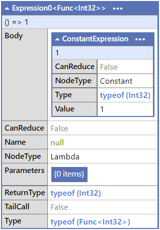

[TOC]

## 1. 什么是表达式树

表达式树（expression tree）是用树型的数据结构来表示代码的运算逻辑。你的**代码**也是你可以用来操作的**数据**，**数据**也可以变成**代码**。当你拿到数据时（比如从数据库拿到数据），你可以通过这些数据创建出代码。这就是表达式树。

说到这里，你可能完全不理解，我们慢慢探索。首先看一下表达式树的图。

`1 + 2` 这个表达式的表达式树：

||
|:--:|
|<b>图 1</b>|

假设我们先序遍历这棵树，首先我们拿到 `+`，我们知道这是要进行一个加法操作，然后我们拿到 `1`，再拿到 `2`，我们就知道是要运算 1 和 2 相加的结果。

`1 + 2 * 3` 的表达式树（注意，乘的优先级高于加）：

||
|:--:|
|<b>图 2</b>|

`1` 与另一个表达式子树的结果相加，表达式子树是 `2` 与 `3` 做 `*` 运算。 

顺便看一下这些表达式在 C# 中的语法树。

```c#
void Main()
{
	int a = 1 + 2;
}
```

||
|:--:|
|<b>图 3</b>

上图是 `a = 1 + 2` 的语法树，红框中是 `1 + 2` 的语法树，变成图的话就是这样：

||
|:--:|
|<b>图 4</b>

跟前面我们绘制的表达式树的图是基本相同的，很容易理解。

`1 + 2 * 3` 也是相似的：

```c#
void Main()
{
	int a = 1 + 2 * 3;
}
```

||
|:--:|
|<b>图 5</b>

## 2. Func<T> 与 Expression<TDelegate>

表达式树在 .NET 中就是 `Expression<TDelegate>` 类型。C# 编译器可以从 lambda 表达式生成 `Expression<TDelegate>` 类型的变量。

`Expression<TDelegate>` 也可以直接编译成 `TDelegate` 类型的委托对象，我们用 `Func<T>` 来举个例子。

`Func<T>` 这个 Func 委托实际上就是一个方法，该类型的变量可以直接当方法调用。

通过代码更容易理解：

```c#
void Main()
{
	Func<int> one = () => 1;
	Console.WriteLine(one()); // 1
	Console.WriteLine(one.GetType()); // System.Func`1[System.Int32]
        
    // 从 lambda 表达式生成 Expression<TDelegate> 类型的变量
	Expression<Func<int>> oneExpression = () => 1;
	Console.WriteLine(oneExpression.Compile()()); // 1
	Console.WriteLine(oneExpression.Compile().Invoke()); // 1
	Console.WriteLine(oneExpression.GetType()); // System.Linq.Expressions.Expression0`1[System.Func`1[System.Int32]]
	Console.WriteLine(oneExpression.Compile().GetType()); // System.Func`1[System.Int32]
}
```

`Expression<Func<int>>` 类型的 `oneExpression` 变量调用了 `Compile` 方法后，得到的结果的类型就是 `Func<int>` 了。

`Func<int>` 对象是一个方法，而 `Expression<Func<int>>` 对象则存储了方法的**信息**，可以通过这些信息来编译（compile）出这个方法。

更进一步说，`Expression` 对象以抽象语法树的形式存储了运算逻辑，我们可以在运行时动态分析运算逻辑。

图 6 就是以结构化的方式查看 `oneExpression` 这个语法树的结构。

||
|:--:|
|<b>图 6</b>

可能现在看这张图还有些不理解，下面尝试手动构建一个语法树，来理解这些图。

## 3. 手动构建 Expression

举一个简单的例子：

```c#
void Main()
{
	var selectProperty = "age";
	
	var person = new Person 
	{
		Name = "Kit Lau",
		Age = 18
	};
	
	if (selectProperty == "name")
	{
		Console.WriteLine(person.Name);
	}
	else if (selectProperty == "age")
	{
		Console.WriteLine(person.Age);
	}
	else 
	{
		throw new Exception($"class Person has no property named {selectProperty}");
	}
}

class Person
{
	public string Name { get; set; }
	public int Age { get; set; }
}
```

这段代码实现的功能是：假设 `selectProperty` 是用户手动选择或者输入的一个代表属性名的字符串，通过它的值来让程序打印 `Person` 类中的属性名与用户输入的 `selectProperty` 相同的属性的值。例如用户输入的 `selectProperty` 的值是字符串 `"Age"` 或 `"age"`，就在控制台打印 `person` 变量的 `Age` 属性的值。 

这段程序里我们通过 if 语句来判断应该打印哪个属性的值，但是我们在 if 语句里硬编码了 `"name"` 和 `"age"` 两个字符串。如果后面有需求修改了 `Person` 的属性名，把 `Name` 改为了 `EnglishName`，开发者无法通过 Visual Studio 等 IDE 的查找引用功能来直接找到这部分代码，只能遍历所有带 `"name"` 字符串的代码，这种代码在一个项目中何其多。这种硬编码的方式会使这份代码不可维护。

下面我们改一下代码，通过创建 `Expression` 来实现相同的功能。

首先我们分析一下这个表达式树应该是什么样子。先写如下代码：

```c#
void Main()
{
	var person = new Person();
	Expression<Func<Person, object>> exp = p => p.Name;
	Console.WriteLine(exp);
}
```

看一下表达式树：

||
|:--:|
|<b>图 7</b>

把 Expression 画成树的形状，大约就是这样：

||
|:--:|
|<b>图 8</b>

严格地说，是这样：

||
|:--:|
|<b>图 9</b>

我们将要构造这么一个表达式树，我们从叶子节点往根节点开始构建。

先给出最终的代码，再分析构建过程：

```c#
public static void Main()
{
    var selectProperty = "age";

    var person = new Person 
    {
	    Name = "Kit Lau",
	    Age = 18
    };

    ParameterExpression parameter = Expression.Parameter(typeof(Person));

    MemberExpression accessor = Expression.PropertyOrField(parameter, selectProperty);

    LambdaExpression lambda = Expression.Lambda(accessor, false, parameter);

    Console.WriteLine(lambda.Compile().DynamicInvoke(person)); // 18
}
```

1. 首先，构建第一个叶子节点，树的左边部分：
   
   ||
   |:--:|
   |<b>图 10</b>

   ```c#
   ParameterExpression parameter = Expression.Parameter(typeof(Person));
   ```
   
   我们如何知道要使用 `Expression.Parameter()` 这个方法？看一下图 11，根节点的左子树的 `NodeType` 是 `Parameter`：

   ||
   |:--:|
   |<b>图 11</b>

   再通过这个关键词去网络上查询如何构建 `NodeType` 为 `Parameter` 的 Expression 即可。

2. 现在我们有了这个 Person， 我们就可以获取它的 Name 了，构建右下的叶子节点：
   
   ||
   |:--:|
   |<b>图 12</b>

   也就是这部分：

   ||
   |:--:|
   |<b>图 13</b>

   ```c#
   MemberExpression accessor = Expression.PropertyOrField(parameter, selectProperty);
   ```

   可能有朋友会问，为什么不根据步骤 1，`NodeType` 是 `MemberAccess`，从而调用与 `MemberAccess` 相关的方法呢？当然可以，输入 `Expression.MemberAccrss` 时，IDE 自动提示了 `Expression.MakeMemberAccess` 这个方法，那么代码就是这样：

   ```c#
   MemberExpression accessor = Expression.MakeMemberAccess(parameter, typeof(Person).GetProperty(selectProperty));
   ```

   这会导致一个问题：如果 `selectProperty` 的值没有区分大小写，依旧使用小写字母开头的 `"age"`，那么 `typeof(Person).GetProperty(selectProperty)` 会取不到值，所以用户输入的 `selectProperty` 的值就只能是大写字母开头的 `"Age"` 了，这样对用户很不方便。

3. 再构建根节点，即使用前面构建的表达式组装为总的 lambda 表达式：
   
   ```c#
   LambdaExpression lambda = Expression.Lambda(accessor, false, parameter);
   ```

4. 最后编译一下就可以调用了，把 person 对象作为参数传递给它：
   
   ```c#
   lambda.Compile().DynamicInvoke(person)
   ```

   打印一下结果，是 18，没有问题。

## 4. 表达式树的常见用途：简化值对象的比较

在领域驱动设计（DDD）中有一个值对象的概念，使用 EF Core 查询时，当值对象作为参数时，比较起来会很麻烦，可以动态构建表达式树来简化这个过程。本来想一起写了，但是我懒了，明天再看，再水一篇新的，所以下一篇文章再介绍👀。

## 总结

本篇博客我通过一个例子简单地介绍了如何手动构建表达式树，这篇官方文档里有更加详细的介绍，有需要的朋友可以看一下：[https://docs.microsoft.com/en-us/dotnet/csharp/expression-trees-building](https://docs.microsoft.com/en-us/dotnet/csharp/expression-trees-building)。

`Expression` 类有一系列像 `Expression.PropertyOrField()` 这样的方法，可以使用他们构建自己的表达式，文档在这里：[https://docs.microsoft.com/en-us/dotnet/api/system.linq.expressions.expression?view=net-6.0#methods](https://docs.microsoft.com/en-us/dotnet/api/system.linq.expressions.expression?view=net-6.0#methods)。

我个人觉得这样动态构建表达式树的代码相对难以理解，不利于其它开发者维护。所以能够避免的情况下最好避免写代码动态构建表达式树。但是在本文的例子中，表达式树能够避免硬编码，利大于弊。