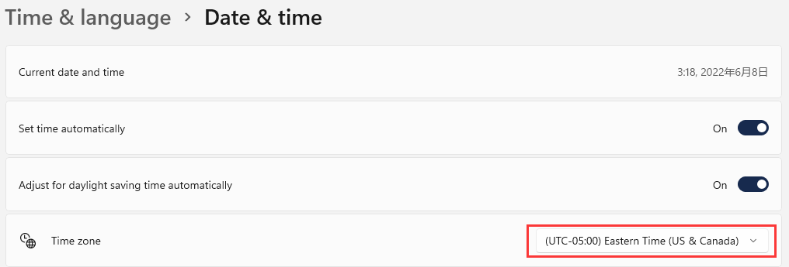

[TOC]

## 1. 问题

前些天经历了 2022 上海封控，封控期间我曾经在“今天”团购到过“明天“生产的牛奶，这让我产生了一个疑问。

假设我运营一个外贸网站，网站后台管理系统部署在国内，前台系统部署在美国，面向美国的客户。我的在后台管理系统中创建一个产品，创建时间自然是使用北京时间，精确到时分秒，然而美国时间比北京时间慢 12 个小时，用户在美国浏览我的网站，就会看到”12个小时之后“的产品，美国用户难免会像我喝团购牛奶时看到生产日期时一样，产生一些疑问和恐慌，并质疑我网站上产品的靠谱性。

我回想起 C# 有一个 `DateTime.UtcNow` 属性，之前没有用过。

## 2. 什么是 UTC 时间

百科上说 UTC 时间是协调世界时，又称世界统一时间、世界标准时间、国际协调时间。听名字就知道它是干啥用的了。我理解为它是世界时间，然后各个国家或者各个时区在这个时间上 +/- 几个小时，就能够调整成本地时间。

## 3. 在 CSharp 中使用 UTC 时间

在 C# 上测试一下：

```c#
var utcNow = DateTime.UtcNow;
var now = DateTime.Now;
Console.WriteLine($"utcNow: {utcNow}");
Console.WriteLine($"now: {now}");
```

输出结果：

```c#
utcNow: 2022/6/8 7:02:26
now: 2022/6/8 15:02:26
```

北京时间是东八区时间，也就是（北京时间 = UTC 时间 + 8h）。

同时，美国东部时间为 `2022/6/8 03:02:26` ，美国东部时间是西五区时间，现在美国实行夏令时，比正常时间快一小时，所以（美国东部时间 = UTC 时间 - 5h + 1h）。美国境内同时有好几个时间，还分夏令时，真麻烦，早知道换个国家举例子。这里我就不管它的夏令时了，就当作（美国东部时间 = UTC 时间 - 5h）。

这样就知道了，一般情况下，本地时间就等于 UTC 时间 +/- n 个小时，如果你的本地在东 n 区，就是 + n，如果在西 n 区，就是 - n。

也就是说我在我的外贸网站后台管理系统中新增产品的时候，应该使用 UTC 时间作为产品的创建时间，在前台网站显示时应该把 UTC 时间转为本地时间。

## 4. 在 CSharp 中将 UTC 时间转为本地时间

```c#
var utcNow = DateTime.UtcNow;
var now = DateTime.Now;
var localDateTime = utcNow.ToLocalTime(); // UTC 时间转本地时间

Console.WriteLine($"utcNow: {utcNow}");
Console.WriteLine($"now: {now}");
Console.WriteLine($"localDateTime: {localDateTime}");
```

输出结果：

```c#
utcNow: 2022/6/8 7:15:36
now: 2022/6/8 15:15:36
localDateTime: 2022/6/8 15:15:36
```

使用 `ToLocalTime()` 方法可以实现 UTC 时间和本地时间的转换。因为我的电脑的系统时间使用北京时间，所以这个方法返回了北京时间。

我现在将我的系统时间调整为东部时间：



重新运行代码，输出结果：

```c#
utcNow: 2022/6/8 7:18:57
now: 2022/6/8 3:18:57
localDateTime: 2022/6/8 3:18:57
```

没有问题，输出的确实是美国东部时间。

## 5. 在 EF Core 中使用 UTC 时间

最近想学习一下 EF Core，所以这里尝试使用 EF Core 处理 UTC 时间的问题。

首先创建一个控制台项目，并安装 EF Core 相关的库。如果不会的话，可以参考这份官方文档：https://docs.microsoft.com/en-us/ef/core/get-started/overview/first-app?tabs=netcore-cli

我这里的基本代码如下：

Product.cs:

```c#
public class Product
{
    public int ProductId { get; set; }
    [MaxLength(256)] public string Name { get; set; } = null!;
    [Precision(10, 2)] public decimal Price { get; set; }
    public DateTime CreatedUtc { get; set; }
    public DateTime? ModifiedUtc { get; set; }
    public override string ToString()
    {
        return $"ProductId: {ProductId}, Name: {Name}, Price: {Price}, CreatedUtc: {CreatedUtc}, ModifiedUtc: {ModifiedUtc}";
    }
}
```

ApplicationDbContext.cs:

```c#
public class ApplicationDbContext : DbContext
{
    private const string ConnectionString = "server=localhost;port=3306;database=kit_demo;user=kit;password=password;";
    
    public DbSet<Product> Products { get; set; } = null!;

    protected override void OnConfiguring(DbContextOptionsBuilder optionsBuilder)
    {
        var serverVersion = new MariaDbServerVersion(new Version(10,6));
        optionsBuilder.UseMySql(ConnectionString, serverVersion)
            .EnableSensitiveDataLogging()
            .EnableDetailedErrors();
    }
}
```

这里我使用的是 MariaDB:10.6，所以我安装了这两个库：


上面的代码写完之后，可以在 PowerShell 中依次运行以下命令创建 Migration 和更新数据库：

`dotnet ef migrations add Init`

`dotnet ef database update`

你也可以使用 SQL Server 或者 SQLite 等数据库，但要注意 SQLite 中没有我们用到的 decimal 和 DataTime 相关的数据类型。

Program.cs:

```c#
using ApplicationDbContext dbContext = new();
var product = new Product
{
    Name = "Coca-Cola",
    Price = 3.5M,
    CreatedUtc = DateTime.UtcNow,
    ModifiedUtc = DateTime.UtcNow.AddMinutes(10) // 修改时间加 10min 用于区分
};
dbContext.Products.Add(product);
dbContext.SaveChanges();

using ApplicationDbContext queryDbContext = new(); // 使用新的 DbContext 进行查询，模拟真实 Web 应用，防止干扰
var myProduct = queryDbContext.Products.SingleOrDefault(p => p.Name == "Coca-Cola");
if (myProduct is null)
{
    throw new NullReferenceException("Cannot find the product named \"Coca-Cola\"");
}
Console.WriteLine(myProduct);
DateTime created = myProduct.CreatedUtc.ToLocalTime(); // Utc 时间转为 Local 时间
DateTime? modified = myProduct.ModifiedUtc?.ToLocalTime();
Console.WriteLine(created);
Console.WriteLine(modified);
```

运行结果：

```c#
ProductId: 1, Name: Coca-Cola, Price: 3.50, CreatedUtc: 2022/6/8 15:03:14, ModifiedUtc: 2022/6/8 15:13:14
2022/6/8 23:03:14
2022/6/8 23:13:14
```

这种方式，客户端取数据每次都要手动 `.ToLocalTime()`，太麻烦。

## 6. DateTime 的 Kind 属性

在介绍更简单的方法之前，先了解一下 DateTime 的 Kind 属性。

C# 中，DateTime 类型有一个 Kind 属性，这个属性源码如下：

```c#
public DateTimeKind Kind
{
    [MethodImpl(MethodImplOptions.AggressiveInlining)
    get => InternalKind switch
    {
        KindUnspecified => DateTimeKind.Unspecified,
        KindUtc => DateTimeKind.Utc,
        _ => DateTimeKind.Local,
    };
}
```

Kind 属性是 DateTimeKind 这个枚举类型的，看一下这个枚举的源码：

```c#
public enum DateTimeKind
{
    Unspecified = 0,
    Utc = 1,
    Local = 2,
}
```

DateTime 有这 3 中类型。我们可以做一个实验：

```c#
var utcNow = DateTime.UtcNow;
var now = DateTime.Now;
var localDateTime = utcNow.ToLocalTime(); // UTC 时间转本地时间
var localLocalDateTime = localDateTime.ToLocalTime(); // 本地时间转本地时间
var unspecifiedDateTime = DateTime.SpecifyKind(now, DateTimeKind.Unspecified); // 使用 SpecifyKind 自定义 Kind
var unspecifiedToLocalDateTime = unspecifiedDateTime.ToLocalTime(); // unspecified 转本地

Console.WriteLine($"utcNow: {utcNow}");
Console.WriteLine($"utcNow.Kind: {utcNow.Kind}");
Console.WriteLine($"now: {now}");
Console.WriteLine($"now.Kind: {now.Kind}");
Console.WriteLine($"localDateTime: {localDateTime}");
Console.WriteLine($"localDateTime.Kind: {localDateTime.Kind}");
Console.WriteLine($"localLocalDateTime: {localLocalDateTime}");
Console.WriteLine($"localLocalDateTime.Kind: {localLocalDateTime.Kind}");
Console.WriteLine($"unspecifiedDateTime: {unspecifiedDateTime}");
Console.WriteLine($"unspecifiedDateTime.Kind: {unspecifiedDateTime.Kind}");
Console.WriteLine($"unspecifiedToLocalDateTime: {unspecifiedToLocalDateTime}");
Console.WriteLine($"unspecifiedToLocalDateTime.Kind: {unspecifiedToLocalDateTime.Kind}");
```

运行结果：

```c#
utcNow: 2022/6/8 14:01:19
utcNow.Kind: Utc
now: 2022/6/8 22:01:19
now.Kind: Local
localDateTime: 2022/6/8 22:01:19
localDateTime.Kind: Local
localLocalDateTime: 2022/6/8 22:01:19
localLocalDateTime.Kind: Local
unspecifiedDateTime: 2022/6/8 22:01:19
unspecifiedDateTime.Kind: Unspecified
unspecifiedToLocalDateTime: 2022/6/9 6:01:19
unspecifiedToLocalDateTime.Kind: Local
```

可以发现：

1. `DateTime.UtcNow` 的 Kind 是 `Utc`；
2. `DateTime.Now` 的 Kind 是 `Local`；
3. `Utc` 调用`.ToLocalTime()`方法可以将时间转为本地时间，且 Kind 转为 `Local`；
4. `Local` 调用 `.ToLocalTime()` 没有任何意义；
5. 可以使用`DateTime.SpecifyKind()`方法自定义 Kind；

6. 另外补充一下：**使用 EF Core 从数据库读取的 DateTime 的 Kind 默认是 `Unspecified`**。您可以手动试验，这里我不贴代码了。但是要注意，**这里指的是大部分情况下，存数据和取数据在不同的 DbContext 实例的情况下。如果你使用同一个 DbContext 实例先存数据，接着取数据，取到的数据的 DateTime 的 Kind 将会是存时的 Kind，而不是 `unspecified`。**

## 7. 使用 ValueConverter 将 UTC DateTime 的 Kind 修正

了解了 DateTime 的 Kind 之后，我们应该意识到一个问题：EF Core 从数据库读取的 Product.CreatedUtc 的 Kind 默认情况下是 `Unspecified`，但它实际上应该是`Utc`。

这里我们可以使用 ValueConverter 进行属性的批量转换，我们约定将所有 DateTime 和 DateTime? 类型且名称结尾为"Utc"的属性的 Kind 都设置为`Utc`。

在 ApplicationDbContext.cs 中进行如下设置：

```c#
protected override void OnModelCreating(ModelBuilder modelBuilder)
{
    ValueConverter<DateTime, DateTime> utcConverter =
        new(toDb => toDb,
            fromDb => DateTime.SpecifyKind(fromDb, DateTimeKind.Utc));
    
    ValueConverter<DateTime?, DateTime?> utcConverterForNullable =
        new(toDb => toDb,
            fromDb => fromDb.HasValue ? DateTime.SpecifyKind((DateTime)fromDb, DateTimeKind.Utc) : null);
    
    foreach (var entityType in modelBuilder.Model.GetEntityTypes().AsParallel())
    {
        foreach (var entityProperty in entityType.GetProperties().AsParallel())
        {
            if (entityProperty.Name.EndsWith("Utc"))
            {
                if (entityProperty.ClrType == typeof(DateTime))
                {
                    entityProperty.SetValueConverter(utcConverter);
                }
                else if (entityProperty.ClrType == typeof(DateTime?))
                {
                    entityProperty.SetValueConverter(utcConverterForNullable);
                }
            }
        }
    }
    
    base.OnModelCreating(modelBuilder);
}
```

这样可以实现我们的需求，但是这里使用了双层循环，这是我很不喜欢的，但是暂时没想到什么其它办法。这里使用双重循环实际上无伤大雅，因为任何项目的 Entity class 的数量都不会大到无法接受双重循环的地步。

运行代码不再给出，您可以自行打印 Kind 进行确认。

## 8. 便捷地使用 Utc 时间，将其转换为 Local 时间

如何消费这个 `Utc` 时间？应当将它转化为 `Local` 时间。但是每一个都手动调用 ToLocalTime 实在是太麻烦。

### 8.1 该不该 Mapping？

在真实的 Web 应用中，我们可以选择三种方式比较普遍的方式：

1. 给 Product 类再加 `Created` 和 `Modified` 两个属性，调用这两个属性直接返回 `CreatedUtc` 和 `ModifiedUtc` 的 `ToLocalTime` 之后的值：

   ```c#
   [NotMapped] public DateTime Created => CreatedUtc.ToLocalTime();
   [NotMapped] public DateTime? Modified => ModifiedUtc?.ToLocalTime();
   ```

2. 自定义一个 Product 类的 DTO，在这个 DTO 中将 `CreatedUtc` 和 `ModifiedUtc` 属性改为 `Created` 和 `Modified` 属性，手动写一个 Mapping 方法 Mapping 过去；

3. 同方案 2，但是使用 AutoMapper 或者 Mapster 等库来自动 Mapping。

方案 1 的缺点：Product 这个 Entity class 不再纯净了，它实际上自己承担了 Entity 和 DTO 两个 class 的功能。

方案 1 的优点：

1. 很多工程师实际上不喜欢 Mapping，他们喜欢一个 Entity 配合 `[NotMapped]`等 Attribute，添加许多属性到同一个 Entity class，使它同时实现 Entity 和 DTO 的功能。因为如果使用 Mapping 的方式，就必然会有 Entity 和 DTO 两个 class，如果要进行新增属性，修改原属性名称等操作，极有可能既要改 Entity class，又要改 DTO class，还要改 Mapping 方法或者使用的 Mapping 库的配置，想想都麻烦。特别是一个 Entity class 有非常多的属性时，往往可能对应多个 DTO class，修改就更加复杂；
2. 如果不选择方案 1，而是使用 Mapping 的方式，就会失去了 IDE 的自动寻找类或属性在代码中的引用的能力。本来你想查找一个类或属性在代码中的哪个位置被调用，你只需鼠标轻轻一点，而现在有的调用是直接调用的实体，而有的可能调用的是 DTO，你可能要先确定 DTO，打开 DTO 代码，再从 DTO 代码里查找调用。这一点在开发中应该会非常恼人。

方案 2 和 3 的缺点几乎就是方案 1 的优点，方案 2 和 3 的优点也很明确，比较主要的是你的 Entity class 中不会有多余的属性，每个字段都与数据库一一对应，很简明，方便后续维护甚至换人，换团队维护。其余优点不再详述。

这样看起来，似乎方案 1 的缺点比较少，但是这个缺点也很恼人，它让我感觉 Entity class 不再干净了。但是方案 3 的优点也很诱人。

如果使用支持 Code Generation 功能的 Mapping 库，方案 3 的缺点似乎被解决了，你可以便捷地定位代码调用位置了，但是也有其他工程师说在这种场景下使用 Code Generation 会污染你的 Domain Model（领域模型）。他们认为“领域模型不应该引用任何 infrastructure（基础设施）的东西，在这种情况下映射(更糟糕的是引用到第三方库)，这样会污染你的工作流程”。

我猜领域模型可能是 DDD （领域驱动设计）的概念。我从来没有学习过 DDD。在我之前的工作中并没有维护过使用 DDD 思想的软件，所以一直没有机会接触，等后面有机会再详细了解。

没有什么正确和错误，具体选择什么方案应该取决于项目的实际情况，这里我选择方案 3，因为我接触的项目很少用 Mapping 库，这里主动学习一下，并不是说一定要选择方案 3，大家应该因项目制宜。

### 8.2 使用 Mapster 自动将 Utc 映射为 Local 时间

Mapster 是一个与 AutoMapper 类似的 Mapping 库，自称性能和开销优于 AutoMapper 和 ExpressMapper，我本人并没有测试过。

在阅读 Mapster 文档时，我发现它支持 Code Generation，即可以自动生成 DTO 和 Mapper 方法，但是我在文档中并没有发现在使用 Code Generation 时能够自动调用 `.ToLocalTime()` 方法进行 UTC 到 Local DateTime 值转换的配置方式。所以这里还是手动进行配置。

首先定义一个 ProductDto.cs：

```c#
public class ProductDto
{
    public int ProductId { get; set; }
    public string Name { get; set; } = null!;
    public decimal Price { get; set; }
    public DateTime Created { get; set; } // 对应 CreatedUtc
    public DateTime? Modified { get; set; } // 对应 ModifiedUtc
    
    public override string ToString()
    {
        return
            $"ProductId: {ProductId}, Name: {Name}, Price: {Price}, Created: {Created}, Modified: {Modified}";
    }
}
```

然后在 Program.cs 中写一个方法，用于获取 Mapster 映射时的配置，这个配置的类型为 `TypeAdapterConfig`：

```c#
static TypeAdapterConfig getProductTypeAdapterConfig()
{
    TypeAdapterConfig config = new();
    config.NewConfig<Product, ProductDto>()
        .Map(dest => dest.Created, src => src.CreatedUtc.ToLocalTime()) // UTC 转为 Local
        .Map(dest => dest.Modified, src => src.ModifiedUtc != null // UTC 转为 Local
            ? src.ModifiedUtc.Value.ToLocalTime() 
            : (DateTime?)null);
    return config;
}
```

然后把数据库 Products 表清掉（使用 SQL 语句 `TRUNCATE TABLE Products;`），重新运行以下代码：

Program.cs：

```c#
using ApplicationDbContext dbContext = new();

var product = new Product
{
    Name = "Coca-Cola",
    Price = 3.5M,
    CreatedUtc = DateTime.UtcNow,
    ModifiedUtc = DateTime.UtcNow.AddMinutes(10)
};

dbContext.Products.Add(product);
dbContext.SaveChanges();

using ApplicationDbContext queryDbContext = new();

var myProduct = queryDbContext.Products.SingleOrDefault(p => p.Name == "Coca-Cola");
if (myProduct is null)
{
    throw new NullReferenceException("Cannot find the product named \"Coca-Cola\"");
}

Console.WriteLine(myProduct);
TypeAdapterConfig typeAdapterConfig = getProductTypeAdapterConfig(); // 获取配置
ProductDto productDto = myProduct.Adapt<ProductDto>(typeAdapterConfig); // 将 myProduct 映射到 productDto
Console.WriteLine(productDto);
Console.WriteLine(productDto.Created.Kind);
Console.WriteLine(productDto.Modified?.Kind);

//......
```

输出结果：

```c#
ProductId: 1, Name: Coca-Cola, Price: 3.50, CreatedUtc: 2022/6/9 15:43:31, ModifiedUtc: 2022/6/9 15:53:31
ProductId: 1, Name: Coca-Cola, Price: 3.50, Created: 2022/6/9 23:43:31, Modified: 2022/6/9 23:53:31
Local
Local
```

可以看到时间的值转化成功了，Kind 也没什么问题。

## 9. 总结

现在，我就可以把我的外贸网站的前台网站部署在美国。ProductDto 的 Created 和 Modified 都将会被转换成美国的时间，实现了我的需求，不会再出现例如“在今天买到明天生产的牛奶”等问题了。

本篇博客介绍了：

- 什么是 UTC 时间
- 在 C# 中如何使用 UTC 时间
- 如何配合 EF Core 使用 UTC 时间
- 如何配合 Mapster 自动转换 UTC 时间到 Local 时间

希望能给各位带来帮助，谢谢。代码地址：https://github.com/Kit086/kit.demos/tree/main/UtcDateTime/UtcDateTimeConsole