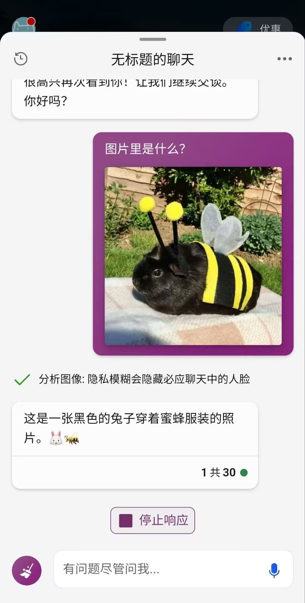
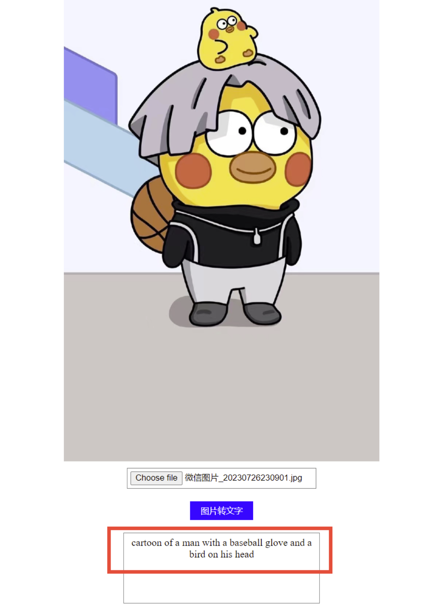
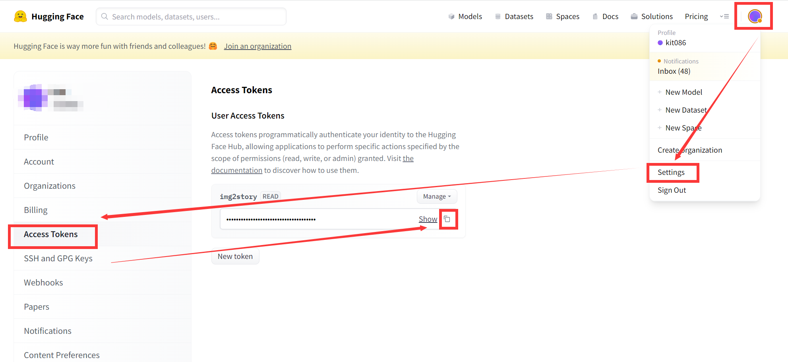
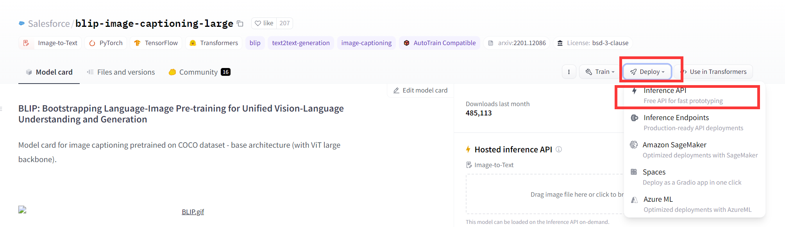
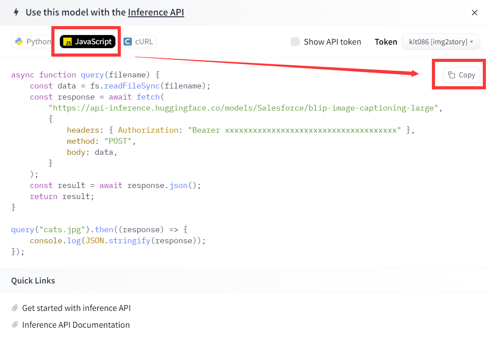
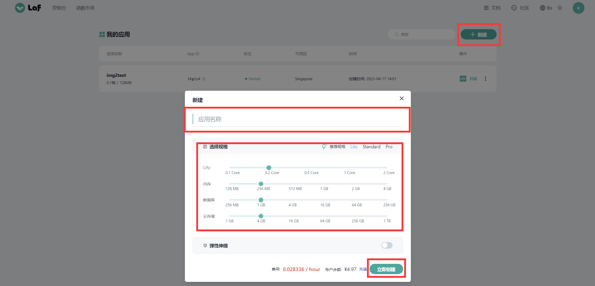
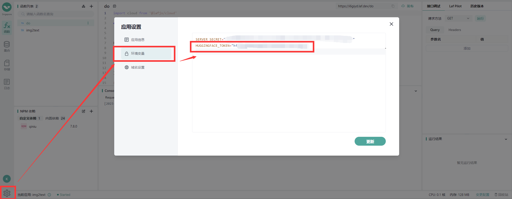
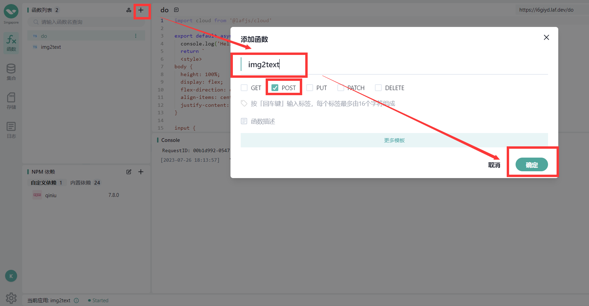
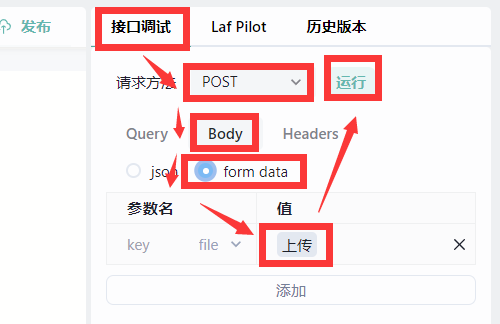
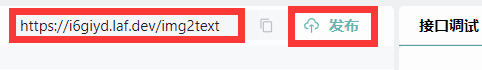

[TOC]

## 0. 为什么会有这篇博客

最近 ChatGPT、Stable Diffusion 等 AI 工具在圈外热度下降，但在圈内热度不减。LLM 工具主要玩的是问答和文本生成文本，Stable Diffusion、Midjourney 等工具玩的主要是文本生成图片和图片生成图片，似乎缺少一个开源的识别图片后生成文本描述的工具，但这显然是一个普遍的需求。New Bing 最近推出了这个功能，可以甩给它一张图片，然后对图片提问，非常强大！但并不是开源的。今天我为大家带来一个开源的方案，仅需 3 分钟即可构建好。

||
|:-:|
|<b>图 1 - New Bing 识别图片</b>|

||
|:-:|
|<b>图 2 - 我的图片转文本工具</b>|

## 1. 在 HuggingFace 上选择合适的模型

因为我无业，暂时没有钱购买服务器资源，我无法自己部署模型，所以选择白嫖 HuggingFace 的 API。如果您有充足的钱购买 GPU 资源，您完全可以将模型部署到您自己的服务器上。下面我展示的是调用 HuggingFace API 的方式，如果您需要自己部署的方式，可以等我有钱买 GPU 之后再写博客介绍😢

首先，你需要注册一个 hugging face 账号。hugging face 地址为：[https://huggingface.co/](https://huggingface.co/)

注册完之后登录，然后点击右上角头像，按照下图操作步骤，进入 Access Tokens 页面，生成一个 Token 并复制。

||
|:-:|
|<b>图 3 - 获取 Access Token</b>|

然后我们选择一个合适的图片转文本的模型，这里我选择了 Salesforce 的 `blip-image-captioning-large` 模型：[https://huggingface.co/Salesforce/blip-image-captioning-large](https://huggingface.co/Salesforce/blip-image-captioning-large)

进入这个页面，点击 Deploy，然后点击 Inference API：

||
|:-:|
|<b>图 4 - Inference API</b>|

在弹出的模态框中，选择 JavaScript，然后直接复制调用的示例代码：

||
|:-:|
|<b>图 5 - 复制示例代码</b>|

前面我说过了，我没有服务器资源。所以我打算白嫖 Laf。Laf 是一个集函数、数据库、存储为一体的云开发平台，可以随时随地，发布上线。这里我用到了它的 JavaScript 云函数功能，所以我选择了复制 JavaScript 的示例代码，您如果想使用 Python 或者 cURL 等语言和工具来调用，可以选择复制对应的示例代码。

我的 Laf 账号上有一定的 Laf 官方免费赠送的额度可以供我白嫖，非常棒🎉

Laf 在大陆和海外都提供服务，大陆的域名为 [https://laf.run/](https://laf.run/)，海外的域名为 [https://laf.dev/](https://laf.dev/)。因为我要调用 HuggingFace 的 API，所以我选择使用海外版本。但我并未测试过大陆版本是否可以访问 HuggingFace 的 API，说不定也能调的到。

## 2. 创建图片转文本的 Laf 云函数

首先进入 [https://laf.dev/](https://laf.dev/) 注册 Laf 账号。注册完之后，进入 dashbord 新建一个 Laf 应用：

||
|:-:|
|<b>图 6 - 新建 Laf 应用</b>|

随便取一个名字，然后选择规格。这里我们不需要很高的配置，因为只是中转调用一下 HuggingFace 的接口。

创建应用后，就可以在这个页面上看到刚刚创建的新应用了。点击右边的三个点，选择运行应用。然后点击右侧操作栏里的“开发”即可进入云函数开发的页面。

||
|:-:|
|<b>图 7 - 设置 Token 环境变量</b>|

如上图，首先点击左下角设置按钮，选择环境变量，添加一个 `HUGGINGFACE_TOKEN` 环境变量，把前面我们复制的 HuggingFace Access Token 作为字符串粘贴进来。

||
|:-:|
|<b>图 8 - 创建 img2text 云函数</b>|

如上图所示，点击加号创建云函数，我这里命名为 img2text，只勾选 POST 方法。

以下是我的云函数的代码。我 JavaScript 玩的一般，我是搞 .NET 后端的，所以大家凑合看一下。比较关键的地方我加了注释。

其中我们从 `process.env` 中获取我们设置的 `HUGGINGFACE_TOKEN` 环境变量，从 ctx 中获取上传的 files，取第 0 个作为 file，也就是我们计划转为文字的图片，保存到 file 变量中。然后做了一些简单的名称、类型、大小校验。

`img2text` 函数是我们之前在 HuggingFace 中复制的 JavaScript 调用示例代码，我稍做了调整。

```javascript
import cloud from '@lafjs/cloud'

const fs = require("fs")

export default async function (ctx: FunctionContext) {
  // 获取到所有 file
  const _files = ctx.files;
  // 从环境变量中获取到 HUGGINGFACE_TOKEN
  const apiKey = process.env['HUGGINGFACE_TOKEN'];

  // 校验 start
  console.log('uploadFile->files', _files);

  // 取 _files 中的第 0 个作为我们要处理的文件
  const file = _files[0];
  if (!_files || _files.length == 0) {
    return '未上传文件！';
  }
  const fileInfo = _files[0];
  if (!fileInfo.filename) {
    return '文件名称为空！';
  }
  if (!fileInfo.mimetype) {
    return '文件类型为空！';
  }
  const mimetype = file.mimetype;
  console.log(mimetype);
  if (!mimetype.startsWith("image/")) {
    return '不合法的图片文件！';
  }
  if (!fileInfo.size || fileInfo.size > 5 * 1024 * 1024) {
    return '文件大小不能超过5M！';
  }
  // 校验 end

  // 获取上传文件的对象
  let fileData = await fs.readFileSync(fileInfo.path);

  // 调用 HuggingFace 接口获取图片转文本的结果
  const img2textResp = await img2text(fileData, apiKey);

  // 取到 Response 中的 generated_text 字段，即图片转文字后的字符串
  const imgText = img2textResp[0].generated_text
  return imgText;
}

// 调用 HuggingFace API 实现图片转文本
async function img2text(fileData, apiKey) {
  const response = await fetch(
    "https://api-inference.huggingface.co/models/Salesforce/blip-image-captioning-large",
    {
      headers: { Authorization: `Bearer ${apiKey}` },
      method: "POST",
      body: fileData,
    }
  );

  // 将得到的结果反序列化并返回后
  const result = await response.json();
  return result;
}
```

调用 HuggingFace 接口返回的结果格式为：

```json
[{"generated_text": "a close up of a small black and yellow animal wearing a bee costume"}]
```

所以我在 `img2text` 函数中使用 `const result = await response.json();` 将得到的结果反序列化并返回后，在主函数中使用 `const imgText = img2textResp[0].generated_text` 来把 `generated_text` 字段取到 `imgText` 变量中并返回。最终我们返回的就是一个简单的图片转文字后的字符串。如果用户上传的图片未通过校验，则会返回报错信息。

我们可以使用 laf 右侧的调试部分进行调试：

||
|:-:|
|<b>图 9 - 调试云函数</b>|

依次选择接口调试，POST 请求方法，Body 传参方式，form data，点击上传按钮，即可选择图片上传，然后点击运行即可在下方运行结果窗口看到运行结果，在 Console 中可以查看日志。

调试完之后，点击右上方“发布”即可把云函数发布。旁边是云函数的地址，可以复制下来。

||
|:-:|
|<b>图 10 - 发布云函数</b>|

## 3. 使用 Laf 云函数实现简单的前端

我打算把白嫖贯彻到底，直接使用云函数返回前端代码组成的字符串，这样就不需要单独的服务器来放前端代码了。

所以我根据前面创建云函数的步骤，创建了一个 `GET` 方法的云函数，命名为 `do`。简单写了一些样式和前端代码，作为该云函数的返回值字符串，直接返回：

```html
import cloud from '@lafjs/cloud'

export default async function (ctx: FunctionContext) {
  console.log('Hello World')
  return `
  <style>
    body {
      height: 100%;
      display: flex;
      flex-direction: column;
      align-items: center;
      justify-content: center;
    }

    input {
      width: 300px;
      border: 1px solid gray;
      padding: 5px;
      margin: 10px;
    }

    button {
      width: 100px;
      height: 30px;
      background-color: blue;
      color: white;
      border: none;
      padding: 5px;
      margin: 10px;
    }

    button:hover {
      background-color: darkblue;
    }

    div {
      width: 300px;
      height: 100px;
      border: 1px solid gray;
      padding: 5px;
      margin: 10px;
      text-align: center;
    }

    img {
      max-width: 500px;
    }
  </style>
  <input type="file" id="imageInput" accept="image/*" onchange="showImage()">
  <button onclick="uploadImage()">图片转文字</button>
  <div id="result"></div>
  <script>
    function uploadImage() {
      var input = document.getElementById("imageInput");
      var file = input.files[0];
      var formData = new FormData();
      formData.append("image", file);
      var xhr = new XMLHttpRequest();
      // open 的第二个参数填入前面复制的第一个云函数的地址
      xhr.open("POST", "https://i6giyd.laf.dev/img2text");
      xhr.onload = function() {
        if (xhr.status === 200) {
          var responseText = xhr.responseText;
          var result = document.getElementById("result");
          result.textContent = responseText;
        } else {
          alert("Upload failed: " + xhr.statusText);
        }
      };
      xhr.send(formData);
    }
    function showImage() {
      var input = document.getElementById("imageInput");
      var file = input.files[0];
      var reader = new FileReader();
      reader.onload = function() {
        var dataURL = reader.result;
        var img = document.createElement("img");
        img.src = dataURL;
        var body = document.body;
        body.insertBefore(img, body.firstChild);
      };
      reader.readAsDataURL(file);
    }
  </script>
  `;
}
```

其中 open 的第二个参数填入前面复制的第一个云函数的地址。我在代码中已经使用注释标出。这都是最基础的前端代码，不做详细解释。

然后发布该云函数，复制下地址，直接在浏览器中访问即可：

||
|:-:|
|<b>图 11 - 识图结果展示</b>|

识图结果为英文，可以再接入翻译接口翻译为中文返回给用户，也可以找一个支持中文的识图模型来替换掉 Salesforce 的 `blip-image-captioning-large` 模型。您现在已经掌握了基本的开发方法，往后的一些特性，可以任凭您的想像来添加。