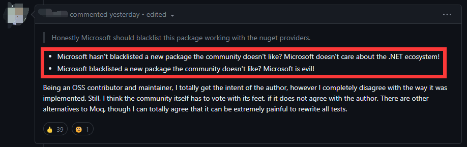
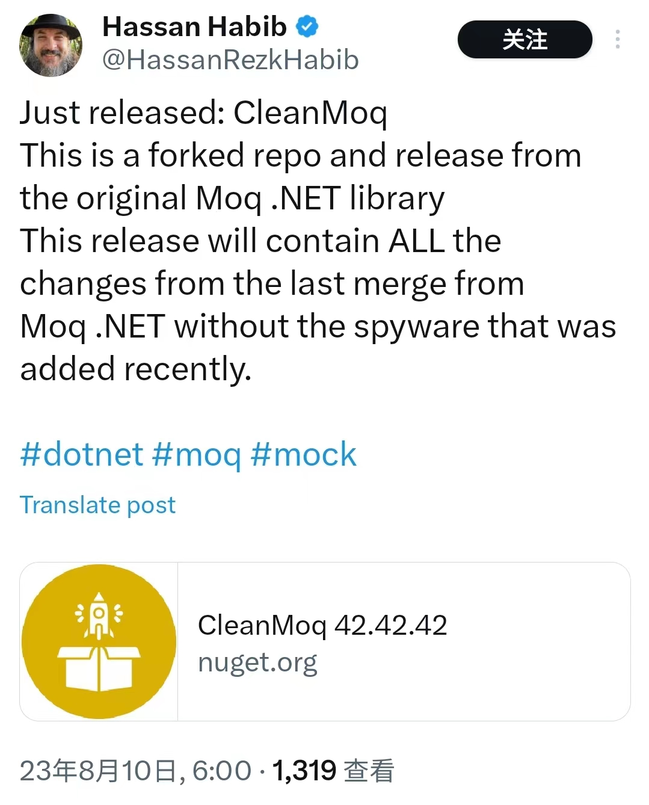
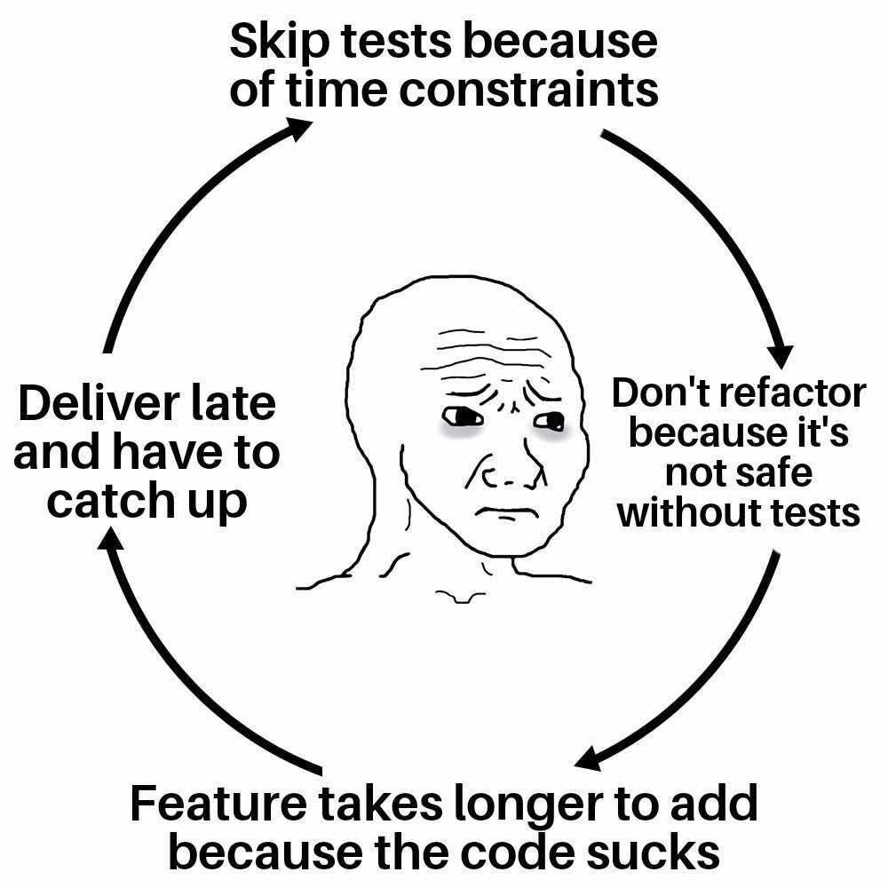

## 0. Moq 发生了什么？

大约两天前，.NET 最著名的的单元测试 Mock 库 [**Moq**: https://github.com/moq/moq](https://github.com/moq/moq) 被爆出从它的 4.20 版本开始，包含了一个 .NET 分析器，在你 build 使用了 Moq 的项目的时候，它会扫描你本地的 git 配置，拿到你本地的电子邮件地址并通过 Moq 作者的另一个项目 **SponsorLink** 发送到托管在 Azure 的某个服务上，以检查你是否是 Sponsor。相关的讨论可以在这个 Reddit 帖子：[https://www.reddit.com/r/dotnet/comments/15ljdcc/does_moq_in_its_latest_version_extract_and_send/](https://www.reddit.com/r/dotnet/comments/15ljdcc/does_moq_in_its_latest_version_extract_and_send/) 和这个 Github issue：[https://github.com/moq/moq/issues/1372](https://github.com/moq/moq/issues/1372) 了解。

这件事在国外 .NET 社区引起轩然大波，有开发者强烈谴责这个行为，也有开发者维护 Moq 的原作者，感谢他一直维护该项目却只收到少到可怜的几个子儿的赞助。

有网友谴责作者并认为微软应该将 Moq 加入黑名单：

||
|:-:|
|**图 1 - 谴责作者并认为微软应该将 Moq 加入黑名单**|

还有网友吐槽上面这条：

||
|:-:|
|**图 2 - 错的总是微软？**|

上面这两句翻译一下就是：

- 微软竟然没有把社区不喜欢的新包列入黑名单？难道微软对 .NET 生态系统不在乎了吗！
- 微软居然将社区不喜欢的新包列入黑名单？这就证明了微软的邪恶本质！

有网友强调我们应该重视开源项目维护者一无所获这件事，毕竟很用户并没有赞助这个库，也没有为它做出过贡献：

||
|:-:|
|**图 3 - 重视开源项目维护者一无所获这件事**|

有网友发布了不包含该争议功能的 **CleanMoq**：

||
|:-:|
|**图 4 - 不包含该争议功能的 CleanMoq**|

我平常并不使用 Moq，我使用的是 **NSubstitute**。这个事件并没有对我造成影响。

真正引起我的兴趣的是，这个事件并没有在国内的社区引起如此广泛的讨论，我只在一个技术很强的 .NET 微信群中与朋友们讨论过几句。根据我的经验，国内普通开发者（包括我自己）可能拼尽全力也只能一些中小公司，而这种类型的公司一般都没有写单元测试的习惯，也就用不到 Moq 和 NSubstitute 这种 Mock 库。虽然公司有开发成本上的考量，但我依然认为这是一种悲哀和恶性循环，我认为多花时间写测试实际上是为公司省钱，但很多公司和团队意识不到，或者有很紧张的开发时间要求，确实没有多余的时间。最终没人写单元测试，也就没人学怎么写单元测试，软件的质量也会越来越差。

## 1. Moq 是做什么的？

```csharp
[Fact] // 表示这是一个单元测试方法
public void GetStudentById_ShouldReturnCorrectStudent_WhenIdExists()
{
    // Arrange（准备阶段）
    var mockStudentRepository = new Mock<IRepository<Student>>(); // 创建一个 Mock 对象，模拟 IRepository<Student> 接口的行为
    var expectedStudent = new Student { Id = 1, Name = "Alice", Age = 18 }; // 创建一个期望返回的学生对象
    mockStudentRepository.Setup(repo => repo.GetById(1)).Returns(expectedStudent); // 设置当调用 GetById 方法，并传入参数为 1 时，返回期望的学生对象
    var studentService = new StudentService(mockStudentRepository.Object); // 创建一个 StudentService 对象，并传入 Mock 对象的 Object 属性，作为依赖注入
    // Act（执行阶段）
    var actualStudent = studentService.GetStudentById(1); // 调用 StudentService 的 GetStudentById 方法，并传入参数为 1
    // Assert（断言阶段）
    Assert.Equal(expectedStudent, actualStudent); // 断言期望的学生对象和实际返回的学生对象相等
    mockStudentRepository.Verify(repo => repo.GetById(1), Times.Once()); // 验证 Mock 对象的 GetById 方法被调用了一次，并传入了参数为 1 
}
```

首先明确一点：单元测试是由开发人员来写，并不是测试人员。

以上是一段使用了 Moq 的单元测试代码。单元测试不应该依赖物理上的数据库，所以我们使用 `var mockStudentRepository = new Mock<IRepository<Student>>();` 这段代码创建了一个仿真的 `studentRepository`，然后用 `mockStudentRepository.Setup(repo => repo.GetById(1)).Returns(expectedStudent);` 这段代码设置当调用 `studentRepository.GetById` 方法并传入参数为 1 时，返回前面构造的 `expectedStudent` 对象。这样我们对 Repository 中的方法的调用就不会影响真正的数据库中的数据，而是返回我们设置好的假数据。

你可能觉得我们这是在掩耳盗铃，实际上我们这个方法测试的是 `StudentService` 的 `GetStudentById` 方法，而不是 `StudentRepository` 的方法，所以假定 Repository 的返回值是必要的。否则，如果我们请求真的数据库，恰好数据库中没有 Id 为 1 的学生，我们岂不是每次做单元测试都要改我们的单元测试代码？单元测试的运行频率是很高的，在开发时，测试时，CI CD 时都可能运行单元测试，每次都做代码的修改，代价很高。

而对于仓储层，我不在其中写任何业务逻辑，所以我一般不会对仓储层进行单元测试，对它进行测试也没什么意义。如果你真的想测试它的话， **集成测试** 会帮你做。

## 2. 什么是单元测试

单元测试是一种软件开发的方法，它可以帮助开发者检查代码的功能是否正确，以及是否符合预期的需求。单元测试的好处有很多，比如 **提高代码的质量，减少错误，增加可读性，方便重构，提高开发效率等。** 相反， **不写单元测试会对代码可维护性，项目的健康性，未来新需求的开发等**，带来很大的破坏。

不写单元测试的破坏有以下几个方面：

1. **代码可维护性**：不写单元测试的代码往往缺乏结构和规范，难以理解和修改。如果代码中存在隐藏的错误或逻辑问题，没有单元测试来发现和修复，那么代码就会变得越来越脆弱和不可靠。这样的代码对于维护者来说是一个噩梦，因为他们不知道修改一处代码会不会影响其他地方的功能。
2. **项目的健康性**：不写单元测试的项目往往缺乏信心和安全感。每次发布新版本或者部署到生产环境时，都有可能出现意想不到的问题或者故障。这样的项目对于客户和用户来说是一个风险，因为他们不知道什么时候会遇到系统崩溃或者数据丢失。
3. **未来新需求的开发**：不写单元测试的开发者往往面临着更多的压力和挑战。当项目需要添加新功能或者改变旧功能时，他们没有办法快速地验证代码是否正确，也没有办法保证代码不会引入新的错误。这样的开发者对于需求变更来说是一个阻碍，因为他们需要花费更多的时间和精力来调试和测试。

不写单元测试还会造成一个恶性循环：

1. 不写单元测试导致代码质量低下，代码质量低下导致维护困难，维护困难导致开发效率低下，开发效率低下导致时间紧迫，时间紧迫导致不写单元测试。
2. 不写单元测试导致项目风险高昂，项目风险高昂导致用户不满意，用户不满意导致需求变更频繁，需求变更频繁导致开发复杂度增加，开发复杂度增加导致不写单元测试。

## 3. 总结

||
|:-:|
|**图 5 - 不进行单元测试的恶性循环**|

这是一张与测试（单元测试、集成测试等）相关的 meme，我简单翻译一下：

1.跳过测试，因为时间很紧 => 2.不重构，因为没有测试，重构起来太危险 => 3.开发新特性需要更长的时间，因为代码烂透了 => 4.延迟交付，并且需要加快开发速度 => 1.跳过测试，因为时间很紧

希望国内的公司和开发者都能更重视单元测试！如果后面我有时间的话，会写一些简单的单元测试入门教程。它本来也不难。

**最后来一条广告：😁鄙人正在寻找新的工作机会，最好是 work-life balance 的工作，base 青岛，有远程工作机会也不错，感兴趣的请通过电子邮件联系我：kit.j.lau@outlook.com，谢谢！**