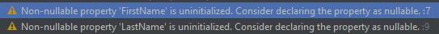
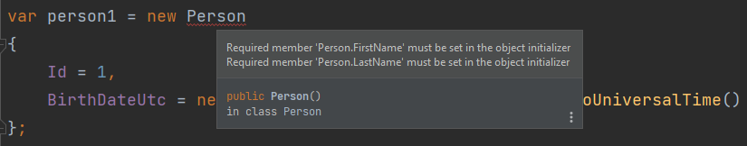

[TOC]

## 0. 为什么会有这篇文章

null 是折磨了广大程序猿很久的一个东西。将 null 引入到编程语言中的 Tony Hoare 爵士曾经表示过：

> Null References: The Billion Dollar Mistake（空引用：一个十亿美元的错误）

我在设计数据库数据结构时，会将所有字段都设置为 Not Null，这只是我的偏好，这里不讨论对错。我觉得连 null 的引入者都认为它是个错误的话，我最好也不要用它。可惜我（跟我一样的大部分普通开发者）在工作中并没有决定数据模型设计的权力。

||
|:-:|
|<b>图 1</b>|

好在现在大部分团队都有“除了字符串类的字段之外，其它字段都 Not Null”的好习惯。所以我们只讨论字符串的 null 问题，讨论如何解决让开发人员饱受折磨的 `NullReferenceException` 问题。string 是比较特殊的，它是一个引用类型，但又经常跟值类型一起出现（声明类时经常被作为属性使用）。其它的值类型都有一个零值，而 string 的默认值是 null，非常容易引起误会。

## 1. 恼人的 `NullReferenceException`

现在我要开发一个控制台应用，使用 EF Core。实体模型如下：

```csharp
public sealed class Person
{
    public int Id { get; set; }

    public string FirstName { get; set; }

    public string LastName { get; set; }

    public DateTime BirthDateUtc { get; set; }
}
```

此时，我的 IDE（实际上是 Roslyn，但我们不扯这么深）报了警告：

||
|:-:|
|<b>图 2</b>|

它告诉我，非 null 属性 `FirstName` 和 `LastName` 没有被初始化，考虑把它们声明成可为 null 的属性。

作为一个经验丰富的开发者，你什么场面没见过，区区两个警告，即使几千个警告，你眼都不眨一下。你可能会说：I don't give a fuck。但是你在这里 don't give them a fuck，它们在生产上就会给你一堆 fuck。

数据库是 postgres，对应的 Persons 表结构是这样的：

```sql
create table public."Persons"
(
    "Id"           integer generated by default as identity
        constraint "PK_Persons"
            primary key,
    "FirstName"    text,
    "LastName"     text,
    "BirthDateUtc" timestamp with time zone not null
)
```

其中 `FirstName` 和 `LastName` 字段都是可为 null 的。

现在我运行下面这段代码，插入两条数据进去：

```csharp
var person1 = new Person
{
    Id = 1,
    FirstName = "Lau",
    LastName = "Kit",
    BirthDateUtc = new DateTime(1990, 1, 1).ToUniversalTime()
};

var person2 = new Person
{
    Id = 2,
    BirthDateUtc = new DateTime(1991, 1, 1).ToUniversalTime()
};

await using var db = new RequiredDbContext();

db.Persons.Add(person1);
db.Persons.Add(person2);

await db.SaveChangesAsync();
```

||
|:-:|
|<b>图 3</b>|

现在需求来了，我要取出所有的 Person，遍历它们，并且输出每一个 Person 的 `FirstName` 和 `LastName` 的大写形式，即调用它们的 `ToUpper()` 方法。

```csharp
await using var db = new RequiredDbContext();

var persons = (await db.Database.GetDbConnection().QueryAsync<Person>("SELECT * FROM \"Persons\"")).ToArray();

foreach (var p in persons)
{
    Console.WriteLine(p.FirstName.ToUpper());
    Console.WriteLine(p.LastName.ToUpper());
}
```

这里我使用了 Dapper 来取数据。因为我发现 `Npgsql.EntityFrameworkCore` 在取数据时会直接抛出异常，因为我取的数据中有 `FirstName` 和 `LastName` 为 null 的数据，但我的 Model 的这两个字段又是 `string` 类型，而不是可为 null 的 `string?`，导致取数据时映射成对象时抛出异常。这非常好，能在开发阶段就让开发者意识到这个问题。但使用 Dapper 的开发者会顺利地取出这些为 null 的数据，映射到 `string` 类型的属性上。Dapper 是一个轻量级的 ORM，这一步的检查不是它的职责，而是开发者的职责。

输出结果：

```
LAU
KIT
Unhandled exception. System.NullReferenceException: Object reference not set to an instance of an object.
   at Program.<Main>$(String[] args) in C:\Users\64191\Desktop\required\Program.cs:line 33
   at Program.<Main>$(String[] args) in C:\Users\64191\Desktop\required\Program.cs:line 31
   at Program.<Main>(String[] args)

Process finished with exit code -532,462,766.
```

不止调用 `ToUpper()` 方法。你使用 `FirstName` 和 `LastName` 的属性和方法都可能会抛出异常。

## 2. 在 C# 11 之前如何解决

在 C# 11 之前，C# 已经引入了可为 null 的声明符号，也就是问号： `?`。IDE 前面给我的两个警告应该是引入这个符号之后的 C#/dotnet 版本才有的。

如果你本意想让 `FirstName` 和 `LastName` 可为 null，你应当把他们声明为 `string?` 类型。这样的话，调用它们的 `ToUpper()` 方法的代码就会报警告，告诉你这两个属性可能为 null。只要你理睬了这两个警告并做了处理，就不会抛异常。

但我前面说过，我会将所有字段都设置为 Not Null。但我又不想在声明 Person 类时看到警告。很多开发者（包括我）的做法是这样的，在声明时：

```csharp
public string FirstName { get; set; } = null!;

public string LastName { get; set; } = null!;
```

这实际上是告诉编译器：我这两个字段绝对不会为 null。从而使编译器不报警告。我会对数据库做一些更改，把`FirstName` 和 `LastName` 字段置为 not null，来帮我实现这个约束：

```sql
create table public."Persons"
(
    "Id"           integer generated by default as identity
        constraint "PK_Persons"
            primary key,
    "FirstName"    text                     not null,
    "LastName"     text                     not null,
    "BirthDateUtc" timestamp with time zone not null
)
```

然后我尝试插入一个 `FirstName` 和 `LastName` 都为 null 的 Person：

```csharp
var person1 = new Person
{
    Id = 1,
    // `FirstName` 和 `LastName` 没有被赋值，会为默认值 null
    BirthDateUtc = new DateTime(1990, 1, 1).ToUniversalTime()
};
```

编译器不会给我任何警告，只有我运行代码往数据库插入数据时，才会抛出异常。

如果团队中有真正懂 C# 的人，了解 `string` 和 `string?` 的区别，知道 `string` 对应不可为 null 的数据库字段，`string?` 对应可为 null 的数据库字段，并做出对应的设计，就可以解决这个问题。

很多团队中根本没有这样的人，把 `string` 类型的属性对应的数据库字段置为可为 null，让程序运行中抛出异常，把用户吓走。

这就让人郁闷了。 **在实际开发中，由于急功近利，公司可能出台一系列绩效考核措施，疯狂压缩工时，开发者为了拿绩效养家糊口，只能快速开发，未必会测试完全。在这样急功近利的团队，单元测试和集成测试更是一种奢望。急匆匆写出这样的代码，没有编译器的警告，开发和测试又没有测到，很容易出现线上问题，因小失大。为了早上线一个月，搞出一些可能会吓走用户的 bug，这真的值得吗？**

## 3. C# 11 的 required

C# 11 引入了 required 关键字，可以直接把 `FirstName` 和 `LastName` 声明为 required：

```csharp
public required string FirstName { get; set; }

public required string LastName { get; set; }
```

此时，再看我们的代码：

||
|:-:|
|<b>图 4</b>|

直接报错了，告诉我们这两个属性必须在对象初始化器里赋值。这样就可以约束开发者在开发时不要把它们赋值为 null，从而一步到位解决问题。

## 4. 总结

技术上并没有什么好总结的，只是一个新关键字，解决一些旧的问题。

但是我遇到的并不是技术问题。我想在这里吐槽一下我遇到的问题。懒得看的朋友可以退出这篇文章了。后面的吐槽对你不会有帮助，只会带来负能量。

我最近加入了一个团队，这个团队开发自己的软件产品，通过运营自己的软件来赚钱。这个团队很注重绩效考核，以工时算绩效，工时精确到小时。这似乎问题不大，但这个团队又会压缩开发的工时。

这令我很惊讶。我个人一般称这种模式为“外包模式”。没有黑外包公司的意思，我毕业后第一份工作就是就职于外包公司，那家公司很注重产品质量，是难得的优秀软件服务商。

外包公司为其它公司开发产品，以最快的速度交付，拿到费用，无可厚非。但是使用“外包模式”开发自己的产品，无异于自寻死路。

在开发人员水平差不多的情况下，工时越短，软件质量越差。如果外包公司选择使用外包模式，付出了自己的声誉，但换到的是快钱。但做自己的产品的公司使用“外包模式”，项目负责人为了业绩，会压缩工时；员工为了在很短的工时内完成任务，拿到绩效，会开足马力写垃圾代码；软件会以最快速度上线。但这不是在硅谷拉风险投资，在没有竞争公司跟你同步开发一个功能极度相似的产品的情况下，没有必要做一个垃圾软件出来。如果只是为了快速上线测试市场反应，也应当在下一个版本立刻投入足够多的，不压缩工时的时间来重构，而不是把所有精力放在做一些没什么人会用的新特性上。这样既赚不到快钱，又会因为软件质量不好而损失用户或者拉不到用户，最终搞崩的是自己的产品。

这里放几个从网上看到的软件开发和项目管理相关的梗图。梗图不止是玩梗，梗图中包含了大智慧：

||
|:-:|
|<b>图 5</b>|
|注意，上图中的 tests 指单元测试、集成测试等能够保证代码质量和软件可维护性的自动化测试。|

||
|:-:|
|<b>图 6</b>|