> 参考资料：https://www.cesarsotovalero.net/blog/i-am-switching-to-python-and-actually-liking-it.html

- [0. 前言](#0-前言)
- [1. 安装 uv](#1-安装-uv)
- [2. 安装 VS Code](#2-安装-vs-code)
- [3. 安装 VS Code Python 插件](#3-安装-vs-code-python-插件)
- [4. 使用 uv 创建一个项目](#4-使用-uv-创建一个项目)
- [5. ruff](#5-ruff)
- [6. 一个不好的 Python 代码示例](#6-一个不好的-python-代码示例)
- [7. 安装 ruff 插件](#7-安装-ruff-插件)
- [8. 体验 ruff](#8-体验-ruff)
- [9. 尝试运行](#9-尝试运行)
- [10. 更完善的示例](#10-更完善的示例)
- [11. 使用国内源（可选）](#11-使用国内源可选)
- [12. 小节](#12-小节)
- [13. ty（可选）](#13-ty可选)
- [14. 体验 ty](#14-体验-ty)
- [15. 总结](#15-总结)

## 0. 前言

现在几乎所有专业的大学生，都会或多或少学习使用 Python。在 ChatGPT 出现之前，非计算机和相关专业的同学们学习 Python，大部分同学几乎就是走个过场，大家都知道它有用，但是不明白多么有用。我虽然是计算机专业，但 Python 也从未成为我的主要学习目标。

但是现在有了 ChatGPT 等 LLM，只要掌握一点点的 Python 基础语法，再配合上 AI 的辅助（实际 AI 是主力，你打辅助），似乎人人都能用它来做一些事情了。即使不搞什么大项目，就用 Python 来批量处理一些 xlsx 和 csv 表格等，也能大量节省大家的时间，把宝贵时间用在学习和玩耍放松等更重要的事情上。

昨天晚上，我的一位还在读研的朋友说，她们的老师让使用 VS Code 写 Python。她们甚至是文科专业。显然这位老师即使在自己的专业领域外也十分优秀，走在了前列上。VS Code 作为学生们进入企业后最有可能使用的代码开发工具之一，提前熟悉它是十分重要的。相信在座的各位高级工程师在带实习生的时候，都因为他们“笨”到不知道怎么配开发环境而生气过，从第一印象就低看他们一眼。我认为应该体谅他们，毕竟万事开头难。而在学校中提前接触企业工具，会建立很大的起步优势。

我不详细比较目前主流的几种开发工具，因为我并不认为我同时精通了这几种工具，我的比较显然会偏颇。我只按照时间线，说一下我使用过的几种工具，而您可以跳过这一段：

1. 我在大学选修 Python 时，大概是 2017-2018 年，学校里教我们使用 Anaconda 管理环境，使用 Anaconda 中可以安装的 Jupyter Notebook 编写代码。它是一款将文档和代码融于一体的工具，即使在现在的科研和教学场景中，依然被广泛使用。
2. 但由于我是先懂的编程后学的 Python，我总感觉 Jupyter Notebook 的文档和代码 cells 混在一起的模式会扰乱我的代码思路，在实际编写代码时，我选择了 Anaconda 中可以安装的 Spyder，它的语法提示等都让我感觉前所未有的舒服。
3. 后来我在网上阅读教程，发现很多人都在提 PyCharm 这个词，于是我安装了 PyCharm Community Edition，配合原本的 Anaconda 来管理环境，它的强大不用我多说，但是由于是 Community 版本，我工作的中小型企业都不以 Python 为主力语言，没有采购 PyCharm 企业版，我无法将其应用于企业开发。我也认为它并不适合学生使用（编程天才除外），据我的观察，大部分使用 PyCharm 的学生都只用了它的 1 成功能，毕竟它是面向企业的一个强大工具，拥有太多的功能。
4. 随着我的编程水平的提升，跟很多人一样，我开始追求轻量化，开始讨厌 Anaconda 的笨重。此时我已经对 Python 环境，lib 等都有了一定概念，我使用 miniconda 替换了 Anaconda，在命令行中操作，使用 environment.yml 管理环境，使用 VS Code 编程。但是这是绝对没有 PyCharm 中的良好体验的，因为我并没有将 VS Code Python 开发环境配置到最佳。但是现在我的代码终于可以商用了，这是 VS Code 的绝对优势。
5. 后来，我发现使用 conda 安装一些比较底层的 lib 时，跟 pip 安装的会有所不同，而且有一些编译安装会失败，而 pip 是绝对的行业标准，所以我改用 venv 管理环境，使用 requirements.txt 管理依赖，使用 pip 安装 libs，在生产环境中使用 pyenv 管理 python 版本，依然使用 VS Code 写代码。这让我回到了一切的起点，最原始的方式。
6. 使用了一些开源项目后，我发现高手都在使用 poetry 管理环境，所以我也切换到了 poetry，它基于 venv 和 pip，只是改用了 pyproject.toml 管理环境和依赖。
7. 后来，uv 横空出世，我发现几乎所有的新的开源项目都在使用 uv 进行环境管理，而且它十分容易学习，我也顺理成章地迁移到了 uv。但此时我面临一个问题：公司某个项目要使用 Python 编写，显然这是一个商业项目。而且我也不能再忍受原来配置了一半的半吊子 VS Code Python 开发环境了，我需要一个高效的开发环境。我开始疯狂查阅开源项目，询问 AI 等，但 AI 给出的都是过时的或者不完美的方案，我明白我需要知道完美方案中的几个名词，然后再基于这些名词来询问 AI，才能得到最好的效果。
8. 最终，我读到了开头的参考资料链接指向的那篇文章，它指引我配置了我目前的高效开发环境。但我时间有限，不确定我是否完整地使用了文章中的方式，但目前的环境已经足够我使用。

还有一个推荐 VS Code 的理由，因为它内置了 Github Copilot 插件，提供了慷慨的免费额度，可以为你自动进行一些代码补全，以及 Agent 辅助的代码自动生成等。我不推荐在你学习基础语法的时候使用 Copilot，因为你会变得懒惰，无法掌握基础语法。但是当你已经掌握了基础语法后，Copilot 会极大地提升你的编程效率。Github Copilot 也有付费版本，价格也不贵，学生使用 Github 账号通过学生认证后还可以免费使用。

> 向不知道的同学们解释以下，Github Copilot 是目前一流的 AI 编程助手（有时会沦为二流，但总是平均水准以上）。

您不必将这篇文章奉为准则，因为我是一个忍受饥寒交迫的，在温饱线边缘艰难挣扎求生的失败软件工程师，并不是那些年薪百万的成功软件工程师。从我目前的身份来看，这篇文章很没有说服力。无论如何，我们正式开始这篇文章。

## 1. 安装 uv

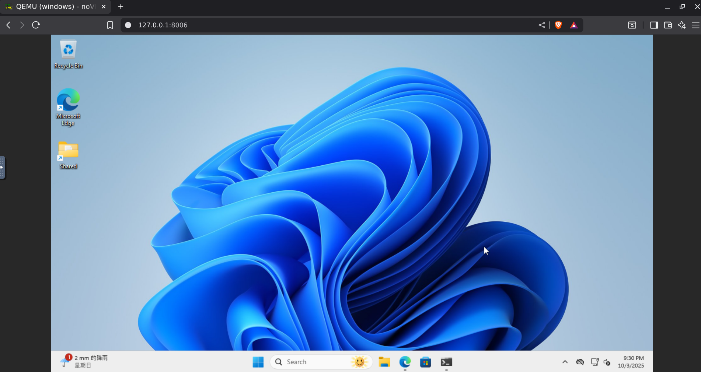

我构建了一个全新的 Windows 11 的虚拟机，来演示这个过程，显然这个虚拟机里目前并没有安装 python。我们先不安装 python，直接来到 uv 的官方文档：

https://docs.astral.sh/uv/

由于我们使用 windows，所以这里选择 Windows，就会显示出 windows 的安装命令。点击右侧的复制按钮即可。

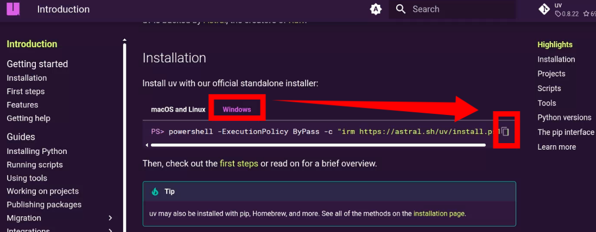

然后打开 powershell：

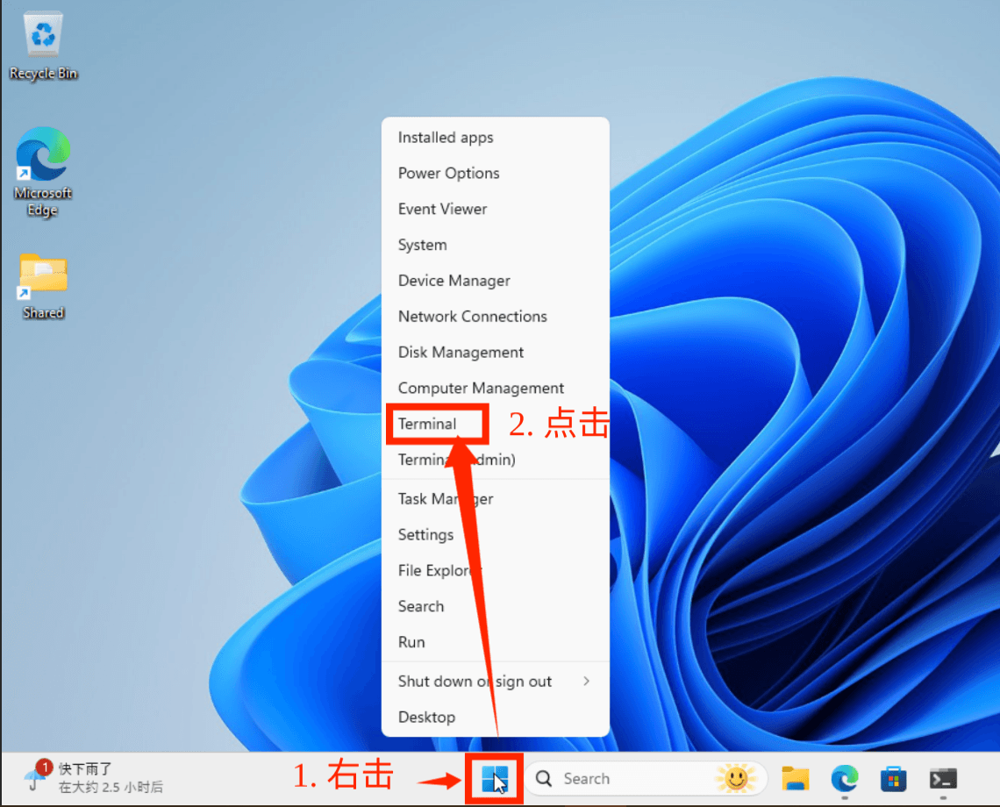

在 powershell 中粘贴入刚才的命令，运行，然后等待安装完成即可。

## 2. 安装 VS Code

相信大家都知道如何安装 VS Code，但我还是贴一下官方地址，大家不要错误安装国内的一些假网站上的“绿色学习版”。VS Code 是完全免费的。

https://code.visualstudio.com/

安装时有一步会让你选择 `Add "Open with Code" action to Windows Explorer file context menu` 等，建议全部勾选，这样你就可以在任何目录下，右键选择“在 Code 中打开”，非常方便。

## 3. 安装 VS Code Python 插件

在 VS Code 中，点击左侧的扩展按钮，搜索 Python，然后安装 Microsoft 出品的 Python 插件，点击安装即可，它会自动安装 Pylance 等几个关键的 Python 插件。

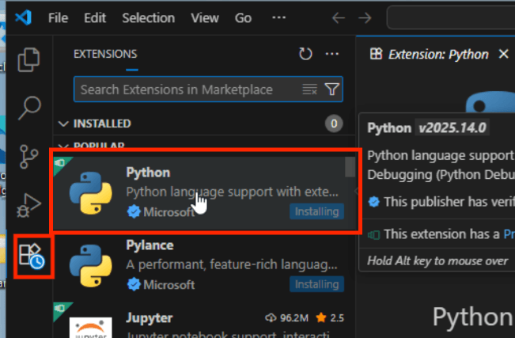

安装完该插件，你的 VS Code 就可以提供 Python 代码的语法高亮，代码补全，代码跳转等功能了，再配合上 Github Copilot，写代码的体会十分顺滑。

例如我想写一个斐波那契数列的函数：

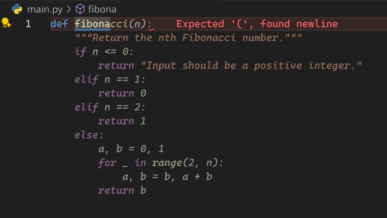

可以看到我刚刚输入 `def fibona`，它就自动帮我补全了函数体，只要点击 tab 就可以将这些代码输入到编辑器中。

但是，我们 VS Code 插件的安装还没有完成，请继续看。我们以实际项目为例。

## 4. 使用 uv 创建一个项目

我在桌面上创建了一个 demo 目录，双击打开该目录，在上面的位置输入 powershell，按下 Enter，就会自动在这个目录打开 powershell

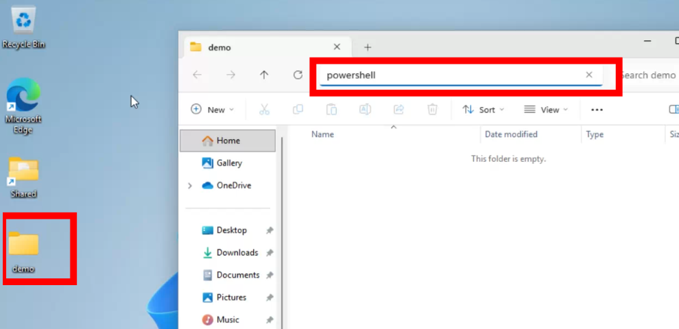

然后我运行：

```bash
uv init example
```

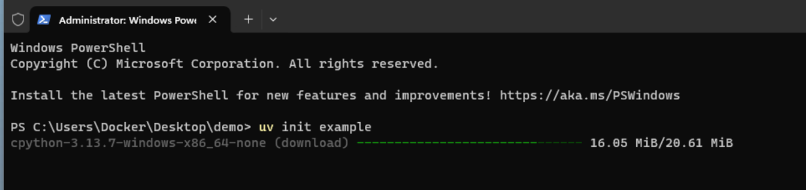

从截图里可以看到，它直接开始安装 cpython 3.13.7 了，这也表示它会自动帮你安装 python 3.13.7 了。如果你的团队使用的是旧版本，如 python 3.12 等，你可以运行 `uv init example --python 3.12` 来指定版本。但这就是 uv 的具体用法了，不是这篇文章的范畴，你可以询问你信任的 AI 来帮你，如 ChatGPT 等。

安装完成后，你会看到 demo 目录下多了一个 example 目录，运行以下命令进入该目录：

```bash
cd example
```

然后运行以下命令在该目录打开 vscode

```bash
code .
```

就可以愉快地开发了。

在 VS Code 中，你会看到右下角显示的 Python 版本，以及你的虚拟环境名称（在这里是我们创建的 example），如图所示：

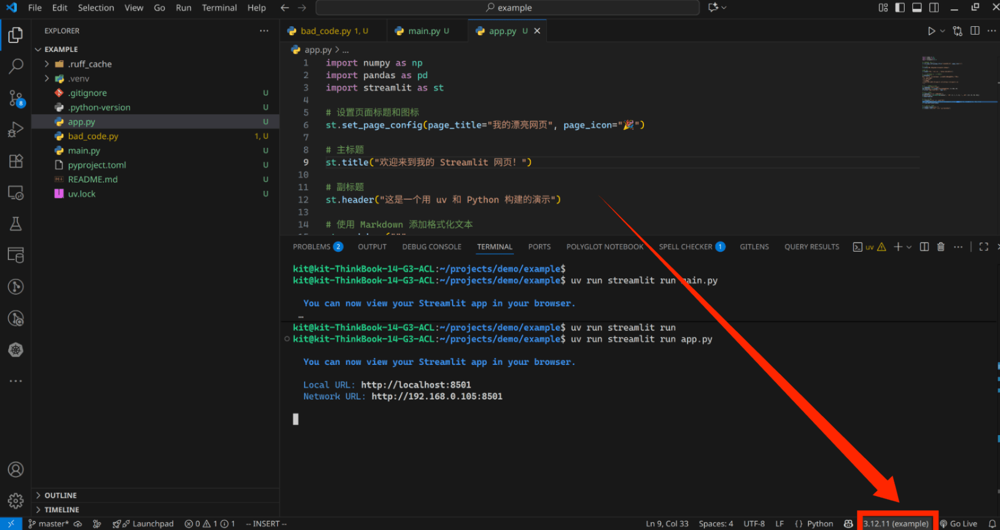

如果这里没有显示像我这样，在版号后面没有显示括号，也没有环境名称，而是只显示了版本号，或者显示了其他的虚拟环境名称，或者显示让你选择 Python 解释器，则说明你没有默认选择该项目的虚拟环境作为当前项目的 Python 解释器。你可以点击这里，选择 `example` 这个虚拟环境即可。如截图所示：

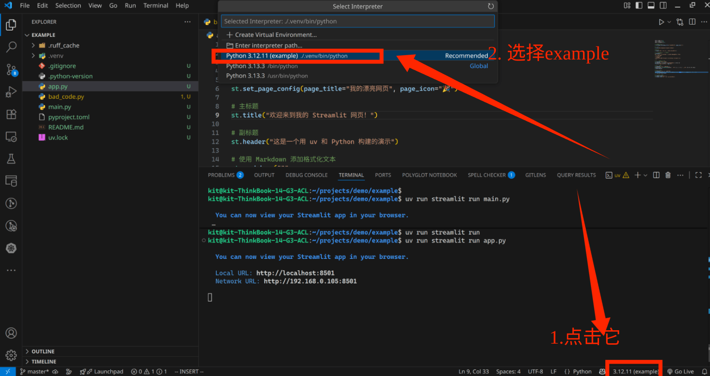

这一步十分重要，关系到 VS Code 能否正确地识别你的项目环境。

## 5. ruff

ruff 是 uv 的团队开发的一个 Python 代码质量检查工具，类似于 eslint 等。它会帮你检查代码中的一些不好的实践，并且给出建议。它的性能特别好，并且安装和配置都非常简单。

我们来到 VS Code 中的命令行，运行

```bash
uv add ruff --dev
```

如图所示：

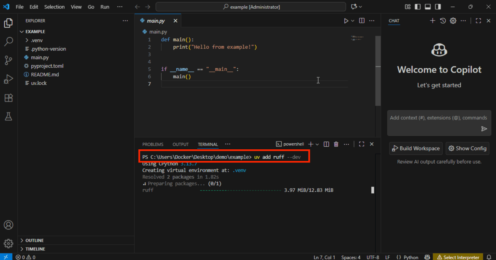

可以看我们的确位于 `demo/example` 目录下，可以安全的运行以上命令，安装 ruff 了。在正确的项目目录下运行 `uv add` 命令十分重要，否则会报错，或者安装到错误的项目中。

安装完成后，我们可以在终端中运行 ruff 来检查代码质量。

## 6. 一个不好的 Python 代码示例

首先我们创建一个新文件 `bad_code.py`，然后输入以下代码：

```python
import os, sys
import math

# 全局变量，不好的实践
person_name = "World"
COUNT = 5

# 函数有危险的可变默认参数
def add_items(items=[]):
    items.append("item")
    return items

def process_data( name,  count):
    # 这行代码太长了，难以阅读，而且有不一致的空格
    print(f"开始为名为'{name}'的用户处理数据，该用户需要处理{count}个项目，这是一个非常长且不必要的消息，只是为了让这行代码的长度超过标准的88个字符限制。")

    unused_variable = "我没有在任何地方被使用"

    # 低效的循环和糟糕的格式
    for i in range(count):
        print("正在处理第 "+str(i +1)+" 个项目" )

    # 另一个糟糕格式的例子
    x=10
    y   = 20
    result=x+y
    print("结果是:", result)

    # 多次调用带有可变默认参数的函数，以显示意外行为
    print("第一次调用:", add_items())
    print("第二次调用:", add_items()) # 这会意外地包含两个'item'！

# 主要逻辑没有被 if __name__ == "__main__": 保护
process_data(person_name, COUNT)
```

然后在终端中运行：

```bash
uv run ruff check
```

结果如截图所示。

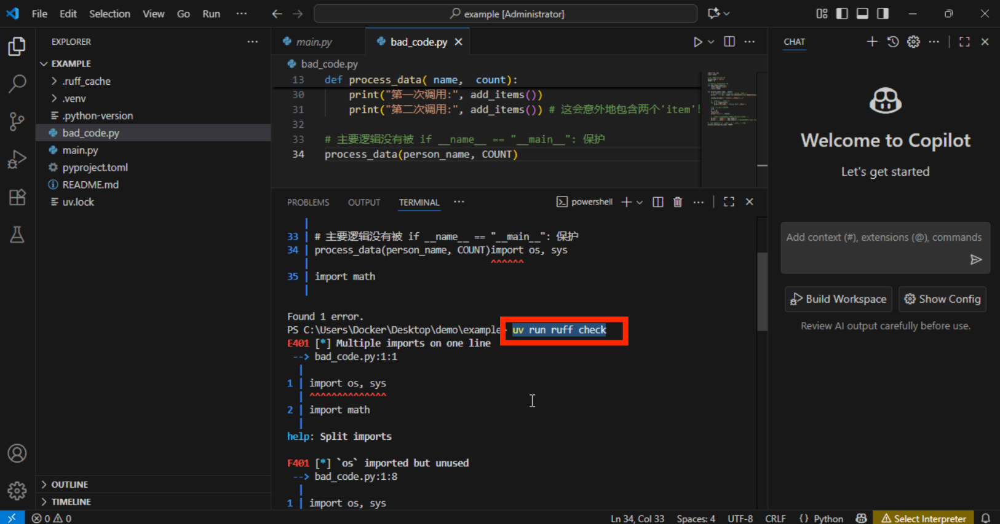

可以看报了一堆错误。这都是代码不规的地方。但是我们不需要在终端中手动输入命令来完成这件事，我们可以配置 VS Code 的插件，让它在 VS Code 的代码编辑器页面中直接展示代码错误，方便自动修改或者我们手动修改。

## 7. 安装 ruff 插件

由于在编写这篇博客的时候是在国庆假期，我回了老家，而且突然要出去办事，为了安全，就关闭了电脑，丢失了我在 Docker 中临时运行的 Windows 虚拟机，接下来的部分我会在我的 Linux（AnduinOS 1.3） 中演示，但是由于安装环境的部分已经完成，后面的部分在 Windows 中也是一样的。

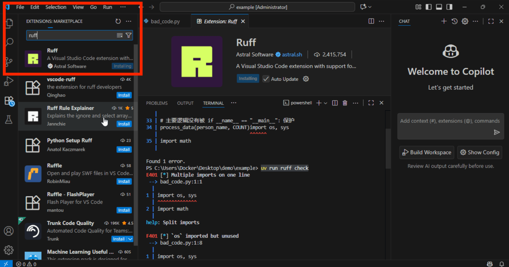

搜索 ruff 并安装这个插件。

然后我们还需要一些配置来发挥它的作用，按下 `ctrl` + `shift` + `p`，输入 `settings json`，选择 `Preferences: Open User Settings (JSON)`：

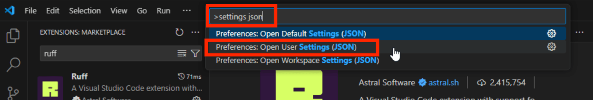

然后会自动打开一个 JSON 文件，我们在里面追加以下内容：

```json
{
    // 原有内容...

    "[python]": {
        "editor.formatOnSave": true,
        "editor.codeActionsOnSave": {
            "source.fixAll": "explicit",
            "source.organizeImports": "explicit"
        },
        "editor.defaultFormatter": "charliermarsh.ruff",
    },
}
```

## 8. 体验 ruff

现在再回到 `bad_code.py` 文件，如截图所示：

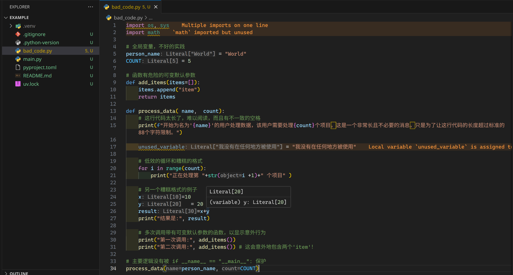

可以看到一不规的地方都黄色波浪线被标黄了。如果你跟我一样，还安装了 `Error Lens` 插件的话，错误会被高亮显示，非常醒目，就像截图中一样。

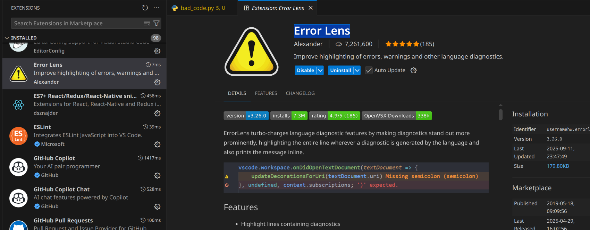

从上到下依次是：

1. import 了一些没有使用的 modules；
2. 声明了未被使用的变量。

还有一些问题全局变量，没有 `if __name__ == "__main__":` 保护等问题没有被标出，因为它们目前不属于 ruff 的检查范围。

由于上面我们配置了 `editor.formatOnSave`，所以我们只需要保存文件（`ctrl` + `s`），就会自动修复大部分问题。

保存后会发现没有被使用的 import 被删除了，但是 `unused_variable` 这个没有被删除，因为它对 ruff 来说是不安全的 fix，当我们在编写代码的过程中，可能出现刚声明完一个变量，还没来得及用，立刻就保存了文件，ruff 不会自动删除这个变量，因为它可能在后续的代码中被使用到。如果你已经编写完了代码，但不确定有哪些变量没有被使用，你只想删除它们，则可以在终端中运行 `uv run ruff check` 来检查，运行 `uv run ruff check --unsafe-fixes --fix` 来强行修复。

你可能会发现你的老师，学长学姐和同学的代码，在你的 VS Code 中会报很多黄色和红色的错误，但在他们的电脑上没有问题。这是因为他们的代码质量不够好。但你万万不要因为这种问题跟他们起冲突，破坏关系。你可以推荐他们阅读这篇博客。

现在你可以很方便地使用 VS Code 和 ruff 来自动提升你的代码质量了！恭喜你！

## 9. 尝试运行

在终端中，可以直接使用 `uv run xxx.py` 来运行你的 Python 代码文件。

```bash
uv run bad_code.py
```

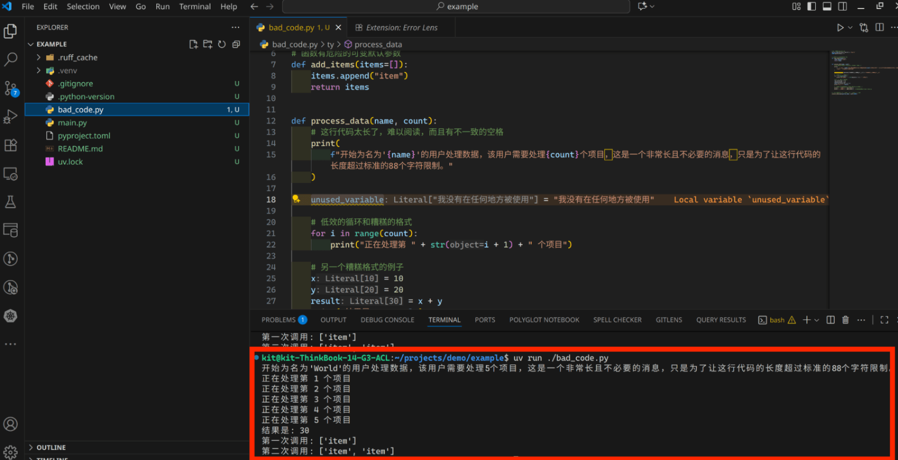

## 10. 更完善的示例

现在我引入大学生常用的 numpy、pandas 等库，使用 streamlit 来做一个简单的网页应用。

首先在终端运行命令，安装这 3 个库：

```bash
uv add numpy pandas streamlit
```

然后创建一个 `app.py` 文件，输入以下代码：

```python
import numpy as np
import pandas as pd
import streamlit as st

# 设置页面标题和图标
st.set_page_config(page_title="我的漂亮网页", page_icon="🎉")

# 主标题
st.title("欢迎来到我的 Streamlit 网页！")

# 副标题
st.header("这是一个用 uv 和 Python 构建的演示")

# 使用 Markdown 添加格式化文本
st.markdown("""
这是一个使用 `st.markdown` 创建的文本块。你可以轻松地：
- **加粗** 文本
- *斜体* 文本
- 创建列表
- 插入链接，例如 [Streamlit 官网](https://streamlit.io)
""")

# 添加一个交互式小部件
st.subheader("交互式滑块")
age = st.slider("请选择你的年龄", 0, 100, 25)
st.write(f"你选择的年龄是: {age} 岁")

# 显示一些数据
st.subheader("显示一个数据表格")
df = pd.DataFrame({
    '第一列': [1, 2, 3, 4],
    '第二列': [10, 20, 30, 40]
})
st.dataframe(df)

# 显示一个图表
st.subheader("显示一个简单的图表")
chart_data = pd.DataFrame(
    np.random.randn(20, 3),
    columns=['a', 'b', 'c'])
st.line_chart(chart_data)

# 在侧边栏添加内容
st.sidebar.header("关于")
st.sidebar.info("这是一个在侧边栏的示例。")
```

然后在终端中运行：

```bash
uv run streamlit run app.py
```

第一次运行，可能终端中会让你输入一个 Email 地址。按 Enter 键跳过即可。

终端输出如下：

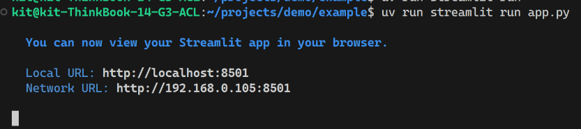

在浏览器中打开 `http://localhost:8501`，就可以看到你的网页应用了！

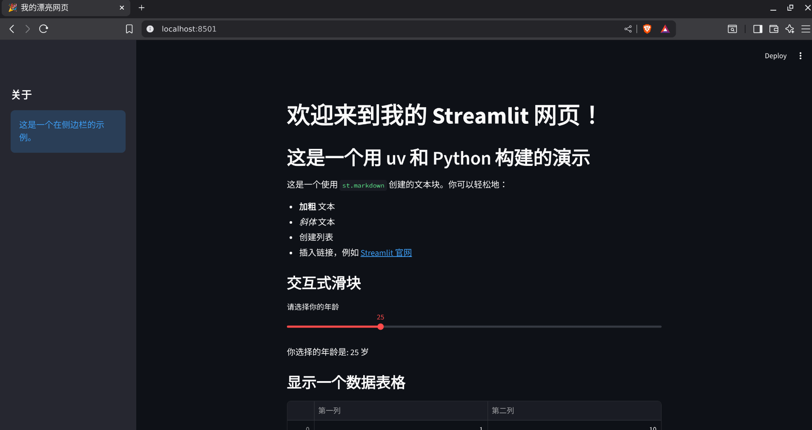

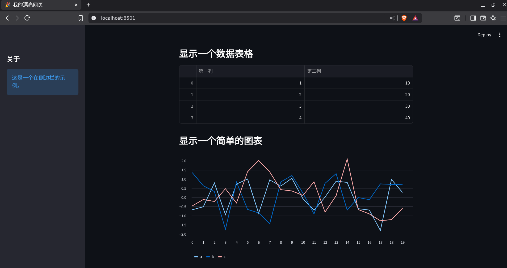

## 11. 使用国内源（可选）

当你需要安装 pytorch 等体积比较大的包时，可能会很慢，甚至失败。你可以使用国内源来加速安装。

以清华的 tuna 站为例，这是文档：

https://mirrors.tuna.tsinghua.edu.cn/help/pypi/

往下翻到文档的 `Astral uv` 部分，按照文档的提示操作即可。但是文档似乎没有更新，你可以编辑项目目录中的 `pyproject.toml` 文件，添加以下内容

```toml
[[tool.uv.index]]
url = "https://mirrors.tuna.tsinghua.edu.cn/pypi/web/simple/"
default = true
```

## 12. 小节

对于科研和学习来说，这个环境已经足够了。你可以在 VS Code 中愉快地编写 Python 代码，享受 ruff 带来的高质量代码体验。

如果你选择 Anaconda，你可以在图形界面中管理环境和包，这对初学者来说可能更友好，但它的性能和灵活性不如 uv。当你熟悉了 uv，熟悉了命令行操作后，你会发现它的强大和简洁。而且如果你的合作伙伴 clone 了代码，只需要运行 `uv sync` 就可以安装所有依赖，省去了配置环境的麻烦。

## 13. ty（可选）

ruff 虽然强大，但它的主要功能是代码检查（Linter）和代码格式化（Formatter），以下是一段简单的总结：

- 代码检查：Ruff 能够快速检测 Python 代码中的错误、潜在问题、不符合规范的写法以及不良实践。它整合了众多流行工具（如 Flake8、isort、pyupgrade 等）的规则，并用 Rust 进行了重新实现，从而极大地提升了检查速度。
- 代码格式化：Ruff 也可以作为代码格式化工具使用，旨在成为 Black 的直接替代品。它可以自动调整代码的格式，使其符合统一的风格规范，例如缩进、引号使用等。
- 自动修复：对于一些检查出的问题，例如未使用的导入，Ruff 能够自动进行修复，简化开发者的工作流程。
- 速度极快：得益于 Rust 的高性能，Ruff 的运行速度比传统的 Python 工具（如 Flake8 和 Black）快 10 到 100 倍，能够为大型项目提供近乎即时的反馈。

但是，在编写需要在生产环境中运行的代码时，对于 Python 这种强类型，动态类型的语言来说，类型检查（Type Checker）也是十分重要的。uv 的团队也开发了名为 ty 的工具，来进行类型检查。

Ty 是一个同样由 Rust 编写的高性能 Python 类型检查器，并且它也扮演着语言服务器的角色。其核心作用在于：

- 静态类型检查：Ty 的主要功能是分析 Python 代码中的类型注解，在代码运行之前找出与类型相关的潜在错误。这有助于开发者在编码阶段就发现问题，例如将错误类型的数据传递给函数。
- 提升代码质量和可维护性：通过强制执行类型约定，Ty 可以帮助开发者编写更健壮、更易于理解和维护的代码。
- 语言服务器功能：作为一个语言服务器，Ty 可以与代码编辑器（如 VS Code）深度集成，提供实时的代码诊断、自动补全和代码跳转等功能，从而改善开发体验。
- 高性能：与 Ruff 类似，Ty 也以速度为核心优势，旨在显著快于现有的 Python 类型检查器，特别是在大型代码库中。

ty 的安装和使用方式与 ruff 类似，你可以尝试一下。

```bash
uv add ty --dev
```

可以在终端中运行：

```bash
uv run ty check
```

来检查类型问题。

他们也提供了 VS Code 插件，但由于还在开发中，极不稳定而且可能有 bug，所以尚未发布到 VS Code 的插件市场上，你可以在这里找到：

https://github.com/astral-sh/ty-vscode

你可以手动安装到 VS Code 中使用。具体教程可以到网上检索如何安装未发布到市场的 VS Code 插件。

我安装 ty 后暂时不安装 VS Code 插件，来体验一下 ty 的类型检查功能。

## 14. 体验 ty

首先，我们在 `main.py` 文件中输入以下代码：

```python
def calculate_sum(numbers: list[int]) -> int:
    """
    接收一个整数列表并返回它们的总和。
    """
    total = 0
    for number in numbers:
        total += number
    return total


def get_user_scores() -> list[int | str]:
    """
    模拟从某个 API 或用户输入获取数据。

    注意：这里的返回类型被精确地标注为 list[int | str]，
    明确告诉类型检查器，列表内容可能是整数或字符串。
    """
    return [100, 95, 88, "75"]


def main():
    print("正在获取用户分数...")
    scores = get_user_scores()

    print("正在计算总分...")
    # ty 会在这里报错！
    # 因为 scores 的类型是 list[int | str]，
    # 而 calculate_sum 需要的类型是 list[int]。
    total_score = calculate_sum(scores)

    print(f"计算出的总分为: {total_score}")


if __name__ == "__main__":
    main()
```

如果直运行，会报错：

```bash
uv run python main.py
```

报错信息：

```bash
正在获取用户分数...
正在计算总分...
Traceback (most recent call last):
  File "/home/kit/projects/demo/example/main.py", line 35, in <module>
    main()
  File "/home/kit/projects/demo/example/main.py", line 29, in main
    total_score = calculate_sum(scores)
                  ^^^^^^^^^^^^^^^^^^^^^
  File "/home/kit/projects/demo/example/main.py", line 7, in calculate_sum
    total += number
TypeError: unsupported operand type(s) for +=: 'int' and 'str'
```

但是 VS Code 的代码编辑器中并没有报错，即使我们安装了 ruff。如截图：

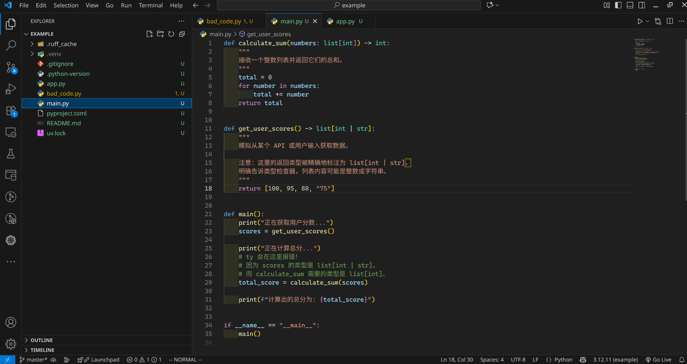

但如果你在终端中运行：

```bash
uv run ty check
```

如截图所示：

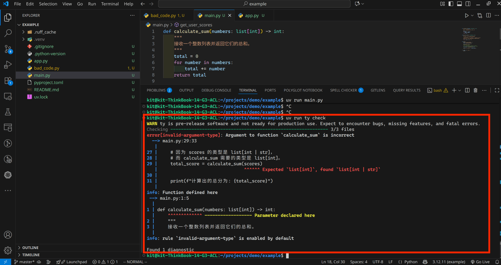

现在我安装 ty 插件，然后回到 `main.py` 文件中，如截图所示：

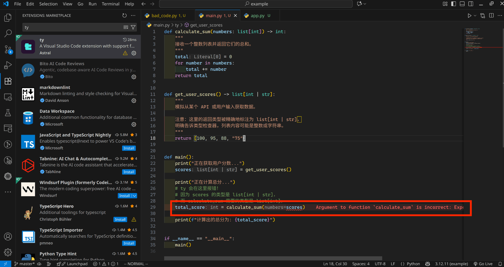

可以看到直接就报错了。你可以根据提示来修复代码。

## 15. 总结

以上就是如何快速配置 VS Code 的 Python 开发环境的完整指南。通过使用 uv 来管理环境和依赖，ruff 来提升代码质量，以及 ty 来进行类型检查，你可以大大提升你的 Python 编程效率和代码质量。

但这种方式适合于已经有了一种编程的“意识”的同学们，你首先能清晰的知道什么是环境，什么是虚拟环境，什么是终端，什么是包，什么是绝对路径，相对路径等等，否则你理解这篇文章的内容会很吃力。但是我们现在拥有 AI，你可以向它们随意提问。你也可以访问 uv、ruff 和 ty 的官方文档，获取更多信息。

uv 的文档：https://docs.astral.sh/uv/
ruff 的文档：https://docs.astral.sh/ruff/
ty 的文档：https://docs.astral.sh/ty/

如果你学习 Python 的目的是科研，而且老师同学都还在用 anaconda 等，你的主力也应该是 anaconda，以免于麻烦，也能更好跟他们配合。但是如果你学习 Python 的目的是为了进入企业工作，或者你已经在企业工作了，那么我强烈建议你使用 uv、ruff 和 ty 来配置你的 Python 开发环境。它们会让你事半功倍。