[TOC]

## 1. 什么是 ASCII，它是如何出现的？

计算机中的数据都是 0 和 1，不管是在 RAM 还是 ROM 中。我们常用的十进制的数字会转化成二进制保存，比如 26 会转化成二进制数 11010。

那么英文字符（英文字母与英文符号）呢？

解决方法是一个约定好的在字符和数字间的映射。最流行的是 ASCII：

|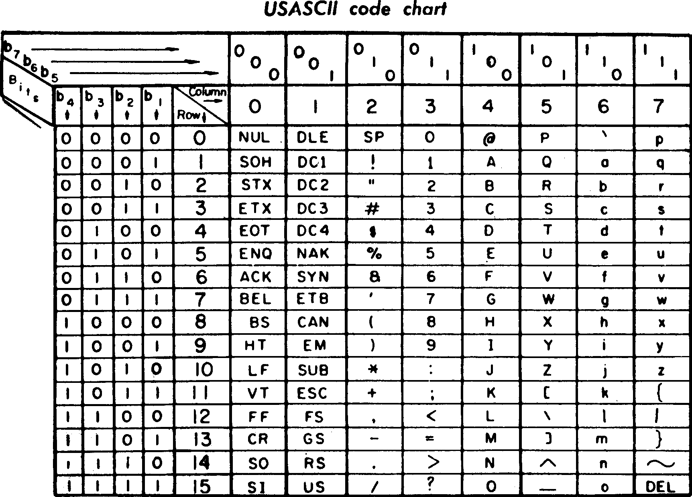|
|:--:|
|<b>图 1</b>|

有了它，西方基础的字符都可以映射成数字了，在 0-127 之间。即 ASCII 可以表达 128 个不同的字符。

例如 Hello 转换为为二进制的过程（叫做编码 Encoding）：

|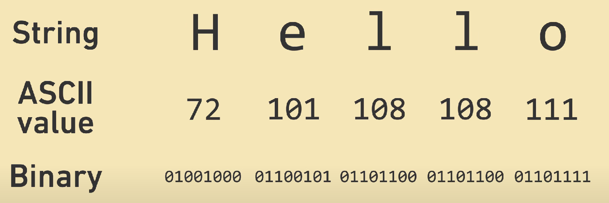|
|:--:|
|<b>图 2</b>|

最后把这些二进制数字拼接起来存储即可。每一个字符都会转换成一个 8 位的二进制数字，称为 1 字节（8 bits，1 byte）。每个字符占 1 个字节。

## 2. 什么是 Unicode，它是如何出现的？它与 ASCII 的区别与联系是什么？

除了英文字符，其他的文字和符号怎么办？例如中文有几万个汉字，而不止是 26 个字母，用 ASCII 肯定无法表示。

Unicode 标准就出来了，包含 100 多种语言中的超过 10 万个独特字符。中文等语言，emoji 表情等都可以用它表示。

Unicode 比 ASCII 复杂很多，在描述 Unicode 时，我们把描述 ASCII 时用的**字符（character）**改为**字素（grapheme）**。一个字素就是一个单字，是人类书写系统的单一单位，例如 **"y"，"你"，"あ"，"ية" 都是一个字素。英文单词不是字素，因为它们能够被拆分成多个字母，而每个字母是一个字素**。

为了表示字素，我们可以引入**编码点（Code Point）**，**一个或多个编码点组合在一起表示一个字素。**

例如 "d" 和 "你" 都可以用一个编码点表示：

|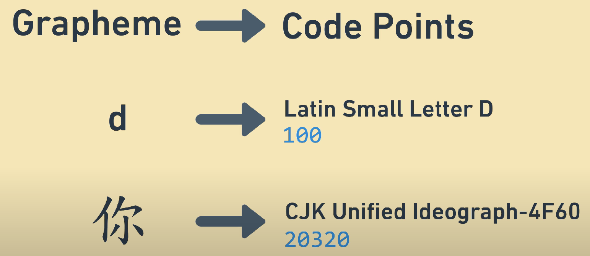|
|:--:|
|<b>图 3</b>|

更复杂的字素，例如带音调的字母，可以有两种方式表示：

|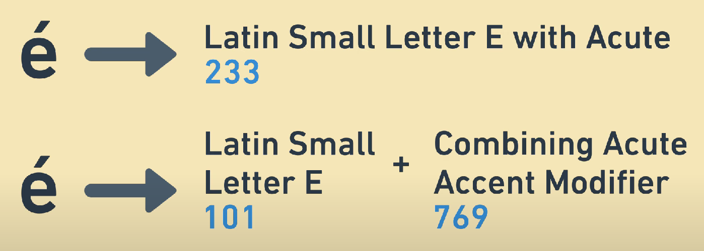|
|:--:|
|<b>图 4</b>|

第二种方式显然是把 e 与音调符号拼接起来。

现在讨论的是如何将字素映射到编码点，这里有更多的例子：

|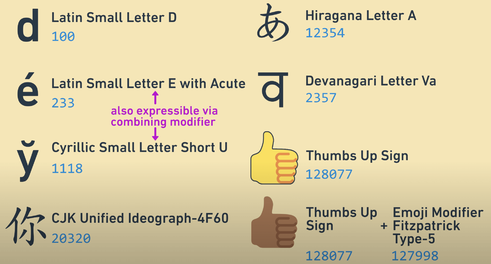|
|:--:|
|<b>图 5</b>|

每一个编码点都有一个名字和一个**值**。这个**值可以转换成二进制的字节**，这就是**编码（Encoding）**。

例如 d 编码点的名字就是 Latin Small Letter D，值是 100。

### UTF-8、UTF-32 等是编码策略，它们与 ASCII 的区别

ASCII 可以直接把值转换为二进制：

|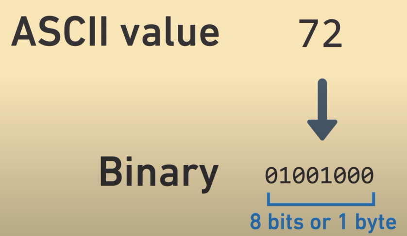|
|:--:|
|<b>图 6</b>|

Unicode 有很多个编码策略，它们各有优劣。

### UTF-32

比如 UTF-32，它将每一个编码点的值编码为 4 个字节，即 32 位。所以这个策略的名字叫 UTF-32。

|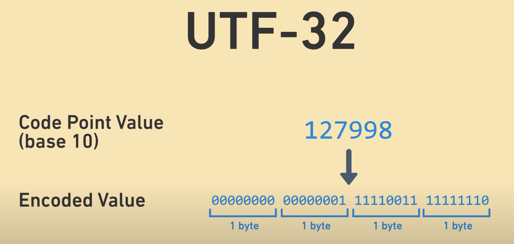|
|:--:|
|<b>图 7</b>|

这很像 ASCII，区别就是 ASCII 将一个 ASCII 值编码为 1 个字节，但 UTF-32 将一个编码点的值编码为 4 个字节，多占了 4 倍空间。

这是一个 Unicode 字符串 "Hello!👍🏿" 编码为 UTF-32 的例子：为了简洁，该图将 4 字节的二进制转换成 16 进制了。

|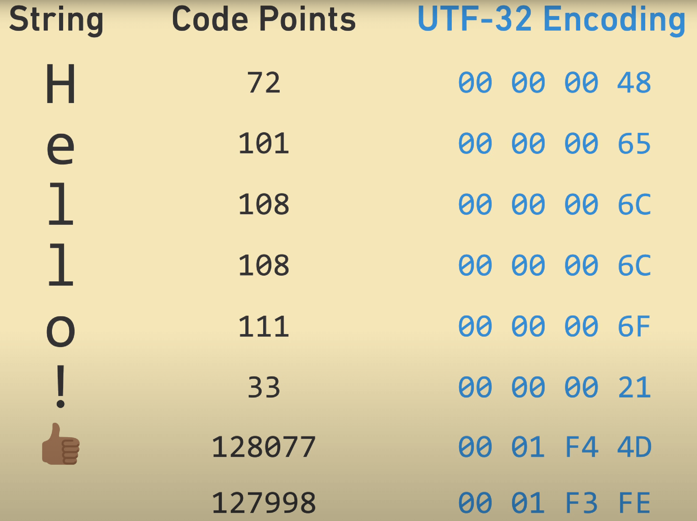|
|:--:|
|<b>图 8</b>|

这种编码的优点是每一个编码点都占同样大的字节，无论这个编码点的值是什么。

|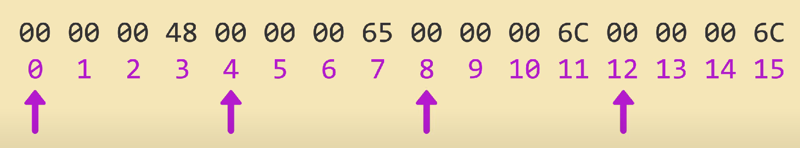|
|:--:|
|<b>图 9</b>|

例如前 4 个字素 "Hell"，H 的编码从是从第 0 个字节到第 3 个字节，e 的是从第 4 个字节到第 7 个字节，等等。可以直接从编码的结果中找到各个字素的索引位置。

缺点也很明显，这种编码方式很浪费存储空间：

|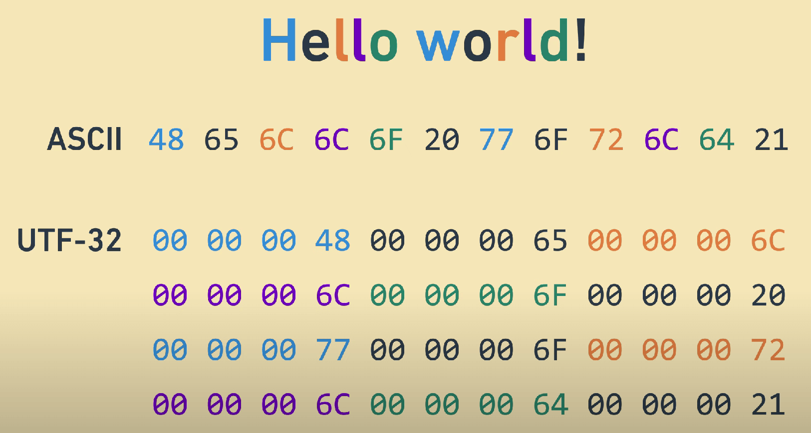|
|:--:|
|<b>图 10</b>|

这是 "Hello world!" 字符串分别在 ASCII 和 UTF-32 编码下的编码结果，UTF-32 是 ASCII 结果的 4 倍大小。特别是这种纯英文字符，完全可以兼容 ASCII 的字符串，看图里有多少 00 就知道有多么浪费了。无论每个编码点的值是大是小，均占 4 个字节。

### UTF-8

UTF-8 并不是把每个编码点编码为 8 位，而是编码为 8 - 32 位，即 1 到 4 个字节。编码点的值很小的时候，只编码为 1 个字节，大的时候就编码为 2-4 个字节，可以节省大量空间。

|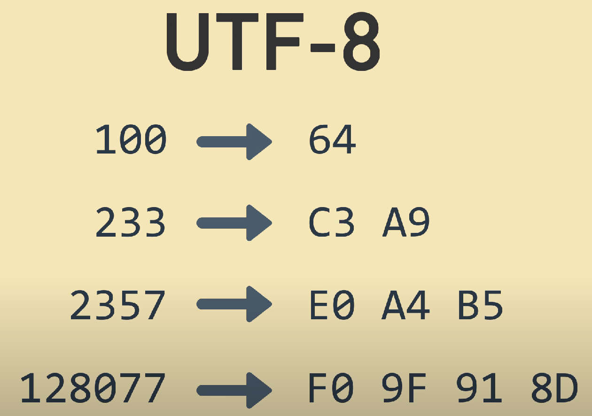|
|:--:|
|<b>图 11</b>|

像 "d" 这种简单的西方字母，UTF-8 和 ASCII 编码的结果是相同的，因为它的 Unicode 的值与它的 ASCII 的值是相同的，都是 100，所以对值的编码结果也是相同的。

这有一个很大的兼容性优势，旧的 ASCII 程序可以读简单字符的 UTF-8 编码，甚至不需要知道它是 UTF-8 编码。

UTF-8 也有缺点，每个编码点编码结果可能不一样长，字节数不同，就很难在编码结果中找到每个编码点的索引。

|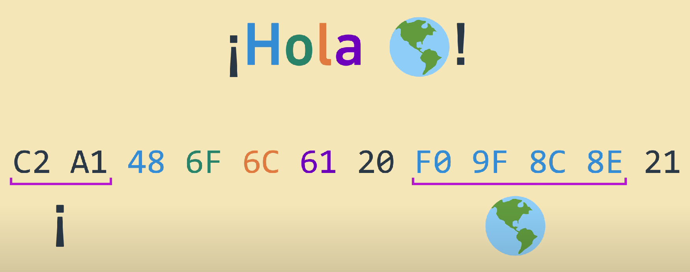|
|:--:|
|<b>图 12</b>|

这对性能有一些影响，但是通常不用担心。

UTF-8 是 Unicode 被采用最多的编码策略。

有时候你可能觉得这对其它语言不太公平，但是这问题不大，例如一个阿拉伯语的网页，它的 HTML 代码中大部分还是英文，UTF-8 编码后的大部分字素都只占 1 个字节，所以总体上并不会多消耗太多流量和存储空间。

|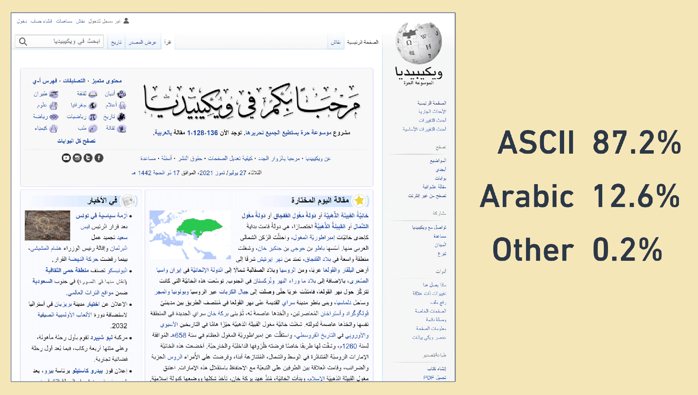|
|:--:|
|<b>图 13</b>|

## 总结

稍微复习一下，**一个字素（grapheme）是人类手写的一个单位，由一个或多个编码点（code point）组成。然后使用几种编码方案中的一种对每个编码点进行编码。例如使用 UTF-8，每个编码点会被编码成 1-4 个字节。**

|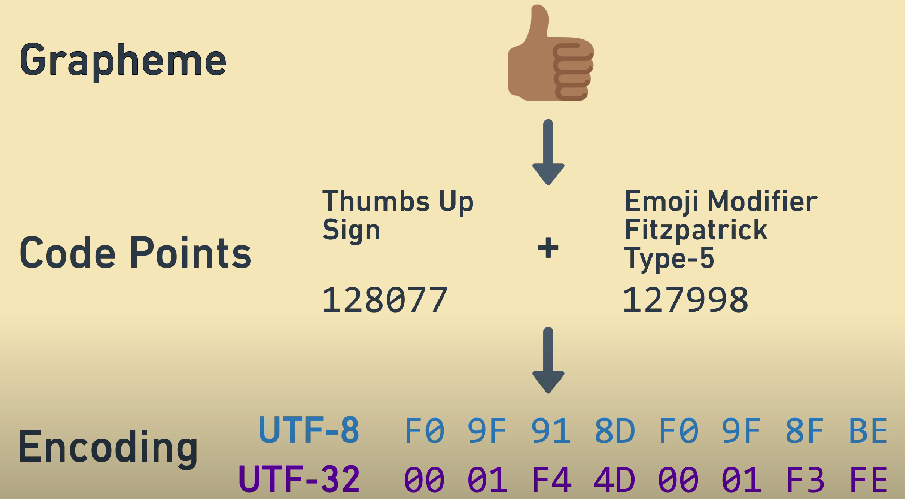|
|:--:|
|<b>图 14</b>|

Unicode 数据比 ASCII 数据复杂很多：

|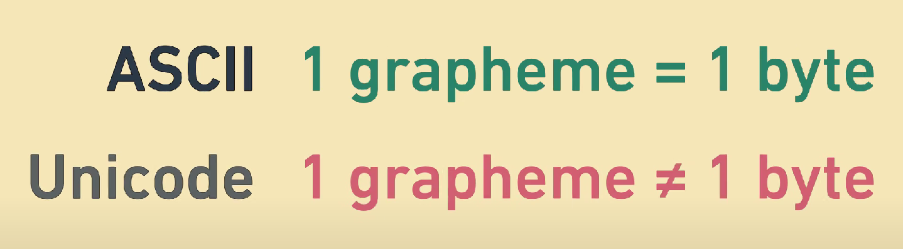|
|:--:|
|<b>图 15</b>|

如果把 UTF-8 编码结果当作 ASCII 或 UTF-32 的编码结果来解析（即使用 ASCII 或 UTF-32 策略来解码），就会造成我们常见的**乱码**：

|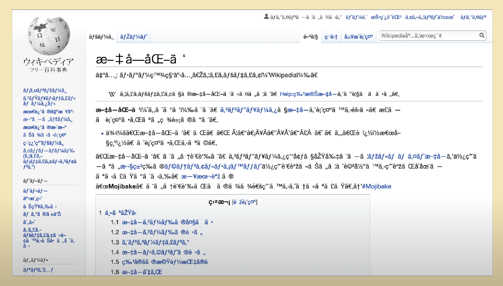|
|:--:|
|<b>图 16</b>|

我们可以总结成几条：

### 1. 我们必须知道原始的编码规则才能把字节解码为字素
### 2. 在 Unicode 中，1 个字素 ≠ 一个编码点 ≠ 1 个字节

例如在 Python 中，直接把 👍 作为一个字符串，会是这样：

|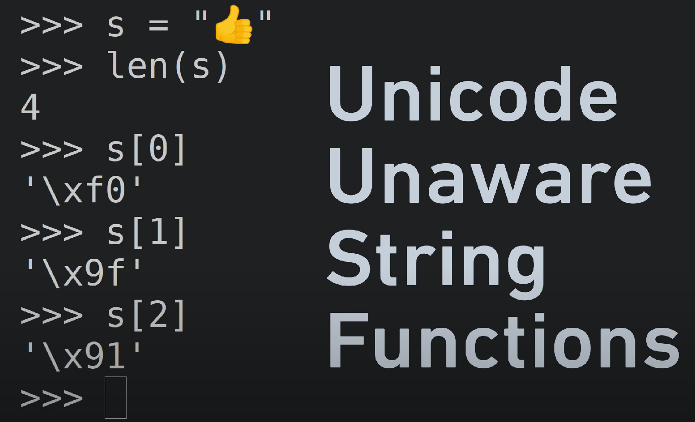|
|:--:|
|<b>图 17</b>|

它的长度是 4 个字符，每一个字符都是一个两位 16 进制的编码。这叫做"不可感知 Unicode 的函数（Unicode-unaware function）"。

但如果这样写，在字符串前加一个 `u`：

|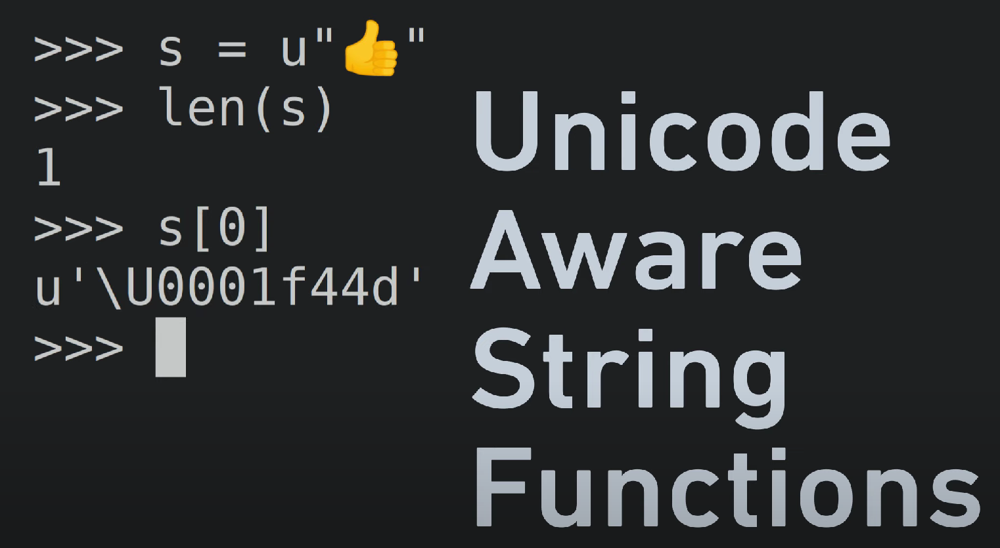|
|:--:|
|<b>图 18</b>|

字符串的长度就是 1 了，这被叫做"可感知 Unicode 的函数（Unicode-aware function）"，因为它计算字符串长度时计算的是 Unicode 字符个数。

这个字素只有一个编码点，再看一个由两个编码点组成的字素👍🏿：

|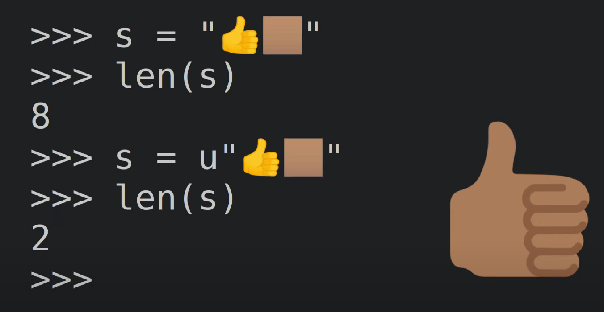|
|:--:|
|<b>图 19</b>|

这个字符串的长度就为 2 了。

在各种编程语言中很容易混淆，容易出问题，因为各种编程语言对字符串的处理方式都是不同的，例如：

|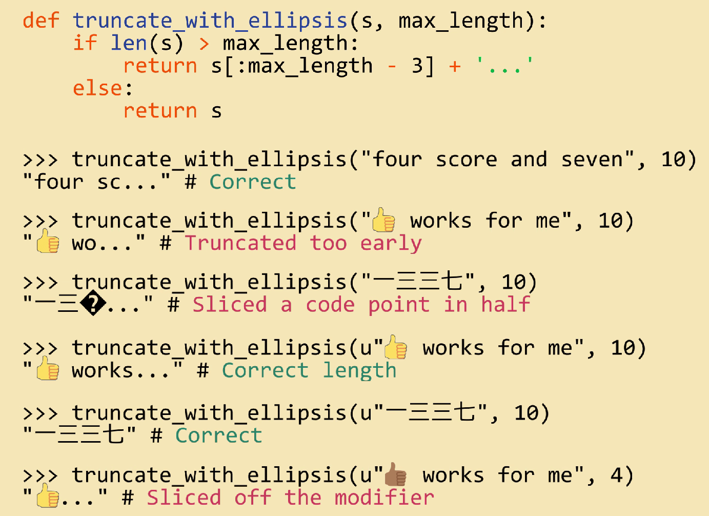|
|:--:|
|<b>图 20</b>|

这段 python 程序定义了一个 `truncate_with_ellipsis()` 方法，输入一个字符串和 `max_length` 参数，如果字符串的长度超过了 `max_length`，就截取到 `max_length-3` 的位置，再补一个省略号。

Python 中在字符串前加 u 即可定义 Unicode 的字符串。在 Python 中，是否是 Unicode 字符串直接影响了这个函数执行的结果。

可以看到 👍 在 Python Unicode 字符串中占 1 个长度，👍🏿 占两个。

而在我常用的 C# 中：

|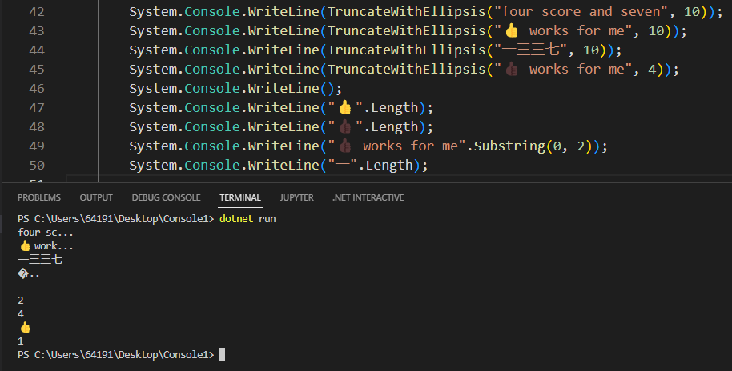|
|:--:|
|<b>图 21</b>|

可以发现 👍 在字符串中占 2 个长度，👍🏿 占 4 个长度，汉字"一"占 1 个长度。

C# 中默认是 Unicode 字符串，但为什么与 Python 中的 Unicode 字符串中各个字素所占的长度不一样呢？这就是 Unicode 各个编码策略不同导致的。

C# 中 string 的 Length 属性返回的是字符串的字符个数（一个字符就是一个 character，是一个 Unicode 字符），而 .NET 字符串是 UTF-16 编码，所以 Length 实际返回的是 UTF-16 编码后的 Unicode 字符个数。

看一下它们在 go 中有多长：

|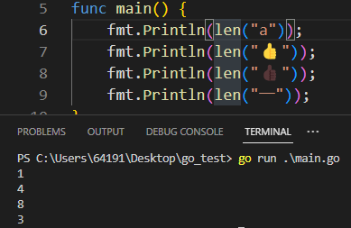|
|:--:|
|<b>图 22</b>|

在 go 中，字母占 1 个长度，👍 占 4 个长度，👍🏿 占 8 个长度，汉字"一"占 3 个长度。go 中字符串的 `len()` 方法返回值是字符串在 UTF-8 编码下的字节数。

对日常使用多种编程语言的开发者来说，不搞清楚编码的这些逻辑，真的很搞人的心态。

- 所以应当在所有字素都是一个字节时（即纯 ASCII 编码的字符）使用 "不可感知 Unicode 的函数"
- 使用 "可感知 unicode 的函数" 来正确处理代码点
- 当需要最大精度时，使用 "可感知字素的函数（grapheme-aware function）

为了防止读完文章后在各种编码和字节长度中迷迷糊糊，这个网页给我们 👍 在各种编码策略下的结果：[https://www.fileformat.info/info/unicode/char/1f44d/index.htm](https://www.fileformat.info/info/unicode/char/1f44d/index.htm)

### 如何理解应试教育中教的 ASCII 与 Unicode 与 UTF-8

在应试教育中，我们常常被告知什么字符代码，字符编码，接连便是难懂的话，什么“字符集”，什么“编码方案”之类，引得众人都哄笑起来，店内外充满了快活的空气。

从应试教育的方向来解释，"字符集"就是需要被编码的文本，例如 `1234abcd!@#$一二三四👍`，为了把最早期的英文字母，数字，英文符号等字符集映射到二进制 0 和 1，就有了 ASCII，它是字符集到 0 和 1 之间的映射关系表，它能支持 128 个字符，很够用。

看 ASCII 的表就知道，它就是给了各个字符一个序号（索引号），规定这个序号就是这个字符。我们把这个号称为"字符代码"。Unicode 的字符代码就是编码点（Code Point）的值。

后面各个国家的各个语言都需要映射到 0 和 1，就有了各自的规则，比如中文的 GB2312，中日韩汉字繁体字的 GBK，它们跟 ASCII 一样，都是映射规则。最后 ISO 看不下去了，搞出了 Unicode，搞了个包含所有字素的 Unicode 字符集，还规定了一套编码（Encoding）规范。编码是把字素转换为 0 和 1 的过程，是把"字符代码"编码为"字符编码"的过程。

ASCII 与 Unicode 都是"字符代码"，ASCII 的编码策略也是 ASCII，ASCII 中字符代码和字符编码是一致的。Unicode 的编码策略就比较多了，UTF-8、UTF-16 等都是。

> 参考资料 [https://www.youtube.com/watch?v=ut74oHojxqo](https://www.youtube.com/watch?v=ut74oHojxqo)