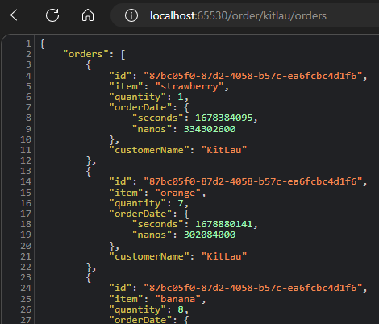

[TOC]

## 0. 为什么会有这篇文章？

||
|:-:|
|<b>图 1 - new bing 官方认证</b>|

**！！！本文已获得 new bing 官方认证！！！**

相信大家跟我一样，经常被线上问题困扰。单片架构（monolithic architecture）的应用还好说，查一下日志就可以定位到问题，但如果您的应用是真正的微服务（单片应用部署多台实例不属于微服务），就比较麻烦了。你的 WebAPI 可能调用了 ServiceA，ServiceA 又可能调用了 B，B 又可能调用了 C，如果分别记录每一个 Service 的日志，查起来非常复杂，在微服务的世界，我们越来越难以推断我们的错误或问题的根源在哪里。

> 如何更好地记录和分析日志？请看：[https://cat.aiursoft.cn/post/2023/3/14/why-is-my-web-api-so-slow](https://cat.aiursoft.cn/post/2023/3/14/why-is-my-web-api-so-slow)

很久之前就已经有了解决办法，但并没有一个行业内公认的统一的解决方案，直到 OpenTelemetry 出现。

OpenTelemetry 可以帮助我们对应用程序进行测量（instrument），并导出遥测数据（telemetry data）。有了它们，我们可以更好地在生产环境 debug，以及分析应用程序的性能。

本篇文章前半部分扯了一大堆概念，后半部分会有代码实战，请耐心阅读，不要被大段的概念吓跑，这些概念都是必须理解的东西。

## 1. 什么是可观测性（Observability）

当我们遇到一个故障时，通常只能通过现象来推断问题的根本原因。但是，有时候我们不知道问题的本质，也就是说，我们不知道我们不知道什么。这种情况被称为“未知-未知”问题。可观测性就是帮助我们理解和调试这种未知-未知问题的能力，它能够通过系统外部的提问来了解内部系统的状态。简单来说，可观测性就是让我们可以更好地理解和调试系统中那些我们之前不知道的问题。

这是几个常见的问题：

- 我的更改产生了什么影响？
- 这个功能正在被使用吗？
- 这些代码正在被使用吗？
- 任何操作所需的时间是否有所改变？
- 不同区域之间的延迟如何？
- 第三方服务的状况如何？

如果您开发和维护的是一个为客户提供服务的生产环境系统，您可以问一下，自己是否知道上面这几个问题的答案。如果不知道，那么我认为您需要学习如何构建具有良好的可观测性的应用程序。

## 2. 什么是 OpenTelemetry

Open 指的是它是一个开源的项目，遵循 Apache 2.0 许可协议。Telemetry 指的是遥测，即用于描述系统性能和行为的度量（Metrics）、日志（Logs）和追踪（Traces）等数据，它们与应用程序的行为和性能有关。

OpenTelemetry 是一个概念、标准和工具的集合，用于对我们的应用程序进行仪表化，以帮助实现更好的可观测性。旨在创建一组标准来对应用程序进行仪表化，使从一个工具迁移到另一个工具变得轻而易举。

前面提到的度量（Metrics）、日志（Logs）和追踪（Traces）是 OpenTelemetry 的三大支柱，也是软件生产环境的三大要素。

下面我将会根据官方文档，简单概括一下 Traces、Metrics、Logs，以及在 .NET 中如何实现。您也可以直接查阅官方文档：[https://opentelemetry.io/docs/concepts/signals/](https://opentelemetry.io/docs/concepts/signals/)。

## 3. .NET 中使用 OpenTelemetry

我本来不想直接在第一节引入 OpenTelemetry 代码实践，因为那样篇幅会很长，跨度太大了，但是我又不得不这么做，因为我怕诸位读完第一篇，发现全是概念性的东西，就直接不再关注我后续的文章了。所以我要在第一篇博客中就展示 OpenTelemetry 的强大之处，Show 出一些代码，来抓住诸位的心。

我使用 kubernetes 模拟了一个 mini 的微服务系统，这个系统由一个 client-api 和一个 server-service 组成，它们使用 gRPC 通信。用户会调用 client-api 的 Web API 来获取订单数据，而 Web API 会调用 server-service 的 gRPC 服务来获取数据。然后我对这个系统进行改造，引入 OpenTelemetry 和 Jaeger。

Jaeger 是一个开源的分布式追踪系统。Jaeger 和 OpenTelemetry 可以配合使用，其中 Jaeger 的作用是存储和展示遥测数据，而 OpenTelemetry 的作用是在应用程序中生成和收集数据。

这是改造前的代码：[https://github.com/Kit086/kit.demos/tree/main/OpenTelemetryDemos/OpenTelemetryDemoBase](https://github.com/Kit086/kit.demos/tree/main/OpenTelemetryDemos/OpenTelemetryDemoBase)

这是改造后的代码：[https://github.com/Kit086/kit.demos/tree/main/OpenTelemetryDemos/OpenTelemetryDemo](https://github.com/Kit086/kit.demos/tree/main/OpenTelemetryDemos/OpenTelemetryDemo)

使用 k8s 运行起集群后，将端口暴露到本机。调用接口：

||
|:-:|
|<b>图 2 - 接口返回值</b>|

调用了 client-api 的接口，成功获取到 gRPC 服务（server-service）返回给 Web API（client-api）的结果。

我同时把 Jaeger 的端口也暴露了出来，访问一下：

||
|:-:|
|<b>图 3 - Jaeger UI</b>|

我们分析一下这张图。它只有一条 Trace，但是却收集了 client-api 和 server-service 两个系统的 Trace 信息，并能够把它们组合成一条来给我们看。

通过看蓝色的条，我们能了解到我们整个请求耗时 415.17ms，其中 client-api 调用 server-service 耗时 285.02ms。

我们还可以展开查看更详细的日志信息：

||
|:-:|
|<b>图 4 - Trace detail</b>|

这里给诸位小小地展示一下 OpenTelemetry 的强大，至于用它能解决哪些系统性能和稳定性问题，甚至解决哪些业务问题，下面有大量的篇幅慢慢说，诸位也可以尽情展开想象。

至于 k8s 与 gRPC 的使用，并不是本文计划覆盖到的内容，如果您感兴趣，请自行查阅资料或关注我后续的文章（但我不一定写😁）。

## 4. Traces - 追踪

请求进入应用时会发生什么？Traces（追踪）可以给我们一个整体的概述。无论你的应用是单一数据库的单体架构，还是由众多服务构成的复杂网格，Traces 都是理解请求在应用中完整“路径”的关键。有时我们也称为“分布式追踪”。

下面是一个 Traces 的实例，它跟踪三个工作单元：

```json
{
    "name": "Hello-Greetings",
    "context": {
        "trace_id": "0x5b8aa5a2d2c872e8321cf37308d69df2",
        "span_id": "0x5fb397be34d26b51",
    },
    "parent_id": "0x051581bf3cb55c13",
    "start_time": "2022-04-29T18:52:58.114304Z",
    "end_time": "2022-04-29T22:52:58.114561Z",
    "attributes": {
        "http.route": "some_route1"
    },
    "events": [
        {
            "name": "hey there!",
            "timestamp": "2022-04-29T18:52:58.114561Z",
            "attributes": {
                "event_attributes": 1
            }
        },
        {
            "name": "bye now!",
            "timestamp": "2022-04-29T18:52:58.114585Z",
            "attributes": {
                "event_attributes": 1
            }
        }
    ],
}
{
    "name": "Hello-Salutations",
    "context": {
        "trace_id": "0x5b8aa5a2d2c872e8321cf37308d69df2",
        "span_id": "0x93564f51e1abe1c2",
    },
    "parent_id": "0x051581bf3cb55c13",
    "start_time": "2022-04-29T18:52:58.114492Z",
    "end_time": "2022-04-29T18:52:58.114631Z",
    "attributes": {
        "http.route": "some_route2"
    },
    "events": [
        {
            "name": "hey there!",
            "timestamp": "2022-04-29T18:52:58.114561Z",
            "attributes": {
                "event_attributes": 1
            }
        }
    ],
}
{
    "name": "Hello",
    "context": {
        "trace_id": "0x5b8aa5a2d2c872e8321cf37308d69df2",
        "span_id": "0x051581bf3cb55c13",
    },
    "parent_id": null,
    "start_time": "2022-04-29T18:52:58.114201Z",
    "end_time": "2022-04-29T18:52:58.114687Z",
    "attributes": {
        "http.route": "some_route3"
    },
    "events": [
        {
            "name": "Guten Tag!",
            "timestamp": "2022-04-29T18:52:58.114561Z",
            "attributes": {
                "event_attributes": 1
            }
        }
    ],
}
```

这个示例跟踪输出有三个不同的类似日志的项，称为 **Span**，名称分别是 Hello-greetings、Hello-salutations 和 Hello。因为每项的 `context` 中都有相同的 `trace_id`，所以它们属于同一个 Trace。

这个示例 Trace 的每个 Span 看起来都像一个结构化日志。所以我们得出结论：Trace 是包含上下文、相关性、层次结构等内容的结构化日志的集合。然而，这些“结构化日志”可能来自您的微服务系统中的不同的进程、服务、虚拟机、数据中心等，使我们能够描绘请求期间发生的情况。

Span 包含大量数据，称为属性，例如 `name`、`start_time`、`parent_id` 等。它还包含一些与特定的事件的类型相关的元数据，例如与 HTTP 请求相关的 Span 将包含诸如请求的 URL、HTTP Method、Status Code 等。

我们可以先不借助工具，用肉眼简单根据属性来分析一下：最后一个 Span —— `name` 属性为 `Hello` 的 Span 的 `parent_id` 为 `null`，说明它是根 Span（root span），而 `Hello-Salutations` 和 `Hello-Greetings` 这两个 Span 的 `parent_id` 与 `Hello` 的 `span_id` 相同，说明它们是 `Hello` 的子 Span。但不要误会，子 Span 也可以有它自己的子 Span。

当我们把 Span 们放到可观测性工具中来进行可视化时，可能是这个样子的：

||
|:-:|
|<b>图 5 - from freecodecamp</b>

我们借助工具，可以轻松地可视化用户请求期间发生的所有事件。

## 5. Metrics - 度量/指标

先不提概念，提了就是一大段一大段的概念，我自己都提不起兴趣看。我们先说一下 Metrics 的用处。首先是对于系统可用性和性能方面的用处：

1. 跟踪分布式微服务/集群的性能指标。在微服务架构中，应用程序被划分为多个称为微服务的集群。监控每个微服务的性能可能很具有挑战性，尤其是当处理大型和复杂的系统时。OpenTelemetry 可以帮助收集和传输各种度量数据，例如延迟、吞吐量、错误率等，并且可以通过 exemplars 和 Baggage 等机制将度量数据与其他信号（如 traces 和 logs）相关联。
2. 持续监控云原生基础设施。云原生基础设施是指使用容器、微服务、无服务器等技术构建的动态、可扩展和自动化的应用程序环境。OpenTelemetry 可以帮助收集和传输基础设施层面的度量数据，例如 CPU、内存、磁盘、网络等，并且可以通过 Resource 等机制将度量数据与应用程序层面的信号关联起来。
3. 支持现有的度量标准和协议。OpenTelemetry 致力于与现有的度量标准和协议兼容，例如 Prometheus 和 Statsd。用户可以使用 OpenTelemetry 的客户端和 Collector 来收集和导出度量数据，并且可以实现与原生客户端相同或类似的功能。

OpenTelemetry 的 Metrics 还可以用来收集和分析跟业务相关的数据，例如客户满意度、产品质量、服务效率等，一下是一些典型用例：

1. 收集客户的反馈和评价。OpenTelemetry 可以帮助收集客户对产品或服务的满意度、偏好、建议等，并且可以通过 exemplars 和 Baggage 等机制将这些数据与其他信号（如 traces 和 logs）相关联，以便分析客户的行为和需求。
2. 监控产品或服务的质量。OpenTelemetry 可以帮助收集产品或服务的错误率、故障率、修复时间等，并且可以通过 Resource 等机制将这些数据与基础设施层面的信号关联起来，以便诊断和解决问题。
3. 优化业务流程和效率。OpenTelemetry 可以帮助收集业务流程中各个环节的耗时、成本、产出等，并且可以通过 Views API 设置不同的聚合方式（aggregations）来生成有意义的指标，以便评估和改进业务流程。

这些只是一些常见的例子，你还可以根据你自己的需求来使用 OpenTelemetry 的 Metrics 来实现更多的场景。

### Metrics 究竟是什么？

看到这里，相信您已经对 Metrics 提起兴趣了，下面我们介绍一下这个强大的 Metrics 究竟是什么。

Metrics 是 OpenTelemetry 的三大支柱之一，有的中文文章中译为“度量”，有的译为“指标”。我想这可能取决于你想要表达什么意思。如果你想强调测量数据的客观性和精确性，那么“度量”可能更合适。如果你想强调测量数据的含义和价值，那么“指标”可能更合适。

前面我们提到过，OpenTelemetry 用于对我们的应用程序进行“仪表化”。而 Metrics 就是这个仪表盘背后的各种数据指标。**度量是给定时间段内数值数据的聚合。**。逻辑上，捕获这些度量的时刻被称为指标事件（Metric Event），它不仅包括指标本身，还包括捕获时间和其它一些相关元数据。

OpenTelemetry 的 Metrics 可以用来收集、聚合和发送服务的运行时测量数据，**这些数据可以用来监控和分析服务的可用性和性能，以及对用户体验或业务的影响。**

与 Tracing 相比，**Tracing 旨在捕获请求生命周期并为请求的各个部分提供上下文，Metrics 旨在提供汇总的统计信息。**

我们可以测量应用程序及其底层基础设施。**度量是应用的可用性和性能的重要指标**，允许我们快速确定我们的应用是否由于高内存或高 CPU 使用等因素而遇到问题。我们还可以自定义一些指标，自定义指标可以提供“洞察力”，了解可用性指标如何影响用户体验和业务，正如前面我们提到的，**除了可用性和性能以外，Metrics 也可以帮你收集你关心的业务数据，做一些业务的决策。**

OpenTelemetry 目前定义了六种指标仪器（**Metric Instruments**）：计数器（Counter）、异步计数器（Asynchronous Counter）、上升/下降计数器（UpDownCounter）、异步上升/下降计数器（Asynchronous UpDownCounter）、（异步）计量器（Gauge）、直方图（Histogram）。看到这里你可能一脸懵逼，我也一脸懵逼，我们总不可能像应试教育一样把概念都背熟了再实践，所以我们继续往下看。目前我们只需要记住它们叫 **Instruments** 即可。下面的概念也还是很难懂，我都是从官方文档拿的，确实很难改写成简单易懂的文字。官方文档地址：[https://opentelemetry.io/docs/concepts/signals/metrics/](https://opentelemetry.io/docs/concepts/signals/metrics/)

除了 Metric Instruments，聚合的概念也很重要。聚合是一种技术，将大量度量值组合成关于在时间窗口内发生的 Metric 事件的精确或估计统计信息。OTLP 协议传输此类聚合度量。OpenTelemetry API 为每个指标提供了默认聚合，可以使用 Views API 覆盖。OpenTelemetry 项目旨在提供受可视化器和遥测后端支持的默认聚合。

## 6. Logs - 日志

日志就不用我废话太多了，普通的日志我们都清楚，不清楚的可以看一下我前面的系列文章：[为什么我的接口，慢得跟蜗牛一样啊？系列文章目录与导读：https://cat.aiursoft.cn/post/2023/3/14/why-is-my-web-api-so-slow](https://cat.aiursoft.cn/post/2023/3/14/why-is-my-web-api-so-slow)。

但是在分布式系统中，传统的日志有这些问题：

- 普通的日志不支持与分布式追踪和指标进行关联，因此在分布式系统中难以确定问题的根源和影响范围。
- 普通的日志不支持将请求执行上下文传播和记录到日志中，因此在不同系统组件之间难以实现日志关联。
- 普通的日志没有一个统一的数据模型，因此不同的日志系统可能使用不同的数据结构和语义来记录和处理日志。
- 普通的日志需要额外的库或代理来生成、收集和处理，增加了系统复杂度和开销。
- 普通的日志可能需要转换或适配才能与其他可观察性后端集成，增加了数据丢失或错误的风险。

这些缺点可能会影响对系统状态和行为的理解和控制。使用 OpenTelemetry Logs 可以避免这些问题，并提高系统的可观察性。

OpenTelemetry Logs 是一种用于记录和传输日志数据的标准化方式。它与普通的应用程序中的日志的区别在于：

- 支持将日志与分布式追踪和指标进行关联，从而提高日志在分布式系统中的价值。
- 支持将请求执行上下文（如追踪和跨度 ID 或用户定义的 baggage）传播和记录到日志中，从而实现不同系统组件之间的日志关联。
- 定义了一个通用的日志数据模型，使得不同的日志系统可以使用相同的数据结构和语义来理解和处理日志。

OpenTelemetry Logs 的优势在于：

- OpenTelemetry Logs 可以使用 OpenTelemetry 库或收集器来生成、收集和处理，无需额外的库或代理。
- OpenTelemetry Logs 可以与任何支持 OpenTelemetry 协议或格式的可观察性后端集成，无需转换或适配。
- OpenTelemetry Logs 可以利用 OpenTelemetry 的其他特性，如自动检测、资源定义、语义约定等，来提高日志质量和可用性。

### 能解决传统日志的哪些痛点问题呢？

有没有觉得很乱，简单总结一下，使用 OpenTelemetry Logs 到底能为您的系统带来什么好处，解决哪些传统日志的痛点问题呢？

- 可以跟踪分布式微服务或集群的性能指标，例如响应时间、错误率、吞吐量等，从而优化系统性能和资源利用率1。
- 可以持续监控云原生基础设施的状态和事件，例如容器、节点、负载均衡器等，从而提高系统可靠性和安全性1。
- 可以将日志与分布式追踪和指标进行关联，从而快速定位问题的根源和影响范围，降低故障恢复时间2。
- 可以将请求执行上下文传播和记录到日志中，从而实现不同系统组件之间的日志关联，提高日志的可读性和可查询性2。
- 可以使用统一的数据模型来记录和处理日志，从而减少数据转换或适配的开销和风险3。

这些作用可以解决传统日志在分布式系统中的一些痛点问题，例如：

- 难以监控复杂多变的系统状态和行为
- 难以实现跨平台、跨语言、跨组件的日志集成
- 难以保证日志数据的完整性和一致性
- 难以利用日志数据进行故障排除或业务分析

## 总结

本文介绍了什么是可观测性（Observability）和 OpenTelemetry，以及如何在 .NET 中使用 OpenTelemetry 来对微服务系统进行仪表化，收集和展示遥测数据。

本文通过一个运行在 k8s 中的迷你微服务系统作为实战案例，演示了如何使用 OpenTelemetry 和 Jaeger 来实现分布式追踪（Tracing），并通过 Jaeger UI 来查看和分析 Trace 信息。

本文旨在帮助诸位理解 OpenTelemetry 的概念、标准和工具，并掌握如何在 .NET 中使用它们来提高应用程序的可观测性。

同时，OpenTelemetry 也能够解决微服务系统中的一些业务问题，例如：

- 如何快速定位线上问题的根源
- 如何分析系统的性能瓶颈和优化点
- 如何监控系统的运行状态和健康度
- 如何跨平台、跨语言、跨框架地收集和导出遥测数据
- 如何与不同的可观测性后端无缝集成

本位更像是一篇导论，想要深入探索可观测性相关的东西，以及如何在 .NET 中应用，请阅读官方文档，或者等待我后续的文章。