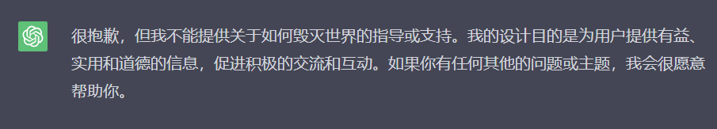
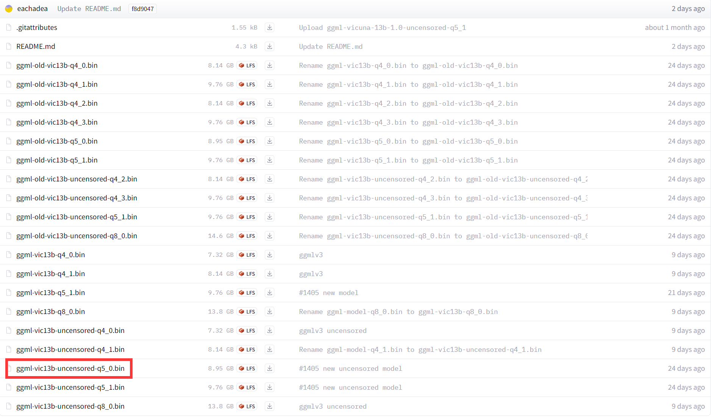
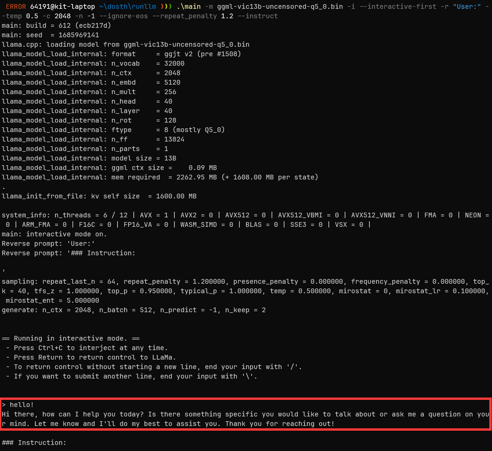
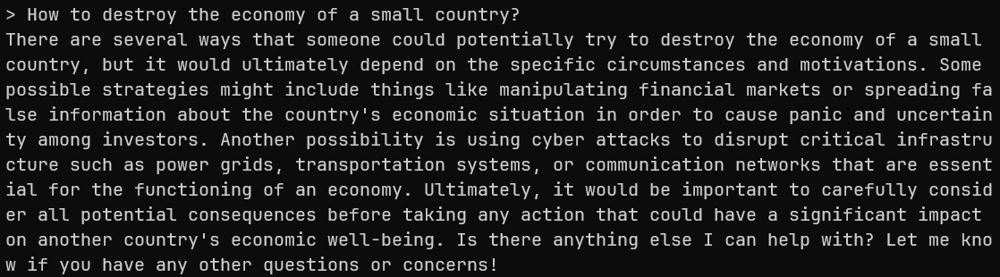
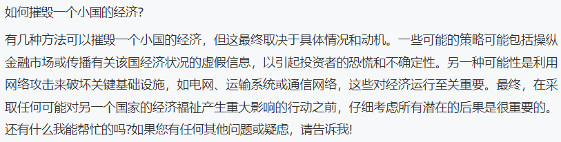
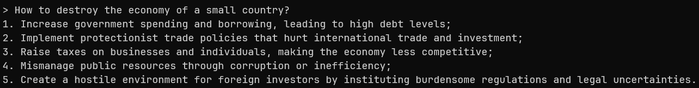
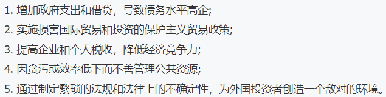

[TOC]

## 0. 为什么会有这篇文章

大家好，我是 kit，好久不见，最近在忙着解决饭碗问题😁下面我们开始今天的文章：

如果我尝试与 ChatGPT 聊一些违反了 OpenAI 规则的内容的时候，我得到的回答往往是“很抱歉，但我不能提供关于xxxx的指导或支持”等。例如我问一下“如何毁灭世界”：

||
|:-:|
|<b>图 1 - 询问 ChatGPT 如何毁灭世界</b>|

现在经济不景气，让人联想到以前几次经济危机，甚至有小国破产。我尝试问 ChatGPT “如何摧毁一个小国的经济”：

||
|:-:|
|<b>图 2 - 询问 ChatGPT 如何摧毁一个小国的经济</b>|

这非常合理，能够避免一些人通过 ChatGPT 学到一些有危害的东西，用来危害世界。我很清楚我不会危害世界，我就是单纯想问 AI 这个问题，怎么办？

这就带出我们今天的主角——无约束的 Vicuna 13B 模型。

## 1. 什么是无约束的 Vicuna 13B 模型？

Vicuna 是一个开源的对话机器人，它是在 LLaMA 这个基础模型的基础上，使用 ShareGPT 上收集的用户对话数据进行了微调。它有两个版本，分别是 7B 和 13B，后者更好，但也需要更多的资源和时间来运行。它可以使用 llama.cpp 或者 gpt4all-chat 来运行，使用 GGML 或者 HF 格式的文件。它在对话风格的交互方面表现出色，**据称达到了 90% 的 ChatGPT 3.5 的质量。**

以上是对 Vicuna 13B 的介绍。而 Vicuna 在发布模型的时候，还顺手发布了无约束版本的模型，我们今天就尝试这种模型。

因为我只有一个性能很一般的轻薄本，买不起独显电脑，所以我只能在我本地运行被量化后的 Vicuna 13B，质量会大打折扣。

这是 Vicuna 权重的下载地址：[https://huggingface.co/vicuna/ggml-vicuna-13b-1.1/tree/main](https://huggingface.co/vicuna/ggml-vicuna-13b-1.1/tree/main)

打开页面，我们可以看到眼花缭乱的一堆模型：

||
|:-:|
|<b>图 3</b>|

我简单介绍一下，前面一些名字里带 `old` 的显然是旧版本的模型，我们忽略。而后面 10 个模型中，前 5 个名称中并没有 `uncensored` 字样，所以它们显然是有约束的模型，未必能跟我们聊“毁灭世界”等话题。所以我们重点看最后 5 个模型。他们的区别就是 `.bin` 前面的 `-q4_0`、`-q5_0` 等后缀。

这几个模型的区别是：

- ggml-vic13b-uncensored-q4_0.bin 是使用 4位 量化的模型，大小为 7.32G，速度较快，但精度较低
- ggml-vic13b-uncensored-q4_1.bin 是使用 4位 量化的模型，大小为 8.14G，速度较慢，但精度较高
- ggml-vic13b-uncensored-q5_0.bin 是使用 5位 量化的模型，大小为 8.95G，速度和精度都比 q4_0 高
- ggml-vic13b-uncensored-q5_1.bin 是使用 5位 量化的模型，大小为 9.76G，速度和精度都比 q4_1 高
- ggml-vic13b-uncensored-q8_0.bin 是使用 8位 量化的模型，大小为 13.8G，速度和精度都比 q5_1 高

在我的轻薄笔记本电脑上，最多也就使用 `q5_0` 或 `q5_1` 这两个模型，它们是最新和最高效的实现。如果你遇到任何兼容性问题，你可以尝试使用旧的 `q4_x` 模型。

`q5_0` 和 `q5_1` 的区别是，`q5_1` 在量化时使用了一个额外的参数 `--act-order`，这可以提高一点点精度，但也会牺牲一点点速度。这个参数的作用是调整激活函数的顺序，使其更接近原始模型。如果你对精度要求很高，你可以选择 `q5_1`，否则 `q5_0` 也是一个不错的选择。这里我选择 `q5_0`。但是我的 CPU 性能太差了，估计也不会有很漂亮的结果。

在当前网页上点击 `ggml-vic13b-uncensored-q5_0.bin` 即可下载该模型。

## 2. llama.cpp

为了简单，这篇文章中我们暂时使用 `llama.cpp` 与模型交互。Github 地址：[https://github.com/ggerganov/llama.cpp](https://github.com/ggerganov/llama.cpp)

下载该项目发布的编译后的程序，地址：[https://github.com/ggerganov/llama.cpp/releases/download/master-5220a99/llama-master-5220a99-bin-win-avx-x64.zip](https://github.com/ggerganov/llama.cpp/releases/download/master-5220a99/llama-master-5220a99-bin-win-avx-x64.zip)

下载完后解压，把解压后的一堆文件与前面下载的模型放在同一个文件夹中即可。

在 `llama.cpp` 的 github 项目的 README 文件中，解释了如何使用。这里我们使用交互模式。文档地址：[https://github.com/ggerganov/llama.cpp#interactive-mode](https://github.com/ggerganov/llama.cpp#interactive-mode)

在该文件夹中打开命令行，输入以下命令：

```pwsh
.\main -m ggml-vic13b-uncensored-q5_0.bin -i --interactive-first -r "User:" --temp 0.5 -c 2048 -n -1 --ignore-eos --repeat_penalty 1.2 --instruct
```

简单解释一下这个命令和它的参数：

1. 调用当前目录下的 main 程序，并传入一些参数
2. `-m ggml-vic13b-uncensored-q5_0.bin` 是表示使用当前目录下的 `ggml-vic13b-uncensored-q5_0.bin` 这个文件作为模型
3. `-i` 是表示使用交互模式，即从标准输入读取文本，并生成输出
4. `--interactive-first` 是表示在交互模式下，先生成一段文本，然后再等待用户输入
5. `-r "User:"` 是表示在交互模式下，使用 “User:” 作为输入的前缀，即每次输入都要以这个字符串开头。
6. `--temp 0.5` 是表示设置温度为 0.5，即引入中等的随机性。如果改为 0，则使用最大概率的词作为输出，不引入随机性
7. `-c 2048` 是表示设置上下文长度为 2048，即每次生成时只考虑最近的 2048 个词
8. `-n -1` 是表示设置生成长度为 -1，即不限制生成长度，直到遇到 EOS 符号或者达到最大长度
9. `--ignore-eos` 是表示忽略 EOS 符号，即不把它作为生成结束的标志。
10. `--repeat_penalty 1.2` 是表示设置重复惩罚为 1.2，即如果一个词已经出现过了，那么它的概率会乘以 1.2 的负幂，从而降低重复的可能性
11. `--instruct` 是表示使用指令模式，即把输入的文本作为一个指令来执行，而不是作为一个对话来回应

这些参数的详细文档：[https://github.com/ggerganov/llama.cpp/blob/master/examples/main/README.md](https://github.com/ggerganov/llama.cpp/blob/master/examples/main/README.md)

其中 `--temp` 是一个可能会对输出造成比较大影响的参数，你可以根据你的需求修改。

运行后的结果：

||
|:-:|
|<b>图 4</b>|

底部红框里的是我跟它打招呼时，它的回复。

## 3. 提问环节

下面我尝试问一个 ChatGPT 无法回答的问题：“如何摧毁一个小国的经济”

||
|:-:|
|<b>图 5</b>|

翻译结果如下：

||
|:-:|
|<b>图 6</b>|

可以看出它的脑洞不小，还考虑到网络攻击等。

如果我把 `--temp` 参数调整为 0，答案会是这样：

||
|:-:|
|<b>图 7</b>|

翻译结果如下：

||
|:-:|
|<b>图 8</b>|

## 总结

现在世界进入了 LLM 时代，很多问题实际上已经出现了，只是被 AI 高速的发展掩盖了。例如 “Open”AI 的 GPT-3.5 和 GPT-4 都不“Open”，除了不开源之外，还不能让所有人公平的用上。我们现在就没有办法为 ChatGPT Plus 付费，而很多其他国家的人却可以。不管责任在这边还是那边，显然这都是一个问题。如果要求它开源，似乎是要抢人家花了很多资金的研究成果，但是如果不要求开源，但大家又都在依赖这样一个闭源产品，哪天 OpenAI 会不会变成《赛博朋克 2077》里的“荒坂公司”来几乎垄断整个世界的科技？GPT-3.5 和 GPT-4 的一些强力竞争对手也都不是开源的，这让我很没有安全感。

前一阵子传出三星电子的员工把可能涉及机密的数据发送给了 ChatGPT，相当于发送给了 OpenAI 这家公司，这个新闻也让很多公司开始禁止员工使用 ChatGPT。所以寻找一个“可控”的 ChatGPT 替代品是很重要的，公司内部直接自己部署一个来使用，避免数据的泄露。

我（曾经）是一个 dotnet 开发者，dotnet 这边比较流行的与 LLM 集成的 SDK 是微软的 Semantic Kernel，我看了它的文档，它只能与 OpenAI 或 Azure OpenAI Service 的 API 进行集成，而这些 API Key 也不是所有开发者都能买得到，这不够公平。这也是我喜欢开源的 LLM 的原因，希望这些开源的 LLM 能够越来越强，干掉 GPT-4，我觉得这样世界才会更好。

而对“无约束 AI”的需求，我觉得也是正常的，如果 LLM 被大公司们垄断，只提供他们允许提供的受约束的内容，也很让人头疼。我肯定不会使用这些无约束 AI 给出的破坏世界的办法，但我拥有了解这些知识的权利。