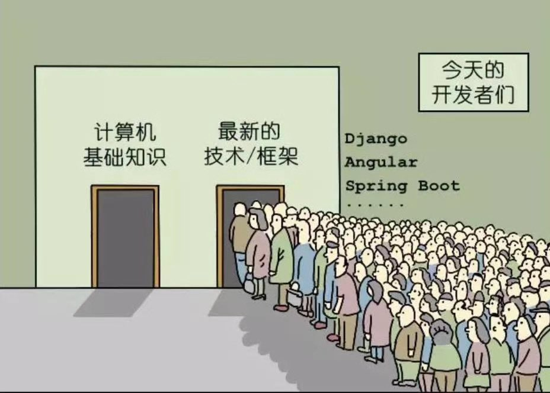

[TOC]

## 0. 为什么会有这篇文章

最近我似乎偶然听到有人在问 Linq 和 lambda 表达式的区别是什么，这显然是一个“应试教育”式的问题，二者的本质没有联系，何来区别？但我认为这个问题并非毫无意义。现在软件开发者岗位的各种招聘 JD 往往写满了对各种第三方库、中间件、软件的要求，很多开发者也对这些新“技术”趋之若鹜，毕竟不学它们，面试的时候就没得聊。人们越来越忽略真正应该掌握的“基础”了。包括我自己。我之前购买过一些计算机网络和操作系统的书，却一直没拿出时间和精力去看，反而把时间用在看电影、看电视剧上。

||
|:-:|
|<b>图 1 - 今天的开发者们</b> <i>from @hellokaton</i>|

写完之后发现我后面扯了很久，什么都没扯明白，为了不浪费读者时间，在这里先长篇大论**总结一下**：

Linq (Language Integrated Query，读作“link”，不读“林球”) 和 Lambda 表达式是 dotnet 框架中的两个重要的功能，它们都是用于编写查询、过滤、排序和处理数据的方法。

Linq 是 dotnet 框架中提供的一种数据查询语言，它可以让开发人员在 C# 代码中以类似 SQL 的方式编写数据查询，便于查询、操作和管理各种类型的数据，如内存数组、数据库表、XML 文档等。

Lambda 表达式是一种匿名函数，它允许开发人员在 C# 代码中定义一个无名函数，并将该函数作为参数传递给其他函数，便于更简洁的编写代码。Lambda 表达式常用于编写 Linq 查询的匿名函数，便于简化查询语句的编写。

总体来说，Linq 和 Lambda 表达式的**区别**是：Linq 是一种数据查询语言，而 Lambda 表达式是一种匿名函数，但它们都是用于帮助开发人员在 C# 代码中更方便地查询、处理和管理数据的功能。

Linq 有两种形态：

1. 查询表达式（Query Expression）：这种形态的 Linq 使用类似 SQL 的语法编写数据查询语句，语法简洁易懂，便于开发人员快速编写查询语句。
2. 方法语法（Method Syntax）：这种形态的 Linq 使用链式方法调用编写数据查询语句，方法语法简洁易用，更灵活一些，并且可以通过 Lambda 表达式来编写复杂的数据查询。

两种形态的 Linq 都可以实现对数据的查询、过滤、排序和处理，开发人员可以根据自己的喜好和开发需要来选择使用查询表达式或者方法语法。

## 1. LINQ

LINQ 全称 Language-Integrated Query，可以翻译为“语言集成查询”。我们就不背概念了，直接看一下什么是 LINQ。

首先定义一个类，以及一个 List：

```c#
class Person
{
    public string FullName { get; set; } = null!;

    public int Age { get; set; }
}

List<Person> persons = new();
```

这是使用查询表达式语法的 LINQ：

```c#
var kids = 
    from person in persons
    where person.Age <= 14
    select person;
```

这也是 LINQ，是使用方法语法的 LINQ：

```c#
var kids = persons.Where(p => p.Age <= 14);
```

LINQ 是一个库，它包含一组可以使用 lambda 表达式（也可以不使用） 的扩展方法，例如 Where。

## 2. lambda 表达式

在使用方法语法的 LINQ 的时候，几乎总是会用到 lambda 表达式。前面的 `p => p.Age <= 14` 就是 lambda 表达式，`=>` 是 lambda 运算符，我认为可以理解成“return”的意思。

看一点 LINQ 的 Where 方法的源码：

```c#
namespace System.Linq
{
    public static partial class Enumerable
    {
        public static IEnumerable<TSource> Where<TSource>(this IEnumerable<TSource> source, Func<TSource, bool> predicate)
        {
            // ......
        }
    }
}
```

我们的 lambda 表达式 `p => p.Age <= 14` 实际上是用更简单的方法构造了一个匿名 Func 委托。

你不使用 lambda 语法也是可以的：

```c#
bool IsKid(Person p)
{
    return p.Age <= 14;
}

var kids = persons.Where(IsKid);
```

lambda 只是一种“更简单”地构造匿名委托的方法，是一种语法糖。当然也可以构造一个具名委托传进 Where 方法：

```c#
Func<Person, bool> IsKitFunc = p => p.Age <= 14;

var kids = persons.Where(IsKitFunc);
```

## 3. 总结

lambda 表达式实际上是一种比匿名方法更简单的委托创建方式。同时可以通过表达式树以数据的方式表示代码，这是更高阶的用法。LINQ 可以通过该功能把 C# 的查询语句转换成其它形式的查询语句，比如 SQL 语句。很多 ORM 就是这样做的。与表达式树相关的知识，可以看一下我这几篇博客：

- [如何使用 CSharp 表达式树？](https://blog.kitlau.dev/posts/how-to-use-csharp-expression-trees/)
- [手把手构建 C# 表达式树](https://blog.kitlau.dev/posts/how-to-build-csharp-expression-trees/)
- [EF Core 动态构建表达式树为所有实体设置软删除的查询过滤器](https://blog.kitlau.dev/posts/ef-core-dynamically-building-expression-trees-sets-soft-delete-query-filter-for-all-entities/)
- [EF Core 动态构建表达式树简化 DDD 值对象的比较](https://blog.kitlau.dev/posts/ef-core-dynamically-building-expression-trees-simplifies-the-comparison-of-ddd-valueobjects/)

开发者们容易把它们弄混，我估计是因为它们常常在很多教材、博客和文档中同时出现。有疑惑的朋友只要稍微查一下资料，稍加区分就行了。
