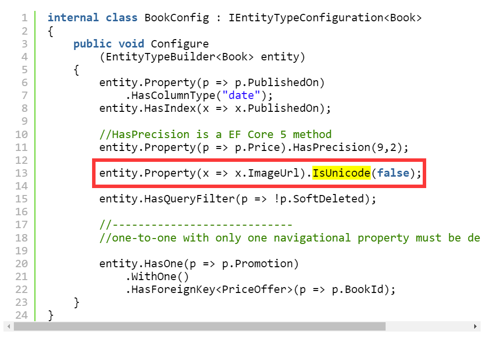
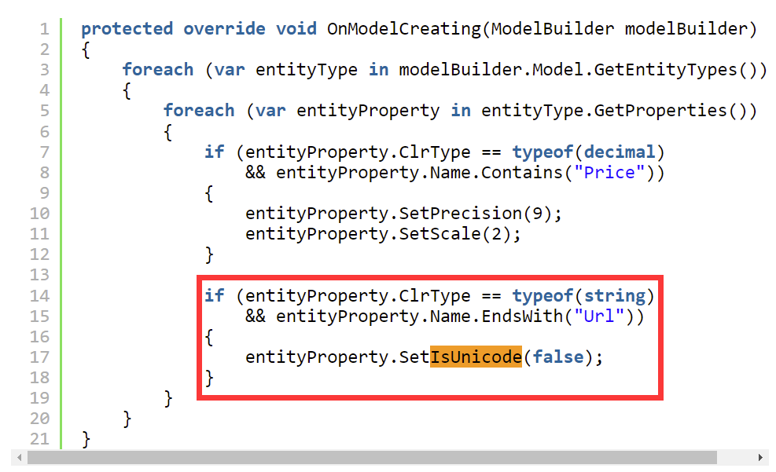

[TOC]

## 0. 为什么会有这篇博客

我在学习 EF Core 时，经常看到示例代码中在配置实体时对 string 类型的属性调用 `IsUnicode()` 方法。我不理解，所以我先学习了一些 ASCII 、Unicode、UTF-8 等知识，不了解的朋友可以看一下我这篇文章：彻底理解 ASCII Unicode UTF-8 UTF-32 是什么以及区别与联系 [https://blog.kitlau.dev/posts/thoroughly-understand-ascii-unicode-utf-8-utf-32/](https://blog.kitlau.dev/posts/thoroughly-understand-ascii-unicode-utf-8-utf-32/)，然后我打算试验一下这个方法。

## 1. 准备工作

您可以直接下载我的代码，具体运行方法请阅读代码中的 README.md 文件。

代码地址：[https://github.com/Kit086/kit.demos/tree/main/EFCore/IsUnicode](https://github.com/Kit086/kit.demos/tree/main/EFCore/IsUnicode)

如果因为网络原因下不到代码，可以参考下面我的步骤来写。当然也可以什么都不做直接看我的结论。

我计划在 MariaDB 和 MS SQL Server 测试该配置方法。MariaDB 是我一直在用的免费关系型数据库，MS SQL Server 是大部分使用 .NET 技术的公司选用的关系型数据库。

### 创建项目，引入包

首先创建一个控制台应用，引入三个 NuGet 包：

- `Microsoft.EntityFrameworkCore.Design`
- `Pomelo.EntityFrameworkCore.MySql`
- `Microsoft.EntityFrameworkCore.SqlServer`

### 创建实体类

创建三个实体类，一个默认配置，一个配置为 `IsUnicode()`（默认参数为 `true`），一个配置为 `IsUnicode(false)`。

默认配置 Person.cs：

```c#
public class Person
{
    public long Id { get; set; }

    public string Name { get; set; } = null!;

    public override string ToString()
    {
        return $"Person: Id: {Id}, Name: {Name}, Name.Length: {Name.Length}";
    }
}

public class PersonConfiguration : IEntityTypeConfiguration<Person>
{
    public void Configure(EntityTypeBuilder<Person> builder)
    {
        builder.HasKey(x => x.Id);

        builder.Property(x => x.Name)
            .HasMaxLength(128)
            .IsRequired();
    }
} 
```

配置为 `IsUnicode()` PersonWithUnicodeName.cs：

```c#
public class PersonWithUnicodeName
{
    public long Id { get; set; }

    public string Name { get; set; } = null!;
    
    public override string ToString()
    {
        return $"PersonWithUnicodeName: Id: {Id}, Name: {Name}, Name.Length: {Name.Length}";
    }
}

public class PersonWithUnicodeNameConfiguration : IEntityTypeConfiguration<PersonWithUnicodeName>
{
    public void Configure(EntityTypeBuilder<PersonWithUnicodeName> builder)
    {
        builder.HasKey(x => x.Id);

        builder.Property(x => x.Name)
            .IsUnicode()
            .HasMaxLength(128)
            .IsRequired();
    }
}
```

配置为 `IsUnicode(false)` PersonWithoutUnicodeName.cs：

```c#
public class PersonWithoutUnicodeName
{
    public long Id { get; set; }

    public string Name { get; set; } = null!;
    
    public override string ToString()
    {
        return $"PersonWithoutUnicodeName: Id: {Id}, Name: {Name}, Name.Length: {Name.Length}";
    }
}

public class PersonWithoutUnicodeNameConfiguration : IEntityTypeConfiguration<PersonWithoutUnicodeName>
{
    public void Configure(EntityTypeBuilder<PersonWithoutUnicodeName> builder)
    {
        builder.HasKey(x => x.Id);

        builder.Property(x => x.Name)
            .IsUnicode(false)
            .HasMaxLength(128)
            .IsRequired();
    }
}
```

### 创建数据库上下文

AppDbContext.cs：

```c#
public class AppDbContext : DbContext
{
    public DbSet<Person> Persons { get; set; } = null!;

    public DbSet<PersonWithUnicodeName> PersonWithUnicodeNames { get; set; } = null!;

    public DbSet<PersonWithoutUnicodeName> PersonWithoutUnicodeNames { get; set; } = null!;
    
    protected override void OnConfiguring(DbContextOptionsBuilder optionsBuilder)
    {
        #region MariaDB Configuration
        
        // optionsBuilder.UseMySql("server=localhost;port=3306;database=is_unicode_test;user=root;password=password;",
        //     new MariaDbServerVersion(new Version(10, 6)));
        
        #endregion

        #region MSSQL Configuration

        optionsBuilder.UseSqlServer("Server=localhost;Database=IsUnicodeTest;User Id=sa;Password=Password01!;");

        #endregion

        optionsBuilder.LogTo(Console.WriteLine);
        
        base.OnConfiguring(optionsBuilder);
    }

    protected override void OnModelCreating(ModelBuilder modelBuilder)
    {
        modelBuilder.ApplyConfigurationsFromAssembly(Assembly.GetExecutingAssembly());
        
        base.OnModelCreating(modelBuilder);
    }

    public async Task SeedAsync()
    {
        if (!this.Persons.Any())
        {
            this.Persons.Add(new Person
            {
                Name = "Zhang Three"
            });
            this.Persons.Add(new Person
            {
                Name = "李四"
            });
            this.Persons.Add(new Person
            {
                Name = "王😿"
            });
        }
        if (!this.PersonWithUnicodeNames.Any())
        {
            this.PersonWithUnicodeNames.Add(new PersonWithUnicodeName
            {
                Name = "Zhang Three"
            });
            this.PersonWithUnicodeNames.Add(new PersonWithUnicodeName
            {
                Name = "李四"
            });
            this.PersonWithUnicodeNames.Add(new PersonWithUnicodeName
            {
                Name = "王😿"
            });
        }
        if (!this.PersonWithoutUnicodeNames.Any())
        {
            this.PersonWithoutUnicodeNames.Add(new PersonWithoutUnicodeName
            {
                Name = "Zhang Three"
            });
            this.PersonWithoutUnicodeNames.Add(new PersonWithoutUnicodeName
            {
                Name = "李四"
            });
            this.PersonWithoutUnicodeNames.Add(new PersonWithoutUnicodeName
            {
                Name = "王😿"
            });
        }
        await this.SaveChangesAsync();
    }
}
```

`OnConfiguring()` 方法中有对 MariaDB 和 MSSQL 的配置，假如您想要使用 MariaDB 进行测试，解除 MariaDB Configuration region 中配置代码的注释，然后注释掉 MSSQL Configuration region 中对 MSSQL 配置的代码。

将 `OnConfiguring()` 方法中的 MariaDB 或 MS SQL Server 的连接字符串改为您自己的测试数据库的连接字符串。

该类中还有一个 `SeedAsync()` 方法，用于添加种子数据。我自定义了三个实体各三个种子数据，`Name` 字段覆盖了纯英文字符的 `Zhang Three`，纯中文字符的 `李四`，以及包含 emoji 的 `王😿`。

### 编写 Program.cs

Program.cs：

```c#
await using AppDbContext dbContext = new AppDbContext();
await dbContext.SeedAsync();

var personList = await dbContext.Persons.ToListAsync();
var personWithUnicodeNameList = await dbContext.PersonWithUnicodeNames.ToListAsync();
var personWithoutUnicodeNameList = await dbContext.PersonWithoutUnicodeNames.ToListAsync();

// Console.OutputEncoding = Encoding.UTF8;

personList.ForEach(p => Console.WriteLine(p.ToString()));
personWithUnicodeNameList.ForEach(pwu => Console.WriteLine(pwu.ToString()));
personWithoutUnicodeNameList.ForEach(pwtu => Console.WriteLine(pwtu.ToString()));
```

### 添加迁移及生成数据库

在修改好 AppDbContext.cs 中的 `OnConfiguring()` 方法中的配置后，可以运行以下步骤添加迁移：

1. cd 到含有 IsUnicode.csproj 文件的目录下，
2. 删除 Migrations_MSSQL 和 Migrations_MariaDB 两个目录及其中的内容。因为这是我本地的 Migration 文件
3. 运行命令 `dotnet ef migrations add Init`
4. 运行命令 `dotnet ef database update` 命令，生成数据库

## 2. 测试程序，观察 `IsUnicode()` 对程序的影响

### MariaDB

我在使用 MariaDB 的配置时，添加完迁移后，查看生成的迁移文件的关键代码，特别是 `Up()` 方法：

```c#
protected override void Up(MigrationBuilder migrationBuilder)
{
    migrationBuilder.AlterDatabase()
        .Annotation("MySql:CharSet", "utf8mb4");
    migrationBuilder.CreateTable(
        name: "Persons",
        columns: table => new
        {
            Id = table.Column<long>(type: "bigint", nullable: false)
                .Annotation("MySql:ValueGenerationStrategy", MySqlValueGenerationStrategy.IdentityColumn),
            Name = table.Column<string>(type: "varchar(128)", maxLength: 128, nullable: false)
                .Annotation("MySql:CharSet", "utf8mb4")
        },
        constraints: table =>
        {
            table.PrimaryKey("PK_Persons", x => x.Id);
        })
        .Annotation("MySql:CharSet", "utf8mb4");
    migrationBuilder.CreateTable(
        name: "PersonWithoutUnicodeNames",
        columns: table => new
        {
            Id = table.Column<long>(type: "bigint", nullable: false)
                .Annotation("MySql:ValueGenerationStrategy", MySqlValueGenerationStrategy.IdentityColumn),
            Name = table.Column<string>(type: "varchar(128)", unicode: false, maxLength: 128, nullable: false)
                .Annotation("MySql:CharSet", "utf8mb4")
        },
        constraints: table =>
        {
            table.PrimaryKey("PK_PersonWithoutUnicodeNames", x => x.Id);
        })
        .Annotation("MySql:CharSet", "utf8mb4");
    migrationBuilder.CreateTable(
        name: "PersonWithUnicodeNames",
        columns: table => new
        {
            Id = table.Column<long>(type: "bigint", nullable: false)
                .Annotation("MySql:ValueGenerationStrategy", MySqlValueGenerationStrategy.IdentityColumn),
            Name = table.Column<string>(type: "varchar(128)", maxLength: 128, nullable: false)
                .Annotation("MySql:CharSet", "utf8mb4")
        },
        constraints: table =>
        {
            table.PrimaryKey("PK_PersonWithUnicodeNames", x => x.Id);
        })
        .Annotation("MySql:CharSet", "utf8mb4");
}
```

可以看到整个数据库的字符集被设置为了 utf8mb4，三张表的字符集也默认被设置为 utf8mb4。三个表的 Name 列数据类型都为 `varchar(128)`，PersonWithoutUnicodeNames 表的 Name 列多了 `unicode: false`，Persons 表和 PersonWithUnicodeNames 表没什么区别，看来使用 `Pomelo.EntityFrameworkCore.MySql` 这个包时，默认的对 string 的配置就是 `IsUnicode(true)`。

我记录下了控制台日志中输出的创建数据库的关键代码：

```sql
Build started...
Build succeeded.

info: 2022/8/5 23:47:42.320 RelationalEventId.CommandExecuted[20101] (Microsoft.EntityFrameworkCore.Database.Command)
      Executed DbCommand (9ms) [Parameters=[], CommandType='Text', CommandTimeout='30']
      CREATE DATABASE `is_unicode_test`;

info: 2022/8/5 23:47:42.653 RelationalEventId.CommandExecuted[20101] (Microsoft.EntityFrameworkCore.Database.Command)
      Executed DbCommand (2ms) [Parameters=[], CommandType='Text', CommandTimeout='30']
      ALTER DATABASE CHARACTER SET utf8mb4;

info: 2022/8/5 23:47:42.687 RelationalEventId.CommandExecuted[20101] (Microsoft.EntityFrameworkCore.Database.Command)
      Executed DbCommand (33ms) [Parameters=[], CommandType='Text', CommandTimeout='30']
      CREATE TABLE `Persons` (
          `Id` bigint NOT NULL AUTO_INCREMENT,
          `Name` varchar(128) CHARACTER SET utf8mb4 NOT NULL,
          CONSTRAINT `PK_Persons` PRIMARY KEY (`Id`)
      ) CHARACTER SET=utf8mb4;

info: 2022/8/5 23:47:42.720 RelationalEventId.CommandExecuted[20101] (Microsoft.EntityFrameworkCore.Database.Command)
      Executed DbCommand (32ms) [Parameters=[], CommandType='Text', CommandTimeout='30']
      CREATE TABLE `PersonWithoutUnicodeNames` (
          `Id` bigint NOT NULL AUTO_INCREMENT,
          `Name` varchar(128) CHARACTER SET utf8mb4 NOT NULL,
          CONSTRAINT `PK_PersonWithoutUnicodeNames` PRIMARY KEY (`Id`)
      ) CHARACTER SET=utf8mb4;

info: 2022/8/5 23:47:42.754 RelationalEventId.CommandExecuted[20101] (Microsoft.EntityFrameworkCore.Database.Command)
      Executed DbCommand (32ms) [Parameters=[], CommandType='Text', CommandTimeout='30']
      CREATE TABLE `PersonWithUnicodeNames` (
          `Id` bigint NOT NULL AUTO_INCREMENT,
          `Name` varchar(128) CHARACTER SET utf8mb4 NOT NULL,
          CONSTRAINT `PK_PersonWithUnicodeNames` PRIMARY KEY (`Id`)
      ) CHARACTER SET=utf8mb4;

dbug: 2022/8/5 23:47:42.764 CoreEventId.ContextDisposed[10407] (Microsoft.EntityFrameworkCore.Infrastructure)
      'AppDbContext' disposed.
Done.
```

创建三张表的 SQL 脚本除了表名外没有任何区别，即使 PersonWithoutUnicodeNames 表的 Name 属性我们配置了 `IsUnicode(false)`，生成的迁移文件中也有了体现：`unicode: false`，但生成的 SQL 脚本中，依然是 `varchar(128) CHARACTER SET utf8mb4 NOT NULL,`，字符集还是 utf8mb4。

是不是这个配置只在读数据库后对读出来的对象有影响？运行程序测试一下。输出结果：

```bash
Person: Id: 1, Name: Zhang Three, Name.Length: 11
Person: Id: 2, Name: 李四, Name.Length: 2
Person: Id: 3, Name: 王😿, Name.Length: 3
PersonWithUnicodeName: Id: 1, Name: Zhang Three, Name.Length: 11
PersonWithUnicodeName: Id: 2, Name: 李四, Name.Length: 2
PersonWithUnicodeName: Id: 3, Name: 王😿, Name.Length: 3
PersonWithoutUnicodeName: Id: 1, Name: Zhang Three, Name.Length: 11
PersonWithoutUnicodeName: Id: 2, Name: 李四, Name.Length: 2
PersonWithoutUnicodeName: Id: 3, Name: 王😿, Name.Length: 3
```

没有任何影响。我们可以得出结论，由于默认字符集为 utf8mb4，`IsUnicode()` 这个配置对 MariaDB 没有任何影响。

### MS SQL Server

看一下生成的迁移文件的关键代码：

```c#
protected override void Up(MigrationBuilder migrationBuilder)
{
    migrationBuilder.CreateTable(
        name: "Persons",
        columns: table => new
        {
            Id = table.Column<long>(type: "bigint", nullable: false)
                .Annotation("SqlServer:Identity", "1, 1"),
            Name = table.Column<string>(type: "nvarchar(128)", maxLength: 128, nullable: false)
        },
        constraints: table =>
        {
            table.PrimaryKey("PK_Persons", x => x.Id);
        });
    migrationBuilder.CreateTable(
        name: "PersonWithoutUnicodeNames",
        columns: table => new
        {
            Id = table.Column<long>(type: "bigint", nullable: false)
                .Annotation("SqlServer:Identity", "1, 1"),
            Name = table.Column<string>(type: "varchar(128)", unicode: false, maxLength: 128, nullable: false)
        },
        constraints: table =>
        {
            table.PrimaryKey("PK_PersonWithoutUnicodeNames", x => x.Id);
        });
    migrationBuilder.CreateTable(
        name: "PersonWithUnicodeNames",
        columns: table => new
        {
            Id = table.Column<long>(type: "bigint", nullable: false)
                .Annotation("SqlServer:Identity", "1, 1"),
            Name = table.Column<string>(type: "nvarchar(128)", maxLength: 128, nullable: false)
        },
        constraints: table =>
        {
            table.PrimaryKey("PK_PersonWithUnicodeNames", x => x.Id);
        });
}
```

Persons 和 PersonWithUnicodeNames 表的 Name 列数据类型都为 `nvarchar(128)`，而配置了 `IsUnicode(false)` 的 PersonWithoutUnicodeNames 表的 Name 列的数据类型为 `varchar(128)`，还多了 `unicode: false`。看起来似乎影响比较大。

我记录下了控制台日志中输出的创建数据库的关键代码：

```sql
Build started...
Build succeeded.

info: 2022/8/6 00:26:00.385 RelationalEventId.CommandExecuted[20101] (Microsoft.EntityFrameworkCore.Database.Command)
      Executed DbCommand (272ms) [Parameters=[], CommandType='Text', CommandTimeout='60']
      CREATE DATABASE [IsUnicodeTest];

info: 2022/8/6 00:26:00.746 RelationalEventId.CommandExecuted[20101] (Microsoft.EntityFrameworkCore.Database.Command)
      Executed DbCommand (3ms) [Parameters=[], CommandType='Text', CommandTimeout='30']
      CREATE TABLE [Persons] (
          [Id] bigint NOT NULL IDENTITY,
          [Name] nvarchar(128) NOT NULL,
          CONSTRAINT [PK_Persons] PRIMARY KEY ([Id])
      );

info: 2022/8/6 00:26:00.750 RelationalEventId.CommandExecuted[20101] (Microsoft.EntityFrameworkCore.Database.Command)
      Executed DbCommand (3ms) [Parameters=[], CommandType='Text', CommandTimeout='30']
      CREATE TABLE [PersonWithoutUnicodeNames] (
          [Id] bigint NOT NULL IDENTITY,
          [Name] varchar(128) NOT NULL,
          CONSTRAINT [PK_PersonWithoutUnicodeNames] PRIMARY KEY ([Id])
      );

info: 2022/8/6 00:26:00.754 RelationalEventId.CommandExecuted[20101] (Microsoft.EntityFrameworkCore.Database.Command)
      Executed DbCommand (3ms) [Parameters=[], CommandType='Text', CommandTimeout='30']
      CREATE TABLE [PersonWithUnicodeNames] (
          [Id] bigint NOT NULL IDENTITY,
          [Name] nvarchar(128) NOT NULL,
          CONSTRAINT [PK_PersonWithUnicodeNames] PRIMARY KEY ([Id])
      );

dbug: 2022/8/6 00:26:00.771 CoreEventId.ContextDisposed[10407] (Microsoft.EntityFrameworkCore.Infrastructure)
      'AppDbContext' disposed.
Done.
```

唯一的区别是 PersonWithoutUnicodeNames 表的 Name 列的数据类型为 `varchar(128)`。另外两个表为 `nvarchar(128)`。

运行一下程序，看一下结果：

```bash
Person: Id: 1, Name: Zhang Three, Name.Length: 11
Person: Id: 2, Name: 李四, Name.Length: 2
Person: Id: 3, Name: 王😿, Name.Length: 3
PersonWithUnicodeName: Id: 1, Name: Zhang Three, Name.Length: 11
PersonWithUnicodeName: Id: 2, Name: 李四, Name.Length: 2
PersonWithUnicodeName: Id: 3, Name: 王😿, Name.Length: 3
PersonWithoutUnicodeName: Id: 1, Name: Zhang Three, Name.Length: 11
PersonWithoutUnicodeName: Id: 2, Name: ??, Name.Length: 2
PersonWithoutUnicodeName: Id: 3, Name: ???, Name.Length: 3
```

PersonWithoutUnicodeName 的 Name（varchar(128)）中的中文与 emoji 均无法正常输出，而 Person 与 PersonWithUnicodeName 的 Name（nvarchar(128)）中的中文与 emoji 均能正常输出，所以可以排除 Terminal 或者操作系统这些外部原因，问题确实出在 `IsUnicode(false)` 这个配置上。

## 3. `IsUnicode()` 的作用

通过实验，我们发现 `IsUnicode()` 对 MariaDB 没什么用，对 MSSQL Server 则会改变 C# string 类型的属性在数据库中的数据类型。当不使用 `IsUnicode()` 或配置为 `IsUnicode(true)` 时，生成的数据库表中对应 string 字段的数据类型为 `nvarchar`，而配置 `IsUnicode(false)` 时则为 `varchar`。

## 4. 何时使用 `IsUnicode()`

使用 MariaDB 时用不用都无所谓了。

使用 MSSQL Server 时，我认为，当我们确定一个 string 类型的属性是 **ASCII 安全（ASCII SAFE）**的时候，即这个属性的值只会包含数字、英文字母和英文符号时，可以为它配置 `IsUnicode(false)`，这样它在数据库中就是 `varchar` 类型。但如果你不确定，最好还是保持默认。如果你不放心，或者想让团队的其他开发成员能够明明白白的知道每个 string 类型的属性到底是 `varchar` 还是 `nvarchar`，可以全部都显式配置。

对 ASCII 和 Unicode、UTF-8 犯迷糊？别担心，这是正常的，可以看一下我这篇文章：彻底理解 ASCII Unicode UTF-8 UTF-32 是什么以及区别与联系 [https://blog.kitlau.dev/posts/thoroughly-understand-ascii-unicode-utf-8-utf-32/](https://blog.kitlau.dev/posts/thoroughly-understand-ascii-unicode-utf-8-utf-32/)，包会。

## 5. 我的经验

1. 对于 ASCII 安全的字符串来说，`nvarchar` 要比 `varchar` 多占 1 倍的存储空间，而且还要考虑性能的影响。
   
   我曾经维护过一个单表二十多亿条数据的项目，因为客户端开发的朋友不小心把 5 分钟调一次接口写成了 5 毫秒调一次接口。该项目是古老的 .NET Framework 项目，没有使用什么限流措施。在我之前的不知道哪位开发人员很大方的给这张表全用了 `nvarchar`，然后他润了我被 DBA 怼了......假设你确实有一张表要存上千万甚至上亿数据，把 ASCII 安全的列设置 `IsUnicode(false)` 是有必要的。
   
2. 可能巨有钱的巨硬（微软）觉得存储空间不值钱，但是在内存中 MS SQL Server 是把数据存到一个个 8k 大小的数据页中，数据列越宽，在需要再次转到磁盘之前，同一个数据页中能存的数据就越少。从磁盘读取总是比从内存读取慢，慢多少? 学过计算机组成原理的朋友应该都有数，当然这也取决于特定服务器或磁盘的 I/O 成本等。 
   
   对数据库如何存储数据有疑惑的朋友可以看一下我的这两篇文章：
   - 【译】SQL 索引是如何工作的 [https://blog.kitlau.dev/posts/how-do-sql-indexes-work/](https://blog.kitlau.dev/posts/how-do-sql-indexes-work/) 
   - 【译】数据是如何存储在 SQL 数据库中 [https://blog.kitlau.dev/posts/how-is-data-stored-in-sql-database/](https://blog.kitlau.dev/posts/how-is-data-stored-in-sql-database/)

3. 但是如果你不确定你的字符串是 ASCII 安全的，最好使用默认的配置，或者显式配置 `IsUnicode()` 或 `IsUnicode(true)`，磁盘很便宜，内存只要不是你自己出钱也都很便宜，不要因为刷 leetcode 养成的极度性能和存储空间洁癖而因小失大（我已经被 leetcode 虐爆了，I am toooooo vegetable，我的级别还用不上算法，我现在不刷 leetcode 了，我刷 let's cook： [https://github.com/Anduin2017/HowToCook](https://github.com/Anduin2017/HowToCook)，我觉得当厨师比较有钱途）。

## 6. 一些容易犯错的情况

1. 让你设计一个存储 URL 的字段，你会不会直接就 `IsUnicode(false)` 了？我暂时不知道你怎么想，但是这里有一位从 1988 年就不再写代码了，2009 年又重拾写代码的骨灰级程序猿，《Entity Framework Core in Action》的作者，是很顶级的 .NET 开发者了，他是想用 `varchar` 来存 URL：

||
|:--:|
|<b>图 1</b>|

他还给所有属性名为 Url 结尾的属性都设置了 `IsUnicode(false)`：

||
|:--:|
|<b>图 2</b>|

但是他这次翻车了。当你用 URL 访问 Web 服务器的时候，确实不能包含 Unicode 字符，这是因为你在浏览器中使用 ASCII 不安全的 URL 字符串时，浏览器会帮你处理。但是数据库有可能保存用户录入的数据，用户可能录入这种 URL：

- https://en.wikipedia.org/wiki/中文
- http://newspaper.annahar.com/article/121638-معرض–جوزف-حرب-في-غاليري-جانين-ربيز-لوحاته-الجدية-تبحث-وتكتشف-وتفرض-الاحترام

所以最好不要配置 URL 为 `varchar`。

这种高手都有翻车的时候，你我又有什么理由在使用 `IsUnicode(false)` 前不深思熟虑仔细斟酌呢？

顺带一提，《Entity Framework Core in Action》是一本很不错的书，不止教 EF Core，我实在是没耐心，仅仅看了第一部分，但是已经见识了很多闻所未闻的代码模式和技巧了。

2. 不要低估了你的用户，就算你的用户全用英语，他们评论的内容，也极有可能添加各种 emoji。我就常常在评论中加入各种字符，中文日语希腊字母阿拉伯语 emoji 以及各种鬼画符，不要让用户把你的系统搞崩了。

## 7. `Unicode` Attribute

EF Core 6 中引入了新玩意儿：Unicode Attribute。你也可以这样配置 `IsUnicode(false)` 的属性了：

```c#
[Unicode(false)]
public string Name { get; set; } = null!;
```

## 总结

软件开发处处是坑，即使 ASP.NET Core 和 EntityFramework Core 这种成熟的库也很难做到上手即用，还是要多学多看。欢迎关注我的博客，我会常常分享一些其它博主并不太留意，却很关键的计算机基础知识和编程知识。