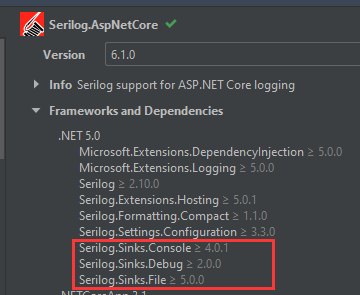
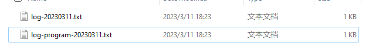

[TOC]

## 0. 为什么我的接口，慢得跟蜗牛一样啊？

想象一下，你和团队像一群疯狂的兔子一样不断迭代产品，一心只想把新版本快速推出市场。时间紧迫，你们往往会牺牲一些看似无关紧要的步骤，比如度量（Metric）、日志（Logging）、跟踪（Tracing）等。

结果，你们的产品像是一艘漏了很多洞的船，虽然勉强能够在水上漂浮，但随时可能出现问题。最终，当用户开始抱怨应用性能低下、线上问题频繁出现时，你们才意识到这些所谓的“无关紧要”的步骤，其实是保障生产环境稳定的必备要素。这时，你们只能慌忙投入大量时间和精力来弥补之前的疏忽，就像在沉船上打补丁一样。你们甚至不知道该从哪里入手解决，线上问题全靠猜，客户疯狂投诉。你们为了速度而省去的时间，现在不得不再次投入并加倍奉还。

现在，想象一下：你的客户投诉上门，你的老板在办公室无能狂怒：“Why is my Web API so slow ?”。你满头的冷汗，因为你甚至无法给出确切的答案。你背着一口滚烫的大锅，傻乎乎地挨个猜测问题的根源......

||
|:-:|
|<b>图 1</b>|

为了防止这种情况的发生，需要采取一系列措施。由于这是一个比较大的话题，我计划撰写几篇文章来详细介绍。主要包括以下几个主题：

1. 如何轻松地结构化记录日志；
2. 如何轻松地收集和分析分布式系统的日志；
3. 如何轻松地记录各项操作的时间开销；
4. 如何轻松地记录诊断数据；
5. 如何轻松进行遥测。
6. 如果我有其他的想法，我会继续更新这个列表。

在本系列文章中，我们会提供一些最佳实践来解决这些问题。考虑到许多应用程序都会部署在多个实例上，我们将在下一篇文章中介绍如何轻松地收集和分析多个实例的日志。当然，这篇文章也将成为后续文章的基础。

为了快速入门，我们将提供一些优秀的代码示例。我们会展示我们认为的最佳实践，并提供其他配置方式的文档供大家参考。

源代码地址：[https://github.com/Kit086/kit.demos/tree/main/WhyIsMyWebApiCrawlingAtASnailsPace/01-StructuredLoggingWithSerilog](https://github.com/Kit086/kit.demos/tree/main/WhyIsMyWebApiCrawlingAtASnailsPace/01-StructuredLoggingWithSerilog)

## 1. 引入 `Serilog.AspNetCore` NuGet 包

在 ASP.NET Core 应用程序中，如何记录日志，想必大家都知道，`ILogger` 嘛。而 Serilog 可以帮助我们将日志记录到各种媒介中，比如文件、关系型数据库如 MSSQL Server、MySQL，文档型数据库如 MongoDB，消息队列如 RabbitMQ，日志收集服务器如 Sql 等。这在 Serilog 中被称为 Sink。想知道能否记录到你意向的媒介，请参考这个网页：[https://github.com/serilog/serilog/wiki/Provided-Sinks](https://github.com/serilog/serilog/wiki/Provided-Sinks)

创建一个 ASP.NET Core 7 的 WebAPI 项目后，安装 NuGet 包：`Serilog.AspNetCore`

||
|:-:|
|<b>图 2</b>|

`Serilog.AspNetCore` 包含了常用的 Console、Debug、File 三种 Sink。如果您的应用是单体的，只部署在一台或很少几台服务器上，那么只需要将日志记录到文件中就足够了，无需单独引入其他的 Sink。如果需要将日志记录到其他的 Sink 中，请安装对应的 NuGet 包。

## 2. 配置 Serilog

我先放一个 Serilog 的配置的文档在这：[https://github.com/serilog/serilog-settings-configuration](https://github.com/serilog/serilog-settings-configuration)

Serilog 可以把配置用代码写死，也可以配在配置文件里。我当然要配置在配置文件里。修改一下配置文件中默认的 `Logging` 这一节，替换为：

```json
"Serilog": {
    "Using": [ "Serilog.Sinks.Console", "Serilog.Sinks.File" ], // Sinks，这样配置会引入往控制台和文件写日志的 Sinks
    // Log level
    "MinimumLevel": {
      "Default": "Information",
      "Override": {
        "Microsoft": "Warning",
        "System": "Warning"
      }
    },
    // 这样配置会把日志写到控制台上和文件里。写到其它服务里需要先安装 NuGet 包，然后在 "Using" 中引入，最后在这里配置
    "WriteTo": [
      { "Name": "Console" },
      {
        "Name": "File",
        "Args": {
          "path": "./logs/log-.txt", // 写入到文件在本机的路径
          "rollingInterval": "Day", // 文件按天拆分
          "rollOnFileSizeLimit": true, // 如果文件达到了允许的最大尺寸，也拆分
          "formatter": "Serilog.Formatting.Compact.CompactJsonFormatter, Serilog.Formatting.Compact" // 格式化器，紧凑的 Json 压缩
        }
      }
    ],
    "Enrich": [ "FromLogContext", "WithMachineName", "WithThreadId" ] // 日志中记录日志上下文，机器名和线程 Id
  },
```

这里我直接展示了比较完整的配置，请注意看注释。

## 3. 在 Program.cs 中启用 Serilog

然后我们回到 Program.cs 中：

```csharp
// ......
builder.Services.AddSwaggerGen();

// 启用 Serilog 接管 ASP.NET Core 的 Log
builder.Host.UseSerilog((context, services, config) =>
    config.ReadFrom.Configuration(context.Configuration));
        // .ReadFrom.Services(services)
        // .Enrich.FromLogContext());

var app = builder.Build();
// ......
```

这段配置很简单，在 Host 上使用了 Serilog 接管了 ASP.NET Core 默认的日志功能。

然后我们简单改写一下 WeatherForecastController 中的接口，让它输出一条日志：

```csharp
[HttpGet(Name = "GetWeatherForecast")]
public IEnumerable<WeatherForecast> Get()
{
    // 输出一条 info 级别的日志
    _logger.LogInformation("Hello Serilog!");

    return Enumerable.Range(1, 5).Select(index => new WeatherForecast
    {
        Date = DateOnly.FromDateTime(DateTime.Now.AddDays(index)),
        TemperatureC = Random.Shared.Next(-20, 55),
        Summary = Summaries[Random.Shared.Next(Summaries.Length)]
    })
    .ToArray();
}
```

运行项目，调一下接口，看一下控制台的日志：

```
[17:14:01 INF] Hello Serilog!
```

从运行起项目到调完接口，就输出了这一条日志，很干净，很爽！日志记录了时间这个关键信息，后面的 `INF` 说明这条日志的 level 是 `information`。

## 4. 如何记录 Program.cs 中的日志？

有时候，应用程序在启动阶段或开始运行时可能会抛出异常，我们需要记录这些日志。在这种情况下，我们需要在 Program.cs 文件中记录日志。但是，在应用程序刚启动时，DI 容器还没有构建完成，因此我们无法通过容器获取 `ILogger` 实例。在这种情况下，我们可以使用 Serilog 的全局静态 `Log` 类来记录日志。

回到 program.cs，改造一下：

```csharp
using Serilog;
using Serilog.Events;

// 配置一下全局静态 Log 的 Logger
Log.Logger = new LoggerConfiguration()
    .MinimumLevel.Override("Microsoft", LogEventLevel.Information)
    .Enrich.FromLogContext()
    .WriteTo.Console()
    .WriteTo.File(
        formatter: new CompactJsonFormatter(),
        Path.Combine(".", "logs","log-program-.txt"),  // 这里我把日志写到了不同的日志文件中，防止与 WebAPI 日志混淆
        rollingInterval: RollingInterval.Day, 
        rollOnFileSizeLimit: true)
    .CreateBootstrapLogger();

try
{
    // 随便记一条日志
    Log.Logger.Information("Hello ASP.NET Core!");
    
    var builder = WebApplication.CreateBuilder(args);

    // Add services to the container.

    builder.Services.AddControllers();
    // Learn more about configuring Swagger/OpenAPI at https://aka.ms/aspnetcore/swashbuckle
    builder.Services.AddEndpointsApiExplorer();
    builder.Services.AddSwaggerGen();

    builder.Host.UseSerilog((context, services, config) =>
        config.ReadFrom.Configuration(context.Configuration));
            // .ReadFrom.Services(services)
            // .Enrich.FromLogContext());

    var app = builder.Build();

    // Configure the HTTP request pipeline.
    if (app.Environment.IsDevelopment())
    {
        app.UseSwagger();
        app.UseSwaggerUI();
    }

    app.UseHttpsRedirection();

    app.UseAuthorization();

    app.MapControllers();

    app.Run();
}
catch (Exception e)
{
    Log.Fatal(e, "Host terminated unexpectedly");
    return 1;
}
finally
{
    Log.CloseAndFlush();
}

return 0;
```

我们配置了 `Log.Logger`，然后尝试在开头随便记了一条日志。

我们还用 Try-catch-finally 包围了所有代码，这样在启动应用过程中有异常抛出的话，也会被记录在日志中。

## 5. 查看结构化日志

再调用几次 WeatherForecast 接口，生成一些日志。

我们可以在项目下的 logs 文件夹中发现记录的日志：

||
|:-:|
|<b>图 3</b>|

打开 `log-20230311.txt` 文件：

```
{"@t":"2023-03-11T10:27:32.6593409Z","@mt":"Hello Serilog!","SourceContext":"StructuredLoggingWithSerilog.Controllers.WeatherForecastController","ActionId":"067ae75c-2be3-41ca-9136-0284a0960e95","ActionName":"StructuredLoggingWithSerilog.Controllers.WeatherForecastController.Get (StructuredLoggingWithSerilog)","RequestId":"0HMP23CQO4NTL:00000005","RequestPath":"/WeatherForecast","ConnectionId":"0HMP23CQO4NTL"}
{"@t":"2023-03-11T10:27:33.3651480Z","@mt":"Hello Serilog!","SourceContext":"StructuredLoggingWithSerilog.Controllers.WeatherForecastController","ActionId":"067ae75c-2be3-41ca-9136-0284a0960e95","ActionName":"StructuredLoggingWithSerilog.Controllers.WeatherForecastController.Get (StructuredLoggingWithSerilog)","RequestId":"0HMP23CQO4NTL:00000007","RequestPath":"/WeatherForecast","ConnectionId":"0HMP23CQO4NTL"}
{"@t":"2023-03-11T10:27:33.5293786Z","@mt":"Hello Serilog!","SourceContext":"StructuredLoggingWithSerilog.Controllers.WeatherForecastController","ActionId":"067ae75c-2be3-41ca-9136-0284a0960e95","ActionName":"StructuredLoggingWithSerilog.Controllers.WeatherForecastController.Get (StructuredLoggingWithSerilog)","RequestId":"0HMP23CQO4NTL:00000009","RequestPath":"/WeatherForecast","ConnectionId":"0HMP23CQO4NTL"}
```

是 JSON 格式的结构化日志了，格式化一下：

```json
{
    "@t": "2023-03-11T10:27:32.6593409Z",
    "@mt": "Hello Serilog!",
    "SourceContext": "StructuredLoggingWithSerilog.Controllers.WeatherForecastController",
    "ActionId": "067ae75c-2be3-41ca-9136-0284a0960e95",
    "ActionName": "StructuredLoggingWithSerilog.Controllers.WeatherForecastController.Get (StructuredLoggingWithSerilog)",
    "RequestId": "0HMP23CQO4NTL:00000005",
    "RequestPath": "/WeatherForecast",
    "ConnectionId": "0HMP23CQO4NTL"
}
{
    "@t": "2023-03-11T10:27:33.3651480Z",
    "@mt": "Hello Serilog!",
    "SourceContext": "StructuredLoggingWithSerilog.Controllers.WeatherForecastController",
    "ActionId": "067ae75c-2be3-41ca-9136-0284a0960e95",
    "ActionName": "StructuredLoggingWithSerilog.Controllers.WeatherForecastController.Get (StructuredLoggingWithSerilog)",
    "RequestId": "0HMP23CQO4NTL:00000007",
    "RequestPath": "/WeatherForecast",
    "ConnectionId": "0HMP23CQO4NTL"
}
{
    "@t": "2023-03-11T10:27:33.5293786Z",
    "@mt": "Hello Serilog!",
    "SourceContext": "StructuredLoggingWithSerilog.Controllers.WeatherForecastController",
    "ActionId": "067ae75c-2be3-41ca-9136-0284a0960e95",
    "ActionName": "StructuredLoggingWithSerilog.Controllers.WeatherForecastController.Get (StructuredLoggingWithSerilog)",
    "RequestId": "0HMP23CQO4NTL:00000009",
    "RequestPath": "/WeatherForecast",
    "ConnectionId": "0HMP23CQO4NTL"
}
```

可以看到日志里有一些我们用于追踪的必要数据，例如 ActionId、RequestId、RequestPath 等。但是今天我们先不分析日志，留给后面的文章。

## 总结

现在，我们已经能够将结构化日志记录到文件中。如果您的团队需要将日志记录到文档数据库（如 MongoDB）或关系型数据库中，只需引入相应的 Sink，并进行类似的配置即可。具体选择哪种方法应根据团队的情况和需求来分析。

另外，一种非常好的选择是使用一些流行的服务器，如 Seq，来收集、搜索、分析和提醒现代结构化日志数据。我们将在之后的日志分析中演示。

如果条件允许，您也可以将日志记录到各种云提供的日志服务中。市面上的云服务通常会提供这样的日志服务，其中包括保存日志、分析日志、定期删除日志等常见功能，非常方便实用。

源代码地址：[https://github.com/Kit086/kit.demos/tree/main/WhyIsMyWebApiCrawlingAtASnailsPace/01-StructuredLoggingWithSerilog](https://github.com/Kit086/kit.demos/tree/main/WhyIsMyWebApiCrawlingAtASnailsPace/01-StructuredLoggingWithSerilog)