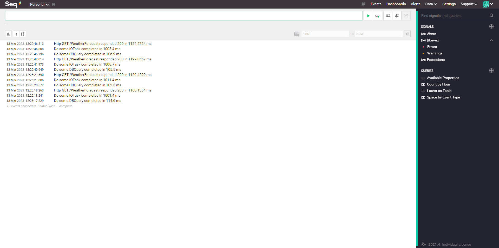
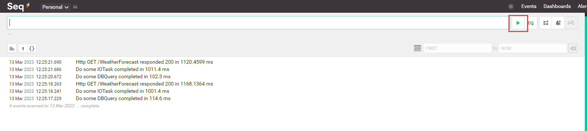
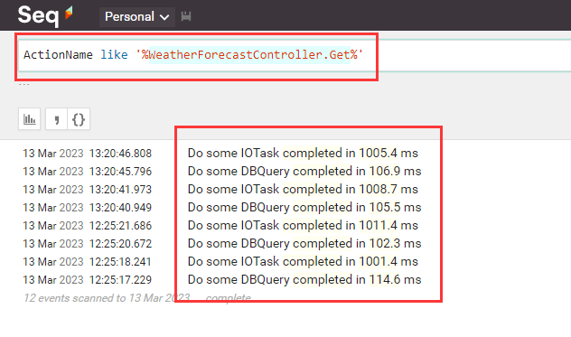
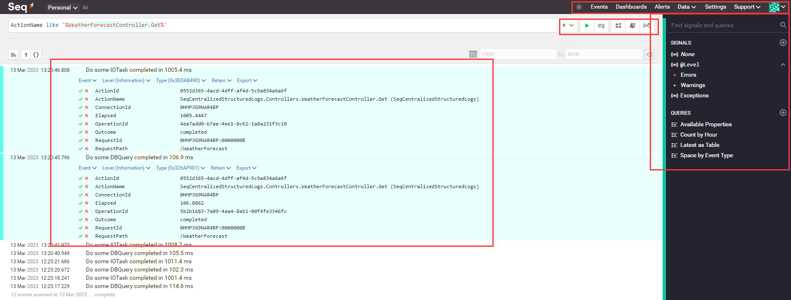
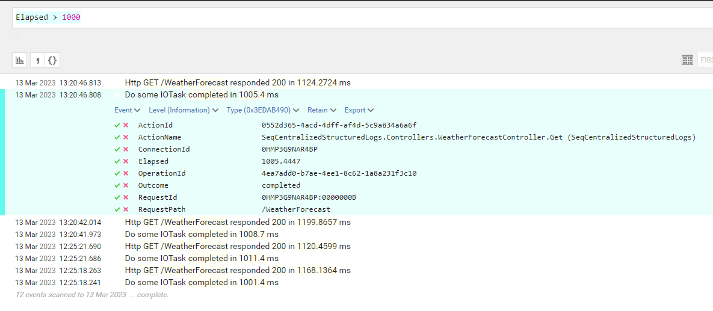

[TOC]

## 0. 前言

源代码地址：[https://github.com/Kit086/kit.demos/tree/main/WhyIsMyWebApiCrawlingAtASnailsPace/03-SeqCentralizedStructuredLogs](https://github.com/Kit086/kit.demos/tree/main/WhyIsMyWebApiCrawlingAtASnailsPace/03-SeqCentralizedStructuredLogs)

这是我“为什么我的接口，慢得跟蜗牛一样啊？”系列文章的第三篇，前两篇的地址：

- [为什么我的接口，慢得跟蜗牛一样啊？- 1. 使用 Serilog 结构化日志：https://blog.kitlau.dev/posts/why-is-my-web-api-crawling-at-a-snails-pace-1-structured-logging-with-serilog/](https://blog.kitlau.dev/posts/why-is-my-web-api-crawling-at-a-snails-pace-1-structured-logging-with-serilog/)
- [为什么我的接口，慢得跟蜗牛一样啊？- 2. Serilog 记录计时和诊断日志：https://blog.kitlau.dev/posts/why-is-my-web-api-crawling-at-a-snails-pace-2-timing-and-diagnostic/](https://blog.kitlau.dev/posts/why-is-my-web-api-crawling-at-a-snails-pace-2-timing-and-diagnostic/)

如果你在国内，通过上面的地址访问比较慢，可以用这个地址查看：

- [为什么我的接口，慢得跟蜗牛一样啊？- 1. 使用 Serilog 结构化日志：https://cat.aiursoft.cn/post/2023/3/12/why-is-my-web-api-so-slow-1-structured-logging-with-serilog](https://cat.aiursoft.cn/post/2023/3/12/why-is-my-web-api-so-slow-1-structured-logging-with-serilog)
- [为什么我的接口，慢得跟蜗牛一样啊？- 2. Serilog 记录计时和诊断日志：https://cat.aiursoft.cn/post/2023/3/12/why-is-my-web-api-so-slow-2-timing-and-diagnostic](https://cat.aiursoft.cn/post/2023/3/12/why-is-my-web-api-so-slow-2-timing-and-diagnostic)

如果你是从微信公众号查看，可以直接翻阅历史文章。因为我记录这些日志的目的最终是性能优化，所以我把它放在了“dotnet” 和 “性能优化”分类中。

看完这两篇文章，您应该已经可以为您的应用配置完善的日志、计时、请求追踪和诊断信息了。这已经能让您的公司提供的软件服务的水平提升好几个层级了。如果说哪一点还不够完善的话，我们目前还是只有记录在文件里的日志。本篇文章我将会介绍如何收集多个实例的日志，聚合到一起，进行优雅而高效的日志分析诊断等操作。

提到日志收集和查询，很多人会想到 ELK。ELK 的鼎鼎大名就不需要我再介绍了，但搭建它并不是易事，所以这里我选择 Seq 进行演示。

相比于 ELK，Seq 是一种更轻量级的日志管理工具。Seq 的设计理念是专注于日志的实时记录和查询，因此它不像 ELK 那样需要处理大量的数据和进行复杂的数据分析。此外，Seq 的安装和配置也比 ELK 更加简单和快速。然而，要根据具体的使用场景和需求选择合适的日志管理工具，ELK 和 Seq 都有各自的优缺点。

但 Seq 并非完全免费，只是对个人免费，详情请看他们的定价页面：[https://datalust.co/pricing](https://datalust.co/pricing)

## 1. 使用 Docker 运行 Seq

我根据 Seq 官方的文档，轻松就使用 Docker 运行起了一个 Seq 实例。文档地址：(https://docs.datalust.co/docs/getting-started-with-docker)[https://docs.datalust.co/docs/getting-started-with-docker]

如果您不会使用 Docker 的话，Seq 提供了 Windows 的安装包，可以直接下载安装，安装时基本一路点击 next 就行，这是文档和安装包下载地址：(https://docs.datalust.co/docs/getting-started)[https://docs.datalust.co/docs/getting-started]

以下是 Docker 运行 Seq 用到的命令和命令的简单解释，我把它翻译成了中文：

```bash
PH=$(echo '<password>' | docker run --rm -i datalust/seq config hash)

mkdir -p <local path to store data>

docker run \
  --name seq \
  -d \
  --restart unless-stopped \
  -e ACCEPT_EULA=Y \
  -e SEQ_FIRSTRUN_ADMINPASSWORDHASH="$PH" \
  -v <local path to store data>:/data \
  -p 80:80 \
  -p 5341:5341 \
  datalust/seq
```

- `--name seq` 参数用于为容器命名，可以使用容器名称运行命令，例如 `docker stop seq`
- `-d` 参数用于在守护进程模式下运行容器（在后台运行），省略此参数将在 `stdout` 中查看容器日志
- `--restart unless-stopped` 参数用于始终重新启动 Seq docker 容器（除非使用 `docker stop seq` 命令停止容器）
- `-e ACCEPT_EULA=Y` 参数用于接受最终用户许可协议，以便运行 Seq
- `-e SEQ_FIRSTRUN_ADMINPASSWORDHASH="$PH"` 参数用于为管理员用户帐户设置初始密码；将 `<password>` 替换为所需的密码；上面的第一行将密码的加密哈希值存储到环境变量 `$PH` 中（bash 语法）
- `-v <local path to store data>:/data` 参数将主机机器上的 `<local path to store data>` 挂载到容器中的 `/data` 目录，Seq 存储所有配置和日志文件的位置。将 Seq 数据存储在容器外部意味着 Seq 的日志数据和元数据会在容器生命周期之外保持并且不会增加 docker 容器的大小。
- `-p 80:80` 参数将主机的 `localhost:80` 映射到 Seq UI 和 API（端口 80）
- `-p 5341:5341` 参数将主机的 `localhost:5341` 映射到 Seq 的特殊摄取端口（端口 5341）。我们建议将摄取端口单独公开。

可以使用 `docker stop seq` 和 `docker start seq` 命令停止和启动容器。

执行上述命令后，可以在 http://localhost:80 上浏览 Seq UI。

运行 Seq 并不是重点，我就介绍到这里，如果您和您的团队没有能力运行它或者承担它的费用，可以去找一下开源替代品，或者继续等我“为什么我的接口，慢得跟蜗牛一样啊？”系列文章，我将会介绍相关的免费工具。

现在打开 http://localhost:80/，用您之前设置的 `<password>` 登录即可。

||
|:-:|
|<b>图 1</b>|

## 2. 记录日志到 Seq

我会在我上一篇文章的代码的基础下进行改造，您可以直接下载源代码。实际上使用 Serilog 往 Seq 等服务中记录日志非常容易，我只需要引入 `Serilog.Sinks.Seq` 这个 NuGet 包，然后修改一下配置文件：

```json
{
  "Serilog": {
    "Using": [ "Serilog.Sinks.Console", "Serilog.Sinks.File" ],
    "MinimumLevel": {
      "Default": "Information",
      "Override": {
        "Microsoft": "Warning",
        "System": "Warning"
      }
    },
    "WriteTo": [
      { "Name": "Console" },
      {
        "Name": "File",
        "Args": {
          "path": "./logs/log-.txt",
          "rollingInterval": "Day",
          "rollOnFileSizeLimit": true,
          "formatter": "Serilog.Formatting.Compact.CompactJsonFormatter, Serilog.Formatting.Compact"
        }
      },
      // 新增了这一节
      {
        "Name": "Seq",
        "Args": { "serverUrl": "http://localhost:5341" }
      }
    ],
    "Enrich": [ "FromLogContext", "WithMachineName", "WithThreadId" ]
  },
  "AllowedHosts": "*"
}
```

新增的部分我用注释标出了，如法炮制即可。

## 3. 查看日志

回到您在浏览器中打开的 Seq 页面，如果没有日志加载出来，请点击这个按钮：

||
|:-:|
|<b>图 2</b>|

如果您想实时监控所有日志，看到日志一条一条被打印到屏幕上，可以点击它右侧的 tail 按钮。

现在，我可以根据条件来查询日志，比如我要查询 WeatherForecastController 的 Get 接口的日志，我可以这样：

||
|:-:|
|<b>图 3</b>|

很简单不是吗，就像写 SQL 一样。我们可以展开日志看一下：

||
|:-:|
|<b>图 4</b>|

每一条都清清楚楚。

再看旁边我红框标记出的部分，说明它还有很多功能等待探索。

## 4. 分析性能

现在回到正题，我希望通过日志来找出耗时过长的操作，所以我用这个条件：`Elapsed > 1000`

||
|:-:|
|<b>图 5</b>|

轻松过滤出耗时超过 1000ms 的日志，然后根据日志即可定位到代码中的位置，进行分析和优化。

## 总结

到现在，我们已经可以为应用配置完善的日志、计时、请求追踪和诊断信息，将日志记录到 Seq 这种日志中心，轻松进行日志分析了。

至于 Seq，它只是个工具，没必要把它学精通，用到什么功能，去查一下就行了。

我们终于解决了我们提出的问题：“为什么我的接口慢得跟蜗牛一样啊？”有了这些日志，我们可以轻松查到我们的接口慢在哪一步操作上。这样对老板对客户都至少有一个交代，遇到了问题也不用再全都靠猜了。

这个系列还没有完结，打算再介绍一点 Tracing 相关的东西。敬请期待。

源代码地址：[https://github.com/Kit086/kit.demos/tree/main/WhyIsMyWebApiCrawlingAtASnailsPace/03-SeqCentralizedStructuredLogs](https://github.com/Kit086/kit.demos/tree/main/WhyIsMyWebApiCrawlingAtASnailsPace/03-SeqCentralizedStructuredLogs)